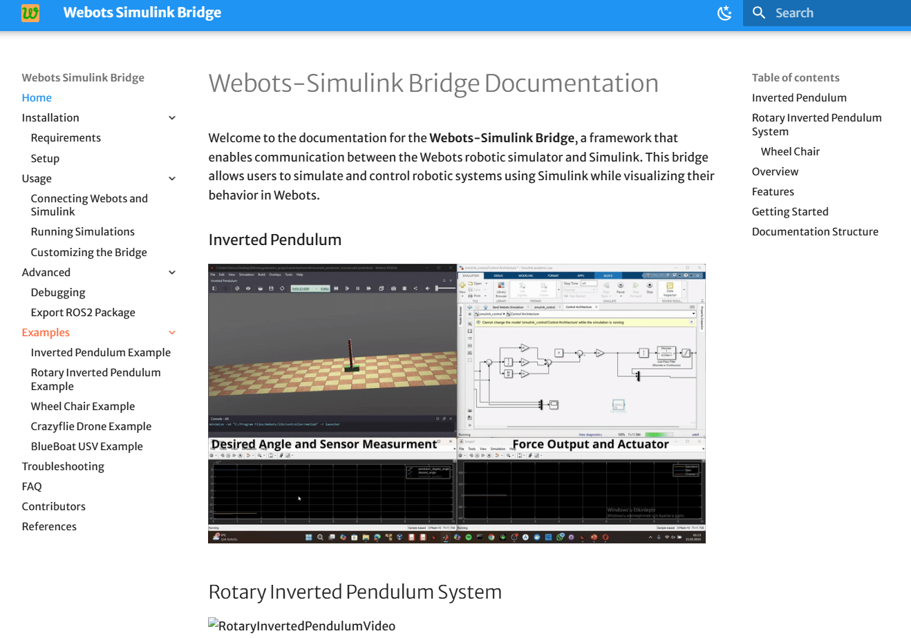

# webots-simulink

Webots2023a bridge Matlab/Simulink

Documentation Website Bellow 
[DOCUMENTATION WEBSITE](https://harunkurtdev.github.io/webots-simulink/)

## Inverted Pendulum System

## Rotary Inverted Pendulum System

## Crazyflie 

## BlueBoat 

## wheelChair 

after setup, refer to the [Usage Guide](../usage/connecting.md) to start running simulations with Webots and Simulink.

<!-- @misc{webots-simulink,
  author       = {Harun Kurt and Ahmet Çayır and Kadir Erkan},
  title        = {Webots Simulink Bridge},
  year         = {2025},
  publisher    = {arXiv},
  howpublished = {\url{https://github.com/harunkurtdev/webots-simulink}},
  note         = {Version X.X. \newline Available at: \url{https://doi.org/xx.xxxx/xxxx}},
} -->

@online{webots-simulink,
  author       = {Harun Kurt and Ahmet Çayır and Kadir Erkan},
  title        = {Simulation Based Control Architecture Using Webots and Simulink},
  year         = {2025},
  url          = {https://github.com/harunkurtdev/webots-simulink},
  note         = {Version X.X. Available at: \url{https://doi.org/xx.xxxx/xxxx}},
}
