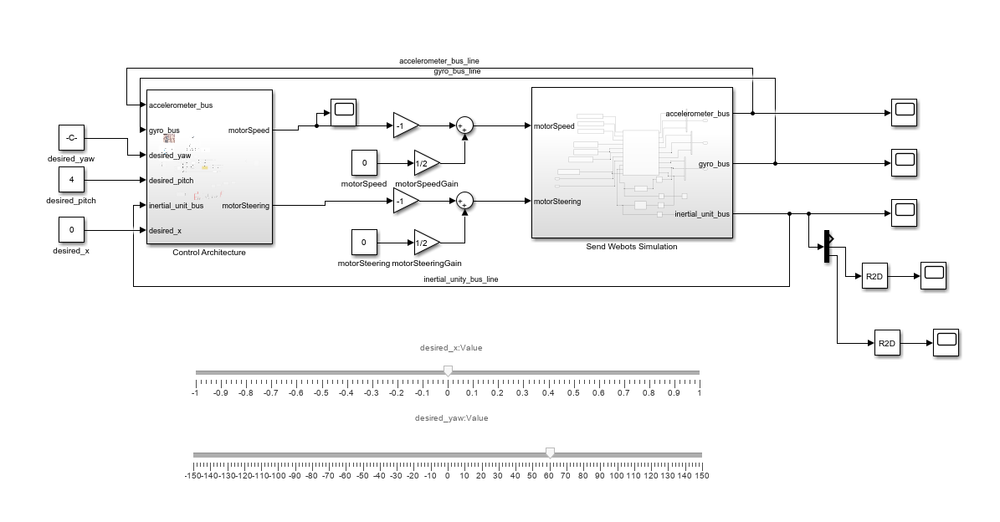
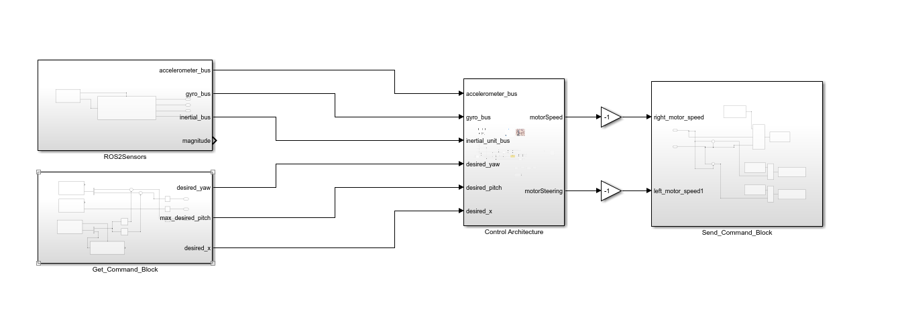
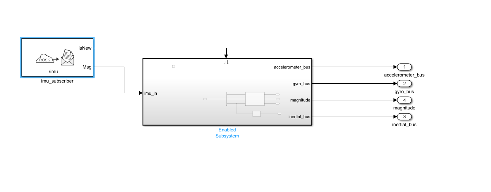
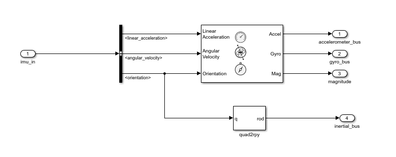
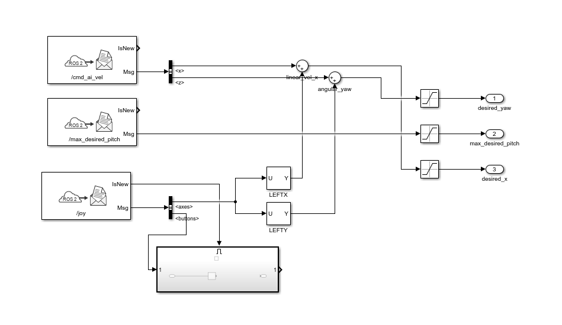
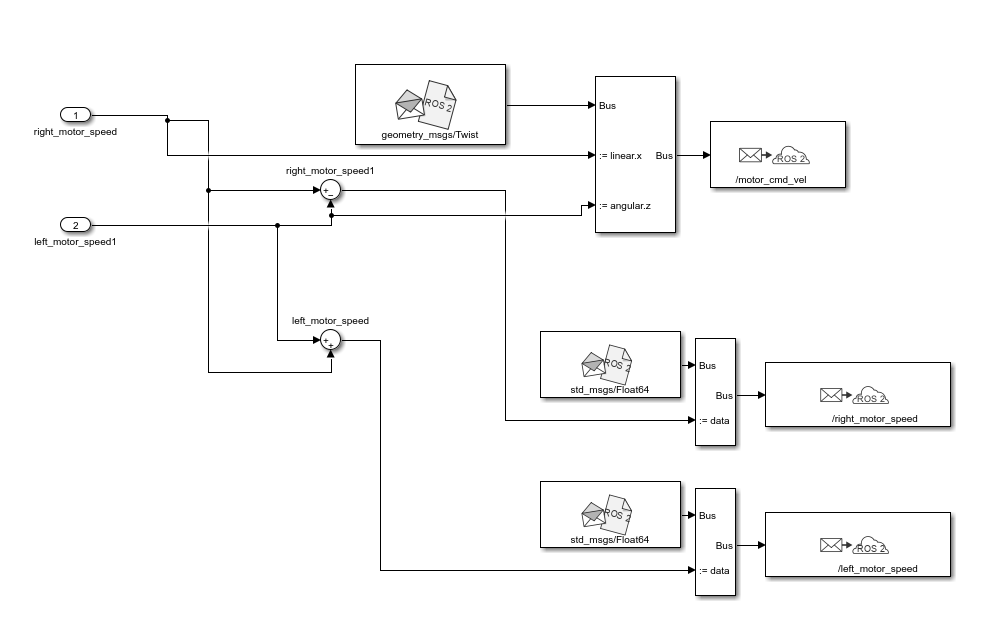
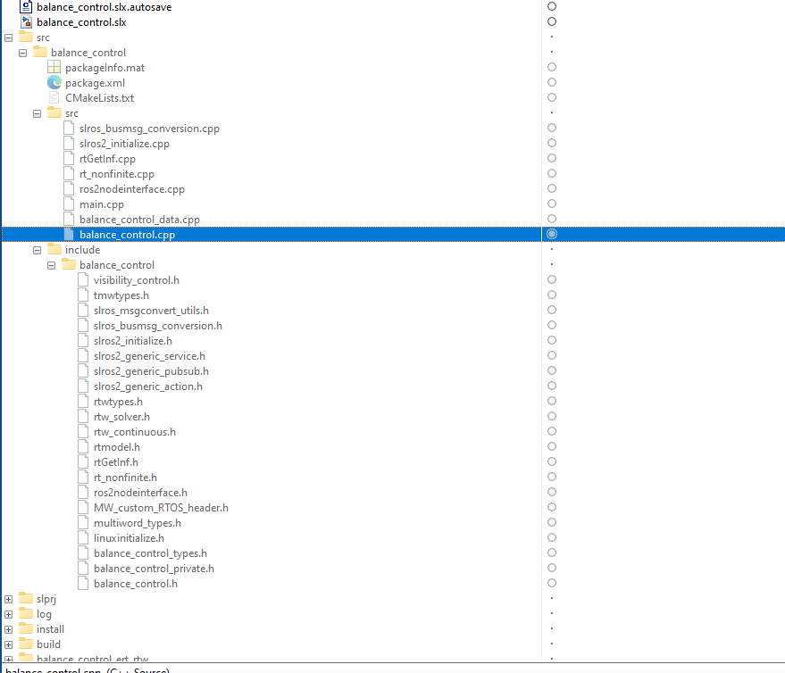

 ## Exporting Robot Model in ROS 2 Format

In this section, we will learn how to export the robot model in ROS 2 format, we need to use the `export_ros2` function. This function takes two arguments: the name of the robot and the path where you want to save the exported file. The exported file will be a URDF (Unified Robot Description Format) file that can be used by other programs such as Gazebo or ROS 2.

## Webots Simulation Blocks

We can use the Control Block to control the robot's movement.

## Create ROS2 Simulink App

We getting from Webots simulation control block.

## Sensor From IMU Sensor

We getting from with imu sensor.

## Basicly getting Command 

## Send Actuator to Robot

## ROS2 Package showing like this

## Reference

- [Webots Documentation](https://www.webots.org/documentation)
- [Simulink Documentation](https://www.mathworks.com/products/simulink.html)
- [ROS 2 Documentation](https://docs.ros.org/en/humble/index.html)
- [Matlab ROS2 Documentation](https://www.mathworks.com/help/ros/examples.html?s_tid=CRUX_topnav&category=index)

