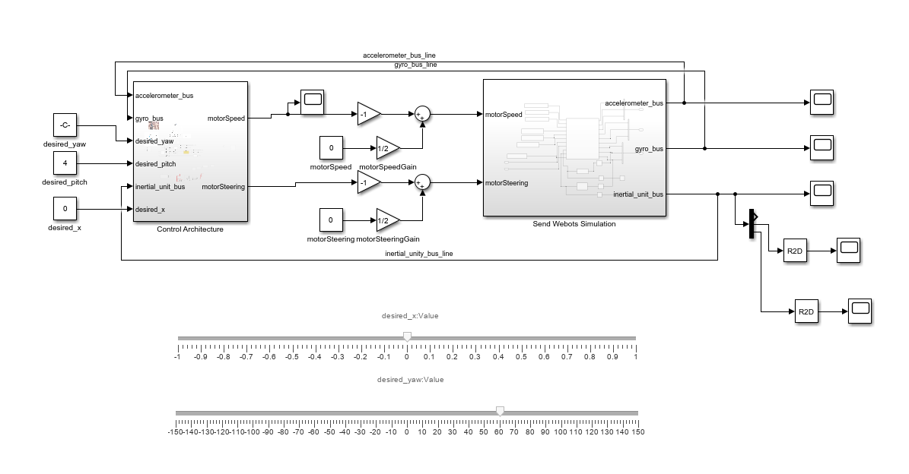
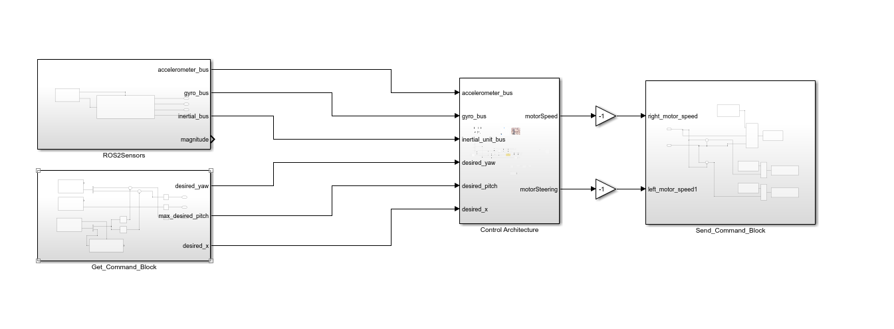
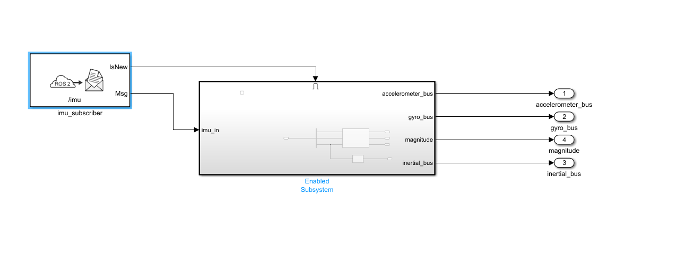
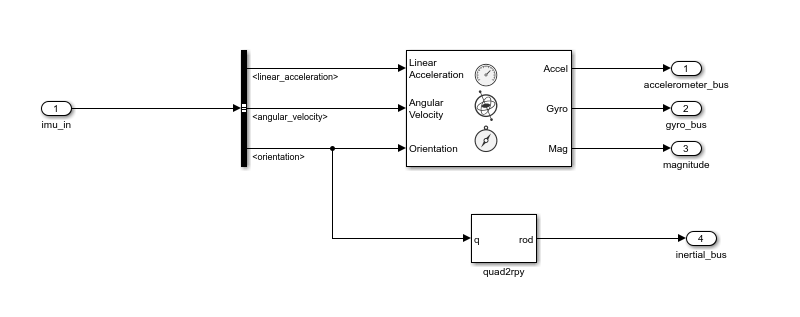
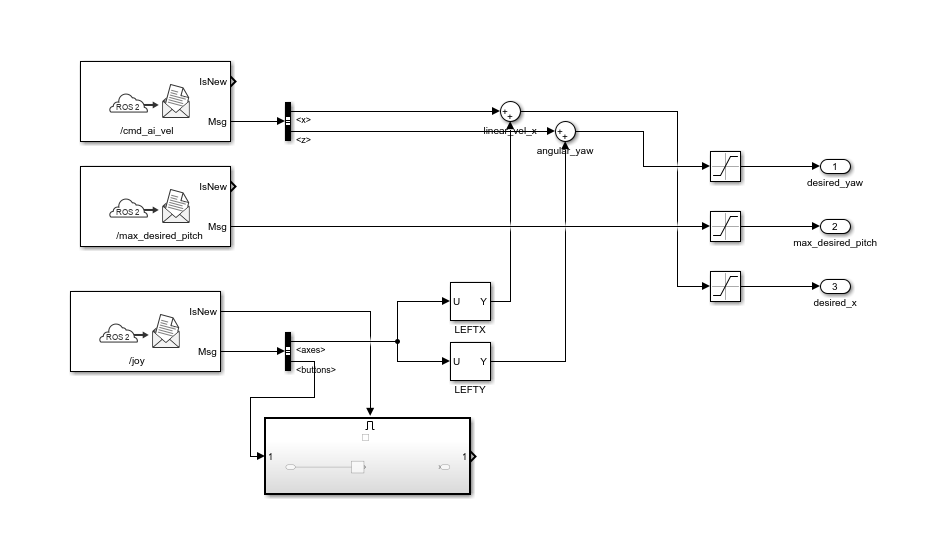
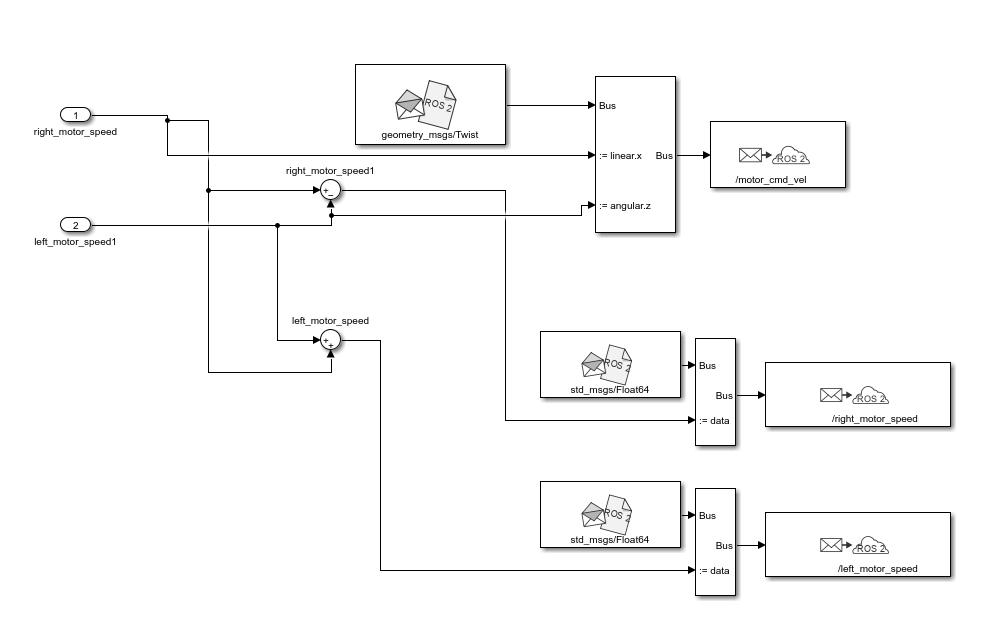
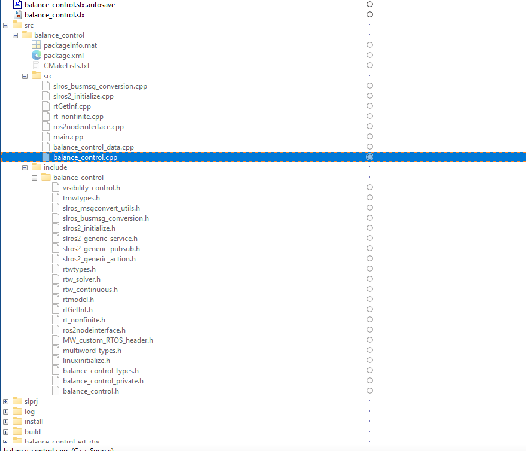
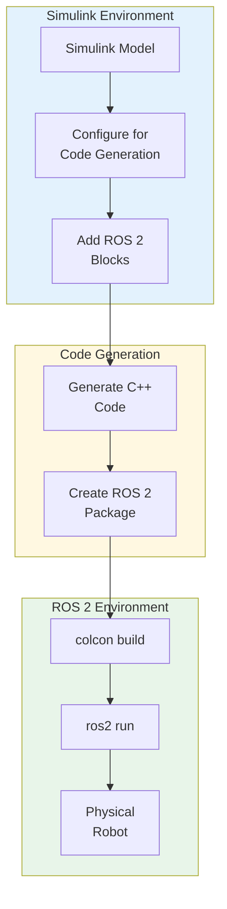

# Exporting to ROS 2

This guide explains how to convert Simulink controllers into ROS 2 packages for deployment on physical robots.

---

## Overview

The export process converts your validated Simulink controller into a ROS 2 node that can run on real robot hardware. This enables:

- **Hardware deployment**: Run the same control algorithms on physical robots
- **ROS 2 integration**: Interface with other ROS 2 nodes (navigation, perception, planning)
- **Real-time execution**: Generated C++ code runs efficiently on embedded systems

---

## Prerequisites

| Requirement | Description |
|-------------|-------------|
| **ROS Toolbox** | MATLAB toolbox for ROS 2 integration |
| **MATLAB Coder** | Code generation from MATLAB functions |
| **Embedded Coder** | Optimized code generation (optional) |
| **ROS 2** | Humble or later installed on target system |

---

## Step 1: Prepare Simulink Model

Configure your Simulink model for code generation:



### Model Configuration

```matlab
% Open model configuration
set_param('model_name', 'SystemTargetFile', 'ert.tlc');
set_param('model_name', 'GenerateReport', 'on');
set_param('model_name', 'LaunchReport', 'on');
```

### Required Settings

| Parameter | Value | Location |
|-----------|-------|----------|
| System target file | ert.tlc | Code Generation → System target file |
| Language | C++ | Code Generation → Language |
| Generate code only | On | Code Generation → Build process |

---

## Step 2: Create ROS 2 Interface



### Add ROS 2 Publish/Subscribe Blocks

1. Open Simulink Library Browser
2. Navigate to **ROS Toolbox** → **ROS 2**
3. Add **Publish** and **Subscribe** blocks

### Configure Publishers

```matlab
% Example: Publish motor commands
% Topic: /cmd_vel
% Message Type: geometry_msgs/Twist
```

### Configure Subscribers

```matlab
% Example: Subscribe to sensor data
% Topic: /imu/data
% Message Type: sensor_msgs/Imu
```

---

## Step 3: Define Message Types



### Standard Message Types

| Data | ROS 2 Message Type | Fields |
|------|-------------------|--------|
| IMU | `sensor_msgs/Imu` | orientation, angular_velocity, linear_acceleration |
| GPS | `sensor_msgs/NavSatFix` | latitude, longitude, altitude |
| Odometry | `nav_msgs/Odometry` | pose, twist |
| Velocity | `geometry_msgs/Twist` | linear (x,y,z), angular (x,y,z) |
| Pose | `geometry_msgs/PoseStamped` | position, orientation |

### Custom Message Example



```matlab
% Create custom message definition
% File: msg/RobotState.msg
float64 x
float64 y
float64 theta
float64 v
float64 omega
```

---

## Step 4: Sensor Integration



### IMU Subscriber Block

```matlab
% Configure IMU subscriber
% Topic: /imu/data
% Message Type: sensor_msgs/Imu
% Sample Time: 0.01 (100 Hz)

% Extract data in MATLAB Function block
function [roll, pitch, yaw, gyro] = parse_imu(imu_msg)
    % Quaternion to Euler
    quat = [imu_msg.Orientation.W, imu_msg.Orientation.X, ...
            imu_msg.Orientation.Y, imu_msg.Orientation.Z];
    [roll, pitch, yaw] = quat2eul(quat);

    % Angular velocity
    gyro = [imu_msg.AngularVelocity.X;
            imu_msg.AngularVelocity.Y;
            imu_msg.AngularVelocity.Z];
end
```

---

## Step 5: Actuator Commands



### Publish Motor Commands

```matlab
% Configure Twist publisher
% Topic: /cmd_vel
% Message Type: geometry_msgs/Twist

% Create Twist message in MATLAB Function block
function twist_msg = create_twist(v, omega)
    twist_msg = rosmessage('geometry_msgs/Twist');
    twist_msg.Linear.X = v;
    twist_msg.Linear.Y = 0;
    twist_msg.Linear.Z = 0;
    twist_msg.Angular.X = 0;
    twist_msg.Angular.Y = 0;
    twist_msg.Angular.Z = omega;
end
```

---

## Step 6: Generate ROS 2 Package

### Using Simulink Coder

1. Open **Apps** → **Simulink Coder**
2. Click **Build** to generate code
3. Navigate to generated folder

### Generated Package Structure



```
ros2_package/
├── CMakeLists.txt
├── package.xml
├── include/
│   └── model_name/
│       └── model_name.h
├── src/
│   ├── model_name.cpp
│   └── model_name_node.cpp
└── launch/
    └── model_name_launch.py
```

---

## Step 7: Build and Run

### Build Package

```bash
# Navigate to ROS 2 workspace
cd ~/ros2_ws/src

# Copy generated package
cp -r /path/to/generated/package .

# Build
cd ~/ros2_ws
colcon build --packages-select model_name

# Source workspace
source install/setup.bash
```

### Run Node

```bash
# Launch the controller node
ros2 launch model_name model_name_launch.py
```

---

## Complete Export Workflow


```mermaid
flowchart TB
    subgraph Simulink["Simulink Environment"]
        MODEL[Simulink Model]
        CONFIG[Configure for<br/>Code Generation]
        ROS2_BLK[Add ROS 2<br/>Blocks]
    end

    subgraph CodeGen["Code Generation"]
        GEN[Generate C++<br/>Code]
        PKG[Create ROS 2<br/>Package]
    end

    subgraph ROS2["ROS 2 Environment"]
        BUILD[colcon build]
        RUN[ros2 run]
        ROBOT[Physical<br/>Robot]
    end

    MODEL --> CONFIG
    CONFIG --> ROS2_BLK
    ROS2_BLK --> GEN
    GEN --> PKG
    PKG --> BUILD
    BUILD --> RUN
    RUN --> ROBOT

    style Simulink fill:#e3f2fd
    style CodeGen fill:#fff8e1
    style ROS2 fill:#e8f5e9
```

---

## Troubleshooting

| Issue | Solution |
|-------|----------|
| Build fails | Check CMakeLists.txt dependencies |
| Node crashes | Verify message types match |
| No data received | Check topic names and QoS settings |
| Timing issues | Adjust node execution rate |

---

## References

- [Webots Documentation](https://cyberbotics.com/doc/guide/index)
- [Simulink Documentation](https://www.mathworks.com/products/simulink.html)
- [ROS 2 Documentation](https://docs.ros.org/en/humble/index.html)
- [MATLAB ROS 2 Examples](https://www.mathworks.com/help/ros/examples.html)
- [Simulink Coder for ROS 2](https://www.mathworks.com/help/ros/ug/generate-a-standalone-ros2-node.html)

---

## Next Steps

After successfully deploying your controller, consider:

- Adding parameter tuning via ROS 2 parameters
- Implementing diagnostics and logging
- Setting up launch files for multi-node systems
- Creating RViz visualizations for debugging
