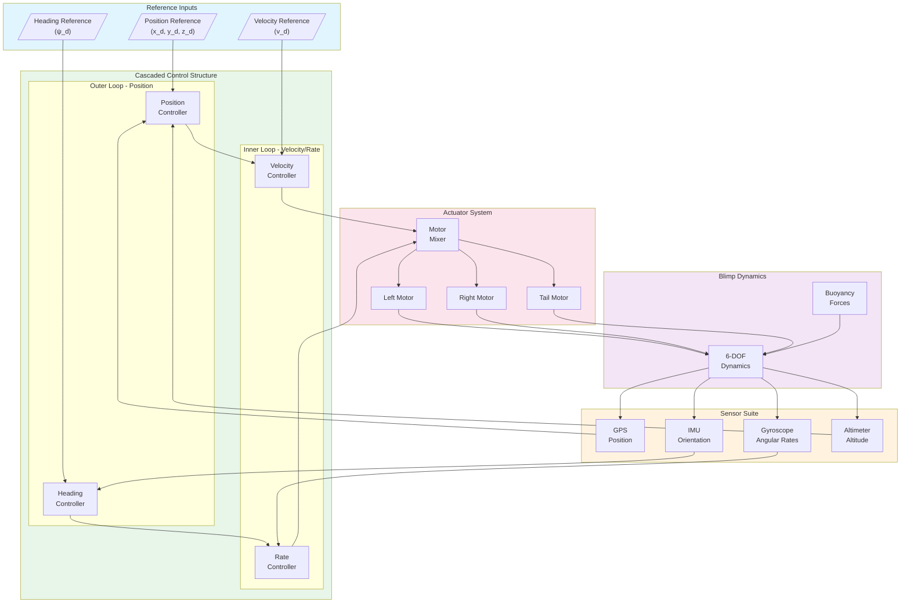
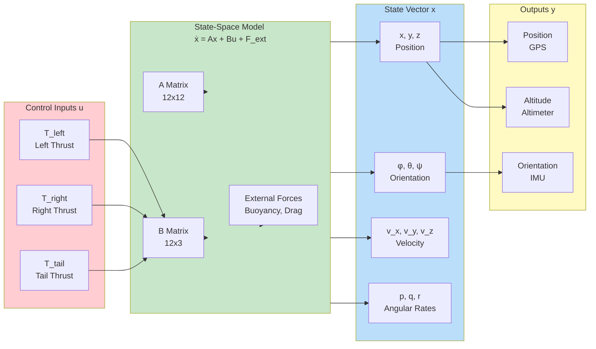
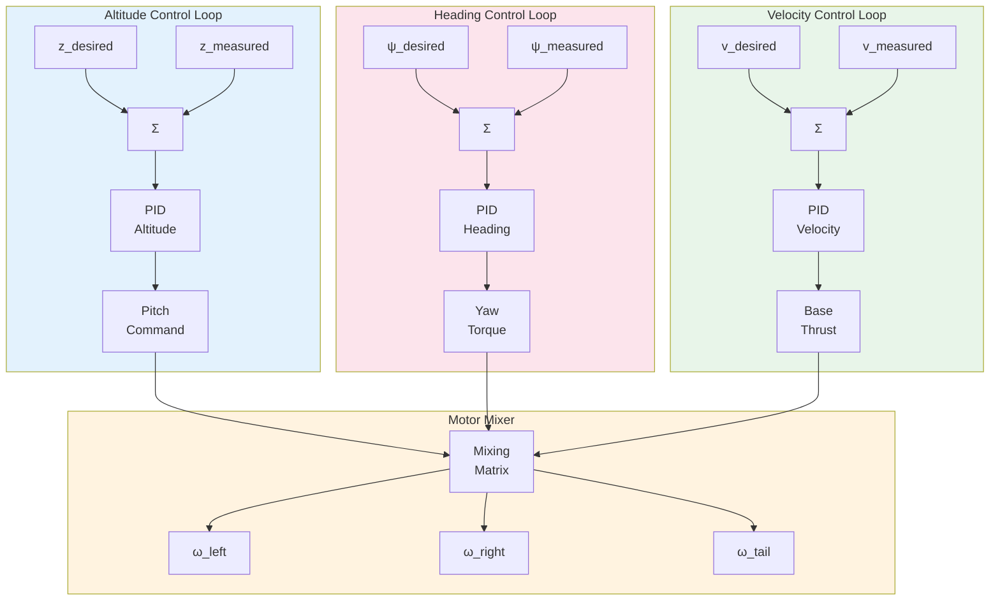

# Blimp (Airship)

This example demonstrates lighter-than-air vehicle control using a Blimp/Airship with MATLAB/Simulink.

---

## Overview

| Property | Value |
|----------|-------|
| **Type** | Lighter-Than-Air Vehicle (LTA) |
| **Robot** | Custom Blimp/Airship |
| **Difficulty** | Intermediate to Advanced |
| **Control Method** | Buoyancy + Thrust Vectoring |

---

## System Overview

The Blimp is a lighter-than-air vehicle that uses buoyancy for lift and propellers for propulsion and attitude control. Unlike quadrotors, blimps are naturally stable but have slower dynamics and are more affected by wind disturbances.

### Key Features

- **Buoyancy-Based Lift**: Passive lift from helium/hydrogen envelope
- **Thrust Vectoring**: Dual propellers for forward motion and steering
- **Tail Propeller**: Yaw control and low-speed maneuvering
- **Slow Dynamics**: Gentle, smooth movements ideal for indoor/outdoor surveillance
- **Energy Efficient**: Minimal power for hover compared to quadrotors

### Specifications

| Parameter | Value |
|-----------|-------|
| Envelope Shape | Capsule (Ellipsoid) |
| Envelope Length | 3 m (height 2m + radius 0.5m×2) |
| Envelope Radius | 0.5 m |
| Total Mass | 2 kg |
| Density | 100 kg/m³ |
| Gondola Size | 0.3 × 0.15 × 0.1 m |

---

## Physical Parameters

The simulation uses accurate physical parameters for realistic airship dynamics:

```matlab
% Physical constants
g = 9.80665;              % Gravity [m/s²]
m_blimp = 2.0;            % Total mass [kg]
rho_air = 1.225;          % Air density [kg/m³]
rho_helium = 0.164;       % Helium density [kg/m³]

% Envelope dimensions
envelope_height = 2.0;    % Capsule height [m]
envelope_radius = 0.5;    % Capsule radius [m]

% Buoyancy calculation
V_envelope = pi * envelope_radius^2 * envelope_height + ...
             (4/3) * pi * envelope_radius^3;  % Capsule volume
F_buoyancy = (rho_air - rho_helium) * V_envelope * g;

% Inertia estimates (simplified)
Ix = 0.5;                 % Roll inertia [kg*m²]
Iy = 1.5;                 % Pitch inertia [kg*m²]
Iz = 1.5;                 % Yaw inertia [kg*m²]

% Damping coefficients (high due to large surface area)
b_linear = 0.8;           % Linear damping
b_angular = 0.8;          % Angular damping
```

---

## Components

### Motors

| Motor | Device Name | Position | Function |
|-------|-------------|----------|----------|
| Left Motor | `left_motor` | Gondola left | Forward thrust + roll |
| Right Motor | `right_motor` | Gondola right | Forward thrust + roll |
| Tail Motor | `tail_motor` | Tail section | Yaw control |

### Sensors

| Sensor | Device Name | Description |
|--------|-------------|-------------|
| Accelerometer | `accelerometer` | 3-axis acceleration |
| Gyroscope | `gyro` | Angular velocity (p, q, r) |
| Inertial Unit | `inertial unit` | Roll, pitch, yaw orientation |
| GPS | `gps` | 3D position (x, y, z) |
| Altimeter | `altimeter` | Ground distance (0-50 m) |
| Camera | `camera` | 640×480 visual sensing |

### Structure

| Component | Description |
|-----------|-------------|
| Envelope | Helium-filled capsule shape (semi-transparent) |
| Gondola | Equipment bay below envelope |
| Fins | Cruciform tail fins for passive stability |

---

## Control Architecture

### System Block Diagram



### State-Space Model Diagram



### Control Loop Detail



### State-Space Matrices

```matlab
% 12-state Blimp Model
% State: x = [x, y, z, φ, θ, ψ, vx, vy, vz, p, q, r]'
% Input: u = [T_left, T_right, T_tail]'

% A Matrix (12x12) - Linearized dynamics at hover
A = zeros(12, 12);
A(1:3, 7:9) = eye(3);           % Position from velocity
A(4:6, 10:12) = eye(3);         % Orientation from angular rates
A(7:9, 7:9) = -b_linear/m * eye(3);    % Velocity damping
A(10:12, 10:12) = -b_angular * diag([1/Ix, 1/Iy, 1/Iz]); % Angular damping

% B Matrix (12x3) - Input mapping
B = zeros(12, 3);
% Left motor thrust contribution
B(7, 1) = 1/m;                  % Forward thrust
B(10, 1) = -d_motor/(2*Ix);     % Roll moment
% Right motor thrust contribution
B(7, 2) = 1/m;                  % Forward thrust
B(10, 2) = d_motor/(2*Ix);      % Roll moment
% Tail motor contribution
B(12, 3) = l_tail/Iz;           % Yaw moment

% C Matrix (6x12) - Output selection
C = zeros(6, 12);
C(1:3, 1:3) = eye(3);           % Position output
C(4:6, 4:6) = eye(3);           % Orientation output

% D Matrix (6x3) - Direct feedthrough (none)
D = zeros(6, 3);
```

---

## Blimp Dynamics

### Forces and Moments

Unlike heavier-than-air vehicles, blimps experience:

1. **Buoyancy Force**: Upward force from displaced air
2. **Gravity**: Downward force from mass
3. **Thrust**: Forward/backward force from propellers
4. **Drag**: Resistance proportional to velocity squared
5. **Added Mass**: Virtual mass from displaced air

### State Vector

```
x = [x, y, z, roll, pitch, yaw, vx, vy, vz, p, q, r]ᵀ
```

Where:
- `x, y, z`: Position in world frame [m]
- `roll, pitch, yaw`: Euler angles [rad]
- `vx, vy, vz`: Velocities [m/s]
- `p, q, r`: Angular velocities [rad/s]

### Control Inputs

```
u = [left_thrust, right_thrust, tail_thrust]ᵀ
```

---

## Simulink Integration

### Available MATLAB Functions

**Motor Control:**
```matlab
wb_motor_set_velocity(tag, velocity)    % Set propeller speed
wb_motor_set_position(tag, position)    % Set motor position
wb_motor_set_torque(tag, torque)        % Set motor torque
```

**Sensor Reading:**
```matlab
wb_inertial_unit_get_roll_pitch_yaw(tag) % Get orientation [roll, pitch, yaw]
wb_gps_get_values(tag)                   % Get position [x, y, z]
wb_gyro_get_values(tag)                  % Get angular rates [p, q, r]
wb_accelerometer_get_values(tag)         % Get acceleration [ax, ay, az]
wb_distance_sensor_get_value(tag)        % Get altimeter reading
wb_camera_get_image(tag)                 % Get camera image
```

**Simulation Control:**
```matlab
wb_robot_step(TIME_STEP)                 % Advance simulation
```

### Initialization Script

```matlab
TIME_STEP = 16;

% Initialize Accelerometer
accelerometer = wb_robot_get_device('accelerometer');
wb_accelerometer_enable(accelerometer, TIME_STEP);

% Initialize Gyroscope
gyro = wb_robot_get_device('gyro');
wb_gyro_enable(gyro, TIME_STEP);

% Initialize IMU
imu = wb_robot_get_device('inertial unit');
wb_inertial_unit_enable(imu, TIME_STEP);

% Initialize GPS
gps = wb_robot_get_device('gps');
wb_gps_enable(gps, TIME_STEP);

% Initialize Altimeter
altimeter = wb_robot_get_device('altimeter');
wb_distance_sensor_enable(altimeter, TIME_STEP);

% Initialize Camera
camera = wb_robot_get_device('camera');
wb_camera_enable(camera, TIME_STEP);

% Initialize Motors (velocity control mode)
left_motor = wb_robot_get_device('left_motor');
wb_motor_set_position(left_motor, inf);
wb_motor_set_velocity(left_motor, 0);

right_motor = wb_robot_get_device('right_motor');
wb_motor_set_position(right_motor, inf);
wb_motor_set_velocity(right_motor, 0);

tail_motor = wb_robot_get_device('tail_motor');
wb_motor_set_position(tail_motor, inf);
wb_motor_set_velocity(tail_motor, 0);
```

---

## Control System Design

### Altitude Control

The blimp maintains altitude through a combination of buoyancy and vertical thrust component:

```matlab
% PID gains for altitude control
Kp_z = 5;   Ki_z = 0.5;   Kd_z = 3;

% Altitude controller
function thrust_vertical = altitude_control(z_current, z_desired, vz)
    z_error = z_desired - z_current;

    % Net force needed (buoyancy already provides lift)
    thrust_vertical = Kp_z * z_error + Kd_z * (0 - vz);

    % Convert to motor commands (pitch angle adjustment)
    thrust_vertical = max(-max_thrust, min(thrust_vertical, max_thrust));
end
```

### Heading Control

Yaw control using differential thrust and tail motor:

```matlab
% PID gains for heading control
Kp_yaw = 10;   Ki_yaw = 1;   Kd_yaw = 5;

% Heading controller
function [left_diff, right_diff, tail_cmd] = heading_control(yaw, yaw_des, r)
    yaw_error = wrap_angle(yaw_des - yaw);

    % Tail motor for yaw torque
    tail_cmd = Kp_yaw * yaw_error + Kd_yaw * (0 - r);

    % Differential thrust for additional yaw control
    left_diff = -0.1 * tail_cmd;
    right_diff = 0.1 * tail_cmd;
end

function angle = wrap_angle(angle)
    while angle > pi
        angle = angle - 2*pi;
    end
    while angle < -pi
        angle = angle + 2*pi;
    end
end
```

### Forward Velocity Control

Speed control using symmetric thrust:

```matlab
% PID gains for velocity control
Kp_v = 8;   Ki_v = 0.5;   Kd_v = 2;

% Velocity controller
function base_thrust = velocity_control(v_current, v_desired, accel)
    v_error = v_desired - v_current;

    base_thrust = Kp_v * v_error + Kd_v * (0 - accel);
    base_thrust = max(0, min(base_thrust, max_thrust));
end
```

### Motor Mixing

Combine control outputs to motor commands:

```matlab
function [w_left, w_right, w_tail] = motor_mixing(base_thrust, left_diff, right_diff, tail_cmd)
    w_left = base_thrust + left_diff;
    w_right = base_thrust + right_diff;
    w_tail = tail_cmd;

    % Apply motor limits
    w_left = max(-max_motor_speed, min(w_left, max_motor_speed));
    w_right = max(-max_motor_speed, min(w_right, max_motor_speed));
    w_tail = max(-max_motor_speed, min(w_tail, max_motor_speed));
end
```

---

## Usage Examples

### Basic Operation

1. **Load World**: Open `blimp/worlds/blimp_outdoor.wbt` in Webots
2. **Set Controller**: Select `simulink_control_app` as the controller
3. **Open Simulink**: Load `simulink_control.slx` in MATLAB
4. **Run Simulation**: Start both Webots and Simulink

### Hover Control Example

```matlab
% Simple hover controller
desired_altitude = 5.0;  % meters
desired_heading = 0;     % radians

while wb_robot_step(TIME_STEP) ~= -1
    % Read sensors
    orientation = wb_inertial_unit_get_roll_pitch_yaw(imu);
    position = wb_gps_get_values(gps);
    angular_rates = wb_gyro_get_values(gyro);
    altitude = wb_distance_sensor_get_value(altimeter);

    % Altitude control
    thrust_adj = altitude_control(position(3), desired_altitude, angular_rates(3));

    % Heading control
    [l_diff, r_diff, t_cmd] = heading_control(orientation(3), desired_heading, angular_rates(3));

    % Motor mixing (hover: minimal forward thrust)
    [w_left, w_right, w_tail] = motor_mixing(0, l_diff, r_diff, t_cmd);

    % Apply motor commands
    wb_motor_set_velocity(left_motor, w_left);
    wb_motor_set_velocity(right_motor, w_right);
    wb_motor_set_velocity(tail_motor, w_tail);
end
```

### Waypoint Navigation

```matlab
% Waypoint following controller
waypoints = [0, 0, 5; 10, 0, 5; 10, 10, 5; 0, 10, 5; 0, 0, 5];
current_wp = 1;
arrival_threshold = 2.0;  % meters

while wb_robot_step(TIME_STEP) ~= -1
    position = wb_gps_get_values(gps);
    orientation = wb_inertial_unit_get_roll_pitch_yaw(imu);

    % Check waypoint arrival
    dist = norm(position(1:2) - waypoints(current_wp, 1:2));
    if dist < arrival_threshold
        current_wp = mod(current_wp, size(waypoints, 1)) + 1;
        disp(['Reached waypoint, heading to: ' num2str(current_wp)]);
    end

    % Compute desired heading to waypoint
    dx = waypoints(current_wp, 1) - position(1);
    dy = waypoints(current_wp, 2) - position(2);
    desired_heading = atan2(dy, dx);

    % Controllers
    thrust_adj = altitude_control(position(3), waypoints(current_wp, 3), 0);
    [l_diff, r_diff, t_cmd] = heading_control(orientation(3), desired_heading, 0);

    % Forward velocity based on distance
    forward_thrust = min(dist * 2, max_thrust);

    % Motor mixing
    [w_left, w_right, w_tail] = motor_mixing(forward_thrust, l_diff, r_diff, t_cmd);

    % Apply commands
    wb_motor_set_velocity(left_motor, w_left);
    wb_motor_set_velocity(right_motor, w_right);
    wb_motor_set_velocity(tail_motor, w_tail);
end
```

---

## Applications

### Research Applications

- **Atmospheric Monitoring**: Long-duration aerial sampling
- **Surveillance**: Persistent observation platforms
- **LTA Vehicle Dynamics**: Study of buoyancy-based flight
- **Wind Disturbance Rejection**: Robust control under wind

### Commercial Applications

- **Advertising**: Aerial advertising platforms
- **Communications**: High-altitude relay stations
- **Cargo Transport**: Heavy-lift applications
- **Tourism**: Sightseeing platforms

### Educational Applications

- **Fluid Dynamics**: Buoyancy and drag concepts
- **Control Systems**: Slow dynamics and stability
- **Vehicle Design**: Trade-offs in aerial platform design

---

## Comparison with Quadrotors

| Feature | Blimp | Quadrotor |
|---------|-------|-----------|
| Lift Mechanism | Buoyancy | Thrust |
| Hover Power | Very low | High |
| Maneuverability | Low | High |
| Speed | Slow | Fast |
| Wind Sensitivity | High | Moderate |
| Payload Capacity | High | Low |
| Endurance | Very high | Low |
| Complexity | Moderate | Moderate |

---

## File Structure

```
blimp/
├── controllers/
│   └── simulink_control_app/
│       ├── simulink_control_app.m    # Initialization script
│       ├── simulink_control.slx      # Simulink model
│       └── wb_*.m                    # MATLAB wrapper functions
├── worlds/
│   └── blimp_outdoor.wbt             # Webots world file
└── README.md                         # Project documentation
```

---

## References

- [Airship Dynamics and Control](https://www.sciencedirect.com/topics/engineering/airship)
- [Lighter-Than-Air Systems](https://arc.aiaa.org/doi/book/10.2514/4.862434)
- [Blimp Control Systems](https://ieeexplore.ieee.org/document/4209279)
- [Webots User Guide](https://cyberbotics.com/doc/guide/index)

**Educational Purpose:**
The Blimp simulation provides an excellent platform for understanding lighter-than-air vehicle dynamics, buoyancy-based flight, and the unique control challenges of slow-dynamics systems. The contrast with quadrotor control helps students appreciate different aerial platform designs.
