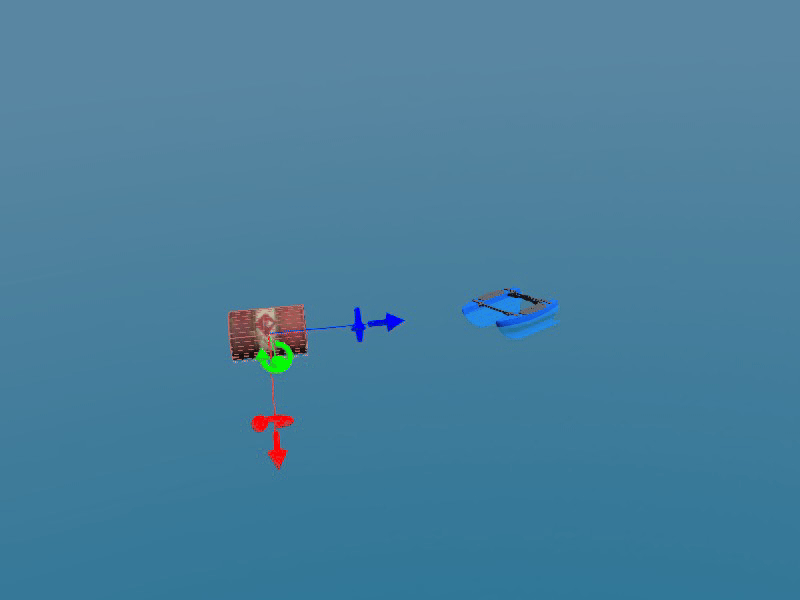

# BlueBoat USV




The BlueBoat USV (Unmanned Surface Vehicle) is a small autonomous watercraft developed by Blue Robotics. It is designed for various marine applications including navigation experiments, environmental monitoring, and autonomous surface operations.

---

## System Overview

The BlueBoat is a compact, versatile unmanned surface vehicle that provides an excellent platform for marine robotics research and development. Its modular design allows for extensive customization with various sensors and payloads.

### Key Features

- **Marine-Grade Design**: Waterproof and corrosion-resistant construction
- **Autonomous Capabilities**: GPS navigation and waypoint following
- **Modular Payload Bay**: Customizable sensor and equipment mounting
- **Long Endurance**: Extended operation time for marine missions
- **Remote Control**: Manual override and telemetry capabilities
- **Open Source**: Hardware and software designs available for customization

### Specifications

- **Length**: Approximately 1.2m 
- **Beam (Width)**: 0.6m
- **Draft**: 0.15m (shallow water capable)
- **Weight**: ~25kg (varies with payload)
- **Max Speed**: ~5 knots (2.5 m/s)
- **Endurance**: Several hours (battery dependent)
- **Communication**: Long-range radio telemetry

---

## Components

### Propulsion System
- **Motors**: Two thruster motors for differential thrust control
  - `left_motor`: Port side propulsion unit
  - `right_motor`: Starboard side propulsion unit
- **Propellers**: Optimized for efficiency and maneuverability
- **Control**: Variable speed control with reverse capability

### Hull Design
- **Catamaran Configuration**: Twin-hull design for stability
- **Buoyancy**: Positive buoyancy with safety margins
- **Payload Bay**: Central compartment for sensors and electronics
- **Waterproofing**: Sealed electronics compartments

### Available Sensors
- **GPS**: High-precision positioning for navigation
- **IMU**: 9-axis inertial measurement unit for orientation
- **Camera**: Optional visual monitoring and recording
- **Depth Sensor**: Water depth measurement capability
- **Environmental Sensors**: Temperature, pH, conductivity (optional)

---

## Simulink Integration

### Control Interface

The BlueBoat USV integrates seamlessly with Simulink through the webots-simulink bridge:

```matlab
% Motor control functions
wb_motor_set_velocity.m     % Set thruster velocities
wb_motor_get_position.m     % Get motor positions
wb_robot_step.m             % Main simulation step

% Sensor interface functions
wb_gps_get_values.m         % GPS position data
wb_imu_get_values.m         % Orientation and acceleration
wb_camera_get_image.m       % Visual data acquisition
```

### Navigation Control

The control system implements:

1. **Waypoint Navigation**: GPS-based path following
2. **Station Keeping**: Position holding against currents
3. **Heading Control**: Compass-based directional control
4. **Speed Control**: Velocity regulation for efficiency

---

## Control System Design

### Marine Vehicle Dynamics

The BlueBoat follows marine vehicle dynamics principles:

```matlab
% Surge motion (forward/backward)
X = thrust_force - drag_force

% Yaw motion (turning)
N = differential_thrust * beam_width/2

% Simple heading control
heading_error = desired_heading - current_heading;
rudder_command = Kp * heading_error;
```

### Differential Thrust Control

The BlueBoat uses differential thrust for maneuvering:

```python
# Forward movement
left_motor_speed = base_speed
right_motor_speed = base_speed

# Turn right
left_motor_speed = base_speed + turn_rate
right_motor_speed = base_speed - turn_rate

# Reverse
left_motor_speed = -base_speed
right_motor_speed = -base_speed
```

---

## Navigation Algorithms

### GPS Waypoint Following

The BlueBoat implements several navigation modes:

1. **Direct Navigation**: Straight-line path to target
2. **Waypoint Following**: Sequential waypoint navigation
3. **Loiter Mode**: Circular pattern around a point
4. **Return-to-Launch**: Automatic return to start position

### Environmental Adaptation

- **Current Compensation**: Drift correction using GPS feedback
- **Wind Resistance**: Heading adjustments for wind effects
- **Wave Response**: Motion filtering for sensor stability

---

## Mission Planning

### Typical Mission Profiles

1. **Environmental Monitoring**:
   - Water quality sampling along transects
   - Temperature and pH measurement
   - Pollution detection and mapping

2. **Bathymetric Surveys**:
   - Depth mapping using sonar
   - Underwater terrain modeling
   - Harbor and coastal surveys

3. **Search and Rescue Support**:
   - Visual search patterns
   - Emergency equipment delivery
   - Communication relay operations

4. **Research Applications**:
   - Marine biology data collection
   - Oceanographic measurements
   - Long-term environmental monitoring

---

## Usage Examples

### Basic Operation

1. **Setup**: Load the BlueBoat world file in Webots
2. **Configuration**: Set desired sensors in the `body_slot`
3. **Mission Planning**: Define waypoints and mission parameters
4. **Execution**: Launch autonomous mission or manual control

### Simulink Control

```matlab
% Example mission parameters
mission_waypoints = [
    0, 0;       % Start position
    100, 0;     % First waypoint
    100, 100;   % Second waypoint
    0, 100;     % Third waypoint
    0, 0        % Return home
];

% Control loop
for i = 1:length(mission_waypoints)
    navigate_to_waypoint(mission_waypoints(i,:));
    wait_for_arrival();
end
```

### Sensor Integration

The BlueBoat's modular design allows for various sensor configurations:

- **Basic Configuration**: GPS + IMU for navigation
- **Mapping Configuration**: + Sonar for bathymetry
- **Monitoring Configuration**: + Water quality sensors
- **Research Configuration**: + Multiple scientific instruments

---

## Performance Characteristics

### Operating Parameters
- **Typical Speed**: 2-3 knots for efficient operation
- **Maximum Speed**: ~5 knots in calm conditions
- **Turning Radius**: ~2 boat lengths minimum
- **Position Accuracy**: ±2-5 meters (GPS dependent)
- **Mission Duration**: 2-6 hours (battery/fuel dependent)

### Environmental Limits
- **Wave Height**: Up to 0.5m significant wave height
- **Wind Speed**: Up to 15 knots sustained
- **Operating Temperature**: -10°C to +50°C
- **Water Depth**: Minimum 0.2m depth required

---

## Safety and Regulations

### Safety Features
- **Fail-Safe Return**: Automatic return on communication loss
- **Low Battery Return**: Automatic return at low power
- **Emergency Stop**: Remote emergency shutdown capability
- **Status Monitoring**: Real-time telemetry and alerts

### Regulatory Compliance
- **Maritime Regulations**: Comply with local USV regulations
- **Navigation Rules**: Follow maritime traffic rules
- **Communication**: Maintain VHF radio monitoring
- **Visual Identification**: Proper lighting and marking

---

## Applications and Use Cases

### Research and Development
- **Algorithm Testing**: Navigation and control algorithm validation
- **Sensor Development**: New marine sensor integration and testing
- **Multi-Vehicle Operations**: Swarm and collaborative behaviors

### Commercial Applications
- **Aquaculture**: Fish farm monitoring and maintenance
- **Port Operations**: Harbor patrol and monitoring
- **Environmental Services**: Water quality monitoring and assessment

### Educational Applications
- **Marine Robotics Courses**: Hands-on USV control and programming
- **Oceanography**: Data collection methods and instruments
- **Control Systems**: Marine vehicle dynamics and control

---

## References

- [Blue Robotics BlueBoat](https://bluerobotics.com/product-category/boat/)
- [Marine Vehicle Dynamics](https://doi.org/10.1002/9781118647172)
- [Unmanned Surface Vehicles](https://link.springer.com/book/10.1007/978-3-319-16649-0)
- [Webots Marine Simulation](https://cyberbotics.com/doc/guide/samples-marine)

**Educational Purpose:**
The BlueBoat USV simulation provides an excellent platform for learning marine robotics concepts including marine vehicle dynamics, GPS navigation, environmental monitoring, and autonomous surface operations. The integration with Simulink enables rapid development and testing of marine control algorithms in a realistic virtual environment before deployment on actual hardware.

