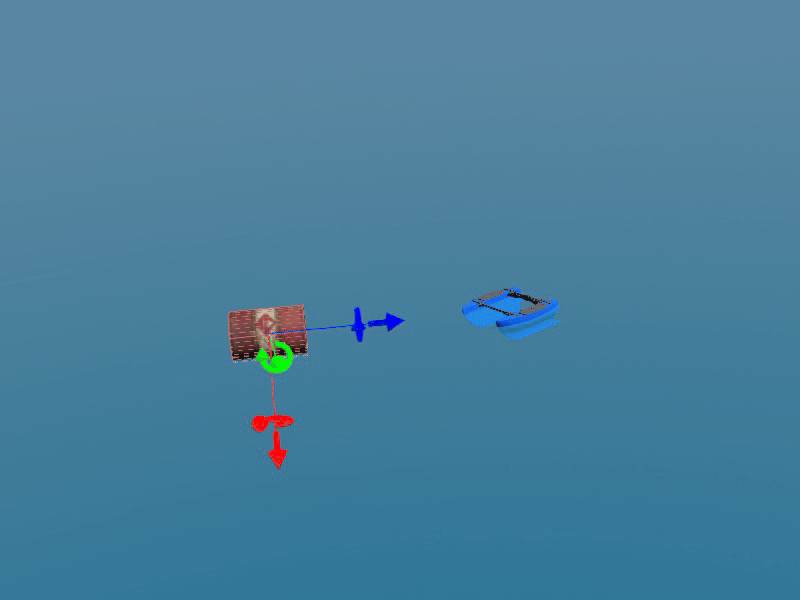

# BlueBoat USV

BlueBoat is a small unmanned surface vehicle developed by Blue Robotics. It is designed to be used for various applications such as navigation and control experiments.

## System Modeling

The system consists of the following components:
 * Propeller: The propeller drives the motors that power the thrusters.
 * Thrusters: The thrusters generate thrust in all directions, allowing the vehicle to move forward or backward.
 * Motors: The motors provide power to the thrusters and control their speed.
 * Thruster Control System: This system controls the thrusters based on the desired motion of the vehicle.

