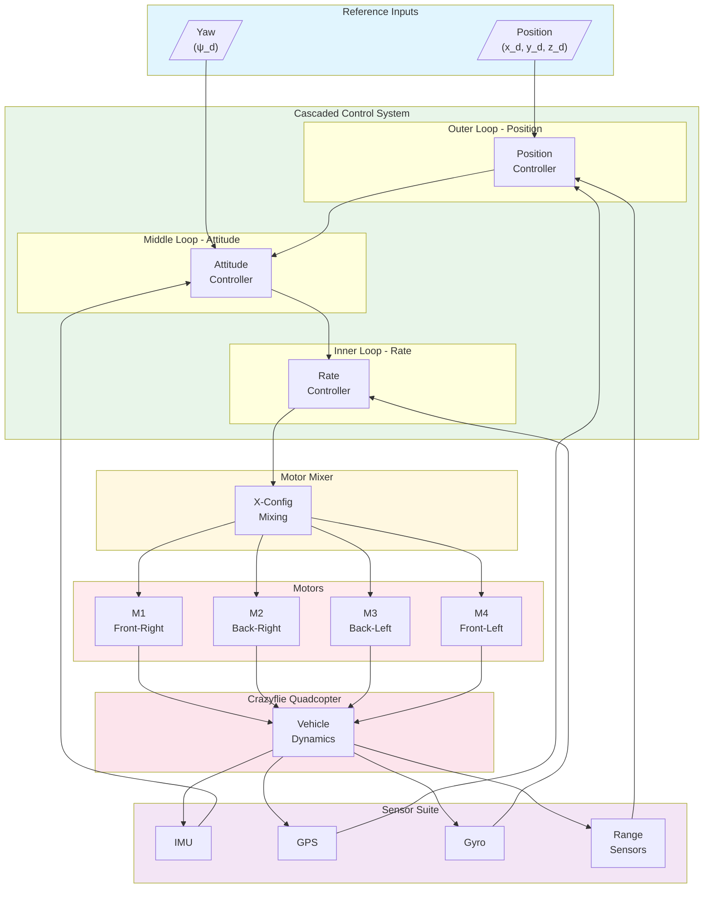
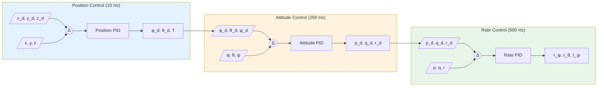
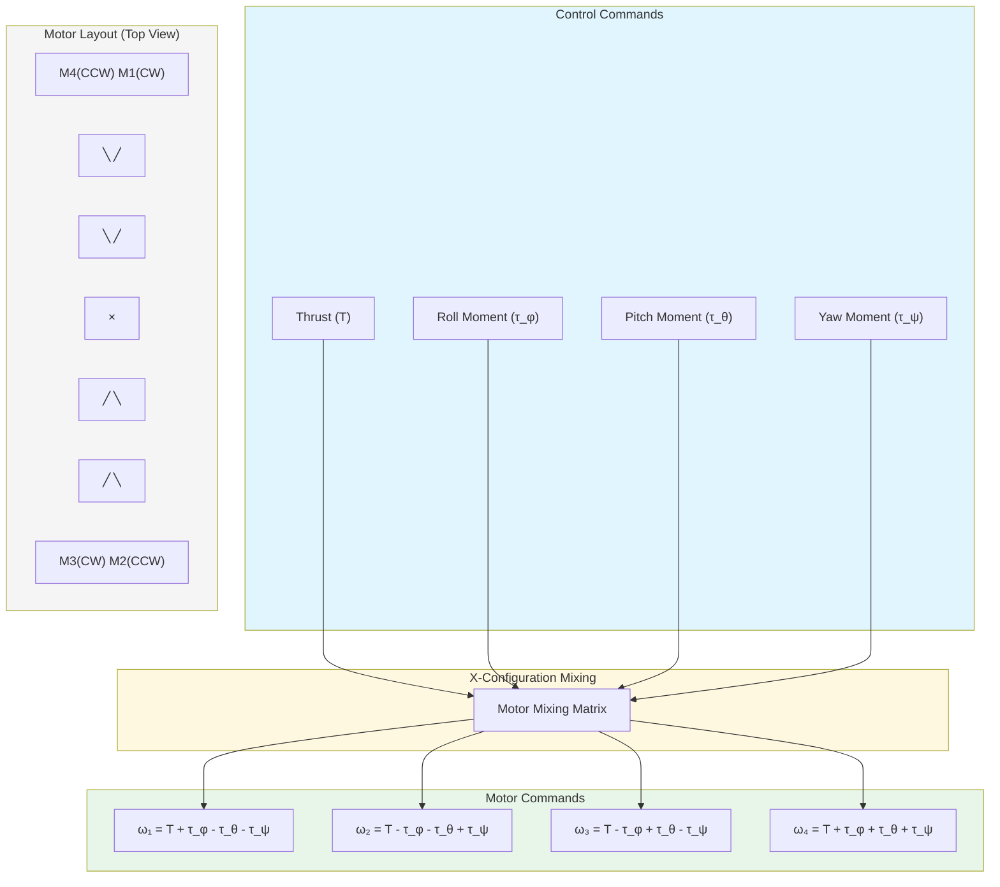
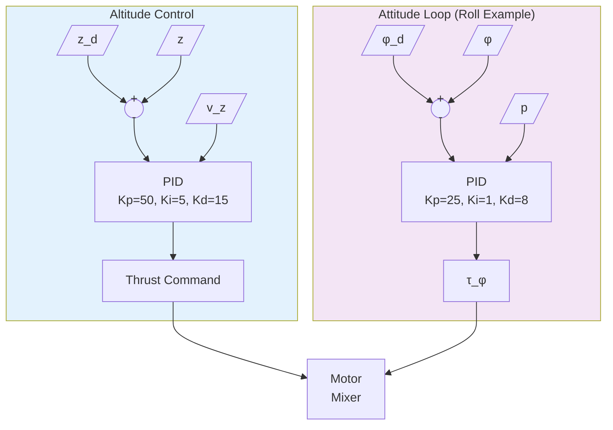

# Crazyflie Drone


## Simulink Architecture


The Crazyflie is a nano quadcopter developed by Bitcraze, widely used for research and education in aerial robotics. This simulation provides a comprehensive platform for developing and testing quadcopter control algorithms using Simulink.

---

## System Overview

The Crazyflie quadcopter is a compact, lightweight aerial platform ideal for indoor flight experiments and control system development. The Webots simulation accurately models the vehicle dynamics and sensor characteristics.

### Key Features

- **Nano Quadcopter Design**: Compact and lightweight for indoor operations
- **Full 6-DOF Control**: Complete attitude and position control
- **Multiple Sensors**: IMU, GPS, gyroscope, camera, and range finders
- **State-Space Model**: Pre-configured dynamics for controller design
- **Obstacle Detection**: Four-directional range sensors

### Specifications

| Parameter | Value |
|-----------|-------|
| Weight | 35g |
| Dimensions | 9 x 9 x 4.5 cm |
| Motors | 4 x Coreless DC motors (m1-m4) |
| Propellers | 3-inch propellers |
| Configuration | X-configuration quadcopter |

---

## Physical Parameters

The simulation uses accurate physical parameters for realistic dynamics:

```matlab
% Physical constants
g = 9.80665;              % Gravity [m/s²]
l1 = 0.0465;              % Arm length X [m]
l2 = 0.045;               % Arm length Y [m]
m_drone = 0.03097;        % Mass [kg]

% Inertia tensor components
Ix = 1.112951e-5;         % Roll inertia [kg*m²]
Iy = 1.1143608e-5;        % Pitch inertia [kg*m²]
Iz = 2.162056e-5;         % Yaw inertia [kg*m²]

% Damping coefficients
b_roll = 1e-5;            % Angular damping (roll)
b_pitch = 1e-5;           % Angular damping (pitch)
b_yaw = 1e-5;             % Angular damping (yaw)
b_drone = 1e-9;           % Translational damping

% Motor parameters
km = 3.5077E-10;          % Thrust coefficient
```

---

## Components

### Motors

| Motor | Device Name | Position |
|-------|-------------|----------|
| Motor 1 | `m1_motor` | Front-right (CCW) |
| Motor 2 | `m2_motor` | Back-right (CW) |
| Motor 3 | `m3_motor` | Back-left (CCW) |
| Motor 4 | `m4_motor` | Front-left (CW) |

### Sensors

| Sensor | Device Name | Description |
|--------|-------------|-------------|
| Inertial Unit | `inertial unit` | Roll, pitch, yaw orientation |
| GPS | `gps` | 3D position (x, y, z) |
| Gyroscope | `gyro` | Angular velocity (p, q, r) |
| Camera | `camera` | Visual sensing |

### Range Sensors

| Sensor | Device Name | Direction |
|--------|-------------|-----------|
| Front Range | `range_front` | +X direction |
| Left Range | `range_left` | +Y direction |
| Back Range | `range_back` | -X direction |
| Right Range | `range_right` | -Y direction |

---

## State-Space Model

The Crazyflie dynamics are modeled using state-space representation for controller design.

### State Vector

```
x = [roll, pitch, yaw, p, q, r, z, vz]ᵀ
```

Where:
- `roll, pitch, yaw`: Euler angles [rad]
- `p, q, r`: Angular velocities [rad/s]
- `z`: Altitude [m]
- `vz`: Vertical velocity [m/s]

### Input Vector

```
u = [thrust, roll_moment, pitch_moment, yaw_moment]ᵀ
```

### State-Space Matrices

```matlab
% A matrix (8x8) - System dynamics
A = zeros(8,8);
A(1:3, 4:6) = eye(3);           % Angle-rate coupling
A(4,4) = -b_roll/Ix;            % Roll damping
A(5,5) = -b_pitch/Iy;           % Pitch damping
A(6,6) = -b_yaw/Iz;             % Yaw damping
A(7,8) = 1;                     % Altitude-velocity coupling
A(8,8) = -b_drone/m_drone;      % Vertical damping

% B matrix (8x4) - Input mapping
B = zeros(8,4);
B(4,2) = l1/Ix;                 % Roll moment input
B(5,3) = l2/Iy;                 % Pitch moment input
B(6,4) = 1/Iz;                  % Yaw moment input
B(8,1) = 1/m_drone;             % Thrust input

% C matrix - Full state output
C = eye(8);

% D matrix - No direct feedthrough
D = zeros(8,4);
```

---

## Simulink Integration

### Available MATLAB Functions

**Motor Control:**
```matlab
wb_motor_set_velocity(tag, velocity)    % Set motor speed
wb_motor_set_position(tag, position)    % Set motor position
wb_motor_set_torque(tag, torque)        % Set motor torque
```

**Sensor Reading:**
```matlab
wb_inertial_unit_get_roll_pitch_yaw(tag) % Get orientation [roll, pitch, yaw]
wb_gps_get_values(tag)                   % Get position [x, y, z]
wb_gyro_get_values(tag)                  % Get angular rates [p, q, r]
wb_distance_sensor_get_value(tag)        % Get range sensor distance
wb_camera_get_image(tag)                 % Get camera image
```

**Simulation Control:**
```matlab
wb_robot_step(TIME_STEP)                 % Advance simulation
```

### Initialization Script

```matlab
TIME_STEP = 16;

% Initialize IMU
imu = wb_robot_get_device('inertial unit');
wb_inertial_unit_enable(imu, TIME_STEP);

% Initialize GPS
gps = wb_robot_get_device('gps');
wb_gps_enable(gps, TIME_STEP);

% Initialize Gyroscope
gyro = wb_robot_get_device('gyro');
wb_gyro_enable(gyro, TIME_STEP);

% Initialize Camera
camera = wb_robot_get_device('camera');
wb_camera_enable(camera, TIME_STEP);

% Initialize Range Sensors
range_front = wb_robot_get_device('range_front');
wb_distance_sensor_enable(range_front, TIME_STEP);

range_left = wb_robot_get_device('range_left');
wb_distance_sensor_enable(range_left, TIME_STEP);

range_back = wb_robot_get_device('range_back');
wb_distance_sensor_enable(range_back, TIME_STEP);

range_right = wb_robot_get_device('range_right');
wb_distance_sensor_enable(range_right, TIME_STEP);

% Initialize Motors
m1_motor = wb_robot_get_device('m1_motor');
m2_motor = wb_robot_get_device('m2_motor');
m3_motor = wb_robot_get_device('m3_motor');
m4_motor = wb_robot_get_device('m4_motor');
```

---

## Control System Design

### System Block Diagram



### Cascaded Control Architecture



### Motor Mixing (X-Configuration)



### Control Loop Details



### Attitude Control

The inner loop controls roll, pitch, and yaw using PID controllers:

```matlab
% PID gains for attitude control
Kp_roll = 25;   Ki_roll = 1;    Kd_roll = 8;
Kp_pitch = 25;  Ki_pitch = 1;   Kd_pitch = 8;
Kp_yaw = 10;    Ki_yaw = 0.5;   Kd_yaw = 2;

% Attitude controller
function [roll_cmd, pitch_cmd, yaw_cmd] = attitude_control(current, desired)
    roll_error = desired.roll - current.roll;
    pitch_error = desired.pitch - current.pitch;
    yaw_error = desired.yaw - current.yaw;

    roll_cmd = Kp_roll * roll_error + Kd_roll * (0 - current.p);
    pitch_cmd = Kp_pitch * pitch_error + Kd_pitch * (0 - current.q);
    yaw_cmd = Kp_yaw * yaw_error + Kd_yaw * (0 - current.r);
end
```

### Altitude Control

Outer loop for altitude hold:

```matlab
% PID gains for altitude control
Kp_z = 50;  Ki_z = 5;  Kd_z = 15;

% Altitude controller
function thrust = altitude_control(z_current, z_desired, vz_current)
    z_error = z_desired - z_current;
    thrust = m_drone * g + Kp_z * z_error + Kd_z * (0 - vz_current);
    thrust = max(0, min(thrust, max_thrust));  % Saturation
end
```

### Motor Mixing

Convert control commands to individual motor speeds:

```matlab
function [w1, w2, w3, w4] = motor_mixing(thrust, roll_cmd, pitch_cmd, yaw_cmd)
    % X-configuration mixing
    w1 = thrust + roll_cmd - pitch_cmd - yaw_cmd;  % Front-right
    w2 = thrust - roll_cmd - pitch_cmd + yaw_cmd;  % Back-right
    w3 = thrust - roll_cmd + pitch_cmd - yaw_cmd;  % Back-left
    w4 = thrust + roll_cmd + pitch_cmd + yaw_cmd;  % Front-left

    % Apply motor limits
    w1 = max(0, min(w1, max_motor_speed));
    w2 = max(0, min(w2, max_motor_speed));
    w3 = max(0, min(w3, max_motor_speed));
    w4 = max(0, min(w4, max_motor_speed));
end
```

---

## Usage Examples

### Basic Operation

1. **Load World**: Open `crazyflie/worlds/crazyflie_control.wbt` in Webots
2. **Set Controller**: Select `crazyflie_simulink_control` as the controller
3. **Open Simulink**: Load `simulink_control.slx` in MATLAB
4. **Run Simulation**: Start both Webots and Simulink

### Hover Control Example

```matlab
% Simple hover controller
desired_altitude = 1.0;  % meters
desired_yaw = 0;         % radians

while wb_robot_step(TIME_STEP) ~= -1
    % Read sensors
    orientation = wb_inertial_unit_get_roll_pitch_yaw(imu);
    position = wb_gps_get_values(gps);
    angular_rates = wb_gyro_get_values(gyro);

    % Compute control
    thrust = altitude_control(position(3), desired_altitude, angular_rates(3));
    [roll_cmd, pitch_cmd, yaw_cmd] = attitude_control(...);

    % Motor mixing
    [w1, w2, w3, w4] = motor_mixing(thrust, roll_cmd, pitch_cmd, yaw_cmd);

    % Apply motor commands
    wb_motor_set_velocity(m1_motor, w1);
    wb_motor_set_velocity(m2_motor, w2);
    wb_motor_set_velocity(m3_motor, w3);
    wb_motor_set_velocity(m4_motor, w4);
end
```

### Position Control

Cascade control structure for waypoint navigation:

```matlab
% Position controller (outer loop)
function [roll_des, pitch_des] = position_control(pos_current, pos_desired, yaw)
    % Position error in world frame
    ex = pos_desired(1) - pos_current(1);
    ey = pos_desired(2) - pos_current(2);

    % Transform to body frame
    ex_body = cos(yaw) * ex + sin(yaw) * ey;
    ey_body = -sin(yaw) * ex + cos(yaw) * ey;

    % Desired attitude commands
    pitch_des = Kp_pos * ex_body;
    roll_des = -Kp_pos * ey_body;

    % Limit angles
    pitch_des = max(-max_angle, min(pitch_des, max_angle));
    roll_des = max(-max_angle, min(roll_des, max_angle));
end
```

---

## Applications

### Research Applications

- **Control Algorithm Development**: Test new attitude and position controllers
- **State Estimation**: Implement sensor fusion algorithms
- **Path Planning**: Develop trajectory generation and following
- **Swarm Robotics**: Multi-quadcopter coordination studies

### Educational Applications

- **Flight Dynamics**: Understanding quadcopter physics
- **Control Systems**: PID, LQR, and model predictive control
- **Sensor Fusion**: Complementary and Kalman filtering
- **Embedded Systems**: Real-time control implementation

---

## File Structure

```
crazyflie/
├── controllers/
│   └── crazyflie_simulink_control/    # Simulink integration
│       ├── crazyflie_simulink_control.m  # Initialization with state-space model
│       ├── simulink_control.slx          # Main Simulink model
│       └── wb_*.m                        # MATLAB wrapper functions
└── worlds/
    └── crazyflie_control.wbt             # Webots world file
```

---

## References

- [Bitcraze Crazyflie](https://www.bitcraze.io/products/crazyflie-2-1/)
- [MATLAB Crazyflie Simulation](https://www.mathworks.com/matlabcentral/fileexchange/65469-crazyflie-quadcopter-simulation-using-simmechanics)
- [Quadcopter Dynamics and Control](https://scholarsarchive.byu.edu/facpub/1325/)
- [Webots Crazyflie Model](https://cyberbotics.com/doc/guide/crazyflie)

**Educational Purpose:**
The Crazyflie simulation provides an excellent platform for learning quadcopter dynamics, control system design, and sensor integration. The state-space model enables rigorous controller design using modern control techniques including LQR, pole placement, and model predictive control.
