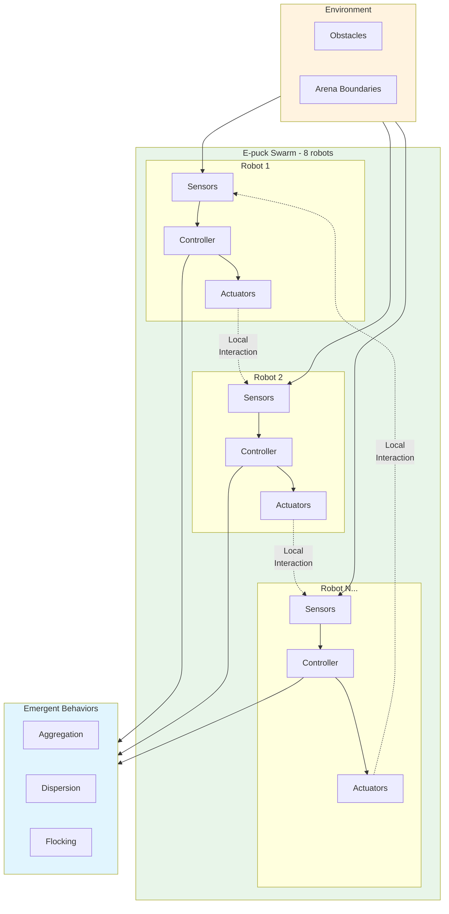
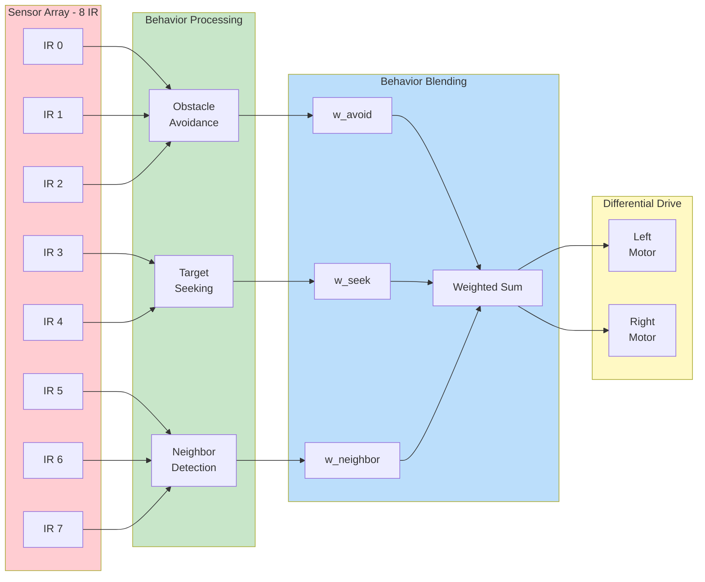
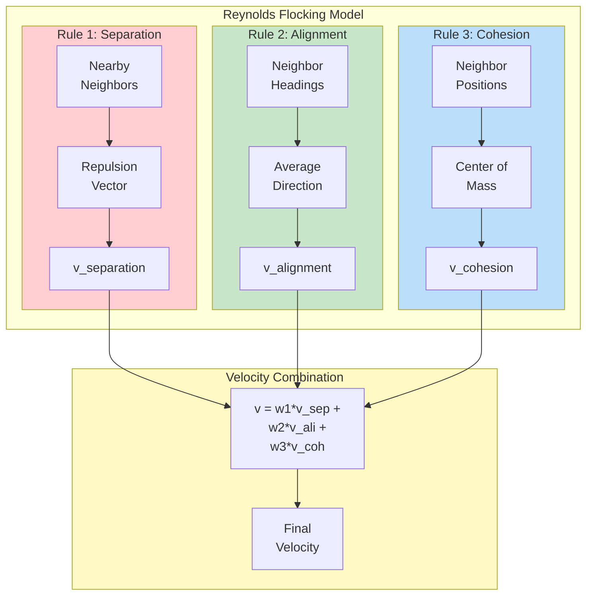
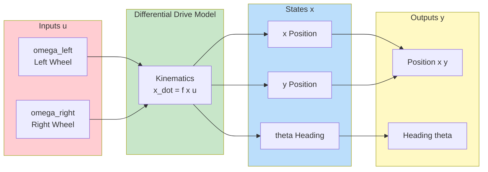

# E-puck Swarm Robotics

This example demonstrates swarm robotics using multiple E-puck robots with MATLAB/Simulink control.


---

## Overview

| Property | Value |
|----------|-------|
| **Type** | Swarm Robotics / Multi-Robot System |
| **Robot** | E-puck (8 instances) |
| **Difficulty** | Intermediate |
| **Control Method** | Decentralized / Behavior-based |

---

## Features

- **Multiple Robot Coordination**: 8 E-puck robots working together
- **Decentralized Control**: Each robot runs independently
- **Swarm Behaviors**: Aggregation, dispersion, flocking
- **Proximity Sensing**: 8 IR sensors per robot
- **Inter-Robot Communication**: IR-based local communication

---

## E-puck Specifications

| Property | Value |
|----------|-------|
| Diameter | 70 mm |
| Height | 50 mm |
| Max Speed | 0.13 m/s |
| Sensors | 8 IR proximity, Camera, Accelerometer |
| Communication | IR emitter/receiver |

---

## Control Architecture

### Swarm System Overview



### Individual Robot Control Architecture



### Reynolds Flocking Rules



### State-Space Model (Single Robot)



---

## State-Space Model

### Differential Drive Kinematics

```matlab
% State vector: x = [x, y, theta]'
% Input vector: u = [omega_left, omega_right]'

% E-puck parameters
r = 0.0205;     % Wheel radius [m]
L = 0.052;      % Wheel separation [m]

% Kinematic equations (non-linear)
% x_dot = (r/2)(omega_left + omega_right)cos(theta)
% y_dot = (r/2)(omega_left + omega_right)sin(theta)
% theta_dot = (r/L)(omega_right - omega_left)

% Convert to linear/angular velocity
v = (r/2) * (omega_left + omega_right);    % Linear velocity
omega = (r/L) * (omega_right - omega_left); % Angular velocity

% State derivatives
x_dot = v * cos(theta);
y_dot = v * sin(theta);
theta_dot = omega;
```

### Swarm State Representation

```matlab
% Full swarm state (N robots)
% X = [x1, y1, theta1, x2, y2, theta2, ..., xN, yN, thetaN]'

N = 8;  % Number of robots
state_dim = 3;  % States per robot

% Swarm centroid
centroid_x = mean([x1, x2, x3, x4, x5, x6, x7, x8]);
centroid_y = mean([y1, y2, y3, y4, y5, y6, y7, y8]);

% Swarm dispersion (spread)
dispersion = std([positions]);

% Swarm polarization (alignment)
polarization = norm(mean([cos(theta); sin(theta)], 2));
```

---

## Swarm Behaviors

### Aggregation
Robots gather in a common area based on local sensing.

```matlab
function [v_left, v_right] = aggregation_behavior(ir_sensors, neighbor_pos)
    % Move toward detected neighbors
    attraction = zeros(2, 1);
    for i = 1:length(neighbor_pos)
        dir = neighbor_pos(i, :) - current_pos;
        attraction = attraction + dir / norm(dir);
    end

    % Convert to wheel velocities
    [v_left, v_right] = vector_to_wheels(attraction);
end
```

### Dispersion
Robots spread out evenly in the environment.

```matlab
function [v_left, v_right] = dispersion_behavior(ir_sensors)
    % Move away from nearby neighbors
    repulsion = zeros(2, 1);
    sensor_angles = [1.57, 0.79, 0, -0.79, -1.57, -2.36, 3.14, 2.36];

    for i = 1:8
        if ir_sensors(i) > threshold
            angle = sensor_angles(i);
            repulsion = repulsion - [cos(angle); sin(angle)] * ir_sensors(i);
        end
    end

    [v_left, v_right] = vector_to_wheels(repulsion);
end
```

### Flocking
Reynolds rules: separation, alignment, cohesion.

```matlab
function [v_left, v_right] = flocking_behavior(neighbors)
    % Separation: avoid crowding
    v_sep = separation(neighbors);

    % Alignment: steer toward average heading
    v_ali = alignment(neighbors);

    % Cohesion: steer toward center of mass
    v_coh = cohesion(neighbors);

    % Weighted combination
    w_sep = 1.5; w_ali = 1.0; w_coh = 1.0;
    v_total = w_sep*v_sep + w_ali*v_ali + w_coh*v_coh;

    [v_left, v_right] = vector_to_wheels(v_total);
end
```

---

## Simulink Integration

### Initialization Script

```matlab
TIME_STEP = 64;

% Initialize proximity sensors (8 IR sensors)
ps = zeros(1, 8);
for i = 0:7
    ps(i+1) = wb_robot_get_device(['ps' num2str(i)]);
    wb_distance_sensor_enable(ps(i+1), TIME_STEP);
end

% Initialize motors
left_motor = wb_robot_get_device('left wheel motor');
right_motor = wb_robot_get_device('right wheel motor');
wb_motor_set_position(left_motor, inf);
wb_motor_set_position(right_motor, inf);
wb_motor_set_velocity(left_motor, 0);
wb_motor_set_velocity(right_motor, 0);

% Behavior weights
w_obstacle = 2.0;
w_flocking = 1.0;
```

### Control Loop

```matlab
while wb_robot_step(TIME_STEP) ~= -1
    % Read all proximity sensors
    ir_values = zeros(1, 8);
    for i = 1:8
        ir_values(i) = wb_distance_sensor_get_value(ps(i));
    end

    % Obstacle avoidance (reactive)
    [v_avoid_l, v_avoid_r] = obstacle_avoidance(ir_values);

    % Flocking behavior
    [v_flock_l, v_flock_r] = flocking_behavior(ir_values);

    % Blend behaviors
    v_left = w_obstacle * v_avoid_l + w_flocking * v_flock_l;
    v_right = w_obstacle * v_avoid_r + w_flocking * v_flock_r;

    % Apply motor commands
    wb_motor_set_velocity(left_motor, v_left);
    wb_motor_set_velocity(right_motor, v_right);
end
```

---

## Quick Start

1. **Open Webots** and load `examples/epuck_swarm/worlds/swarm_arena.wbt`
2. **Configure MATLAB** as the controller
3. **Run simulation** to observe collective behavior
4. **Modify behavior** parameters in Simulink model

---

## Performance Metrics

| Metric | Description | Formula |
|--------|-------------|---------|
| Aggregation | Swarm compactness | dispersion = sqrt(sum((r_i - r_mean)^2)/N) |
| Polarization | Heading alignment | P = norm(sum(e_i))/N |
| Connectivity | Communication graph | C = edges/max_edges |

---

## References

- [E-puck Official](http://www.e-puck.org/)
- [Webots E-puck](https://cyberbotics.com/doc/guide/epuck)
- Reynolds, C. W. (1987). "Flocks, herds and schools"
- Brambilla, M. et al. (2013). "Swarm Robotics: A Review"
