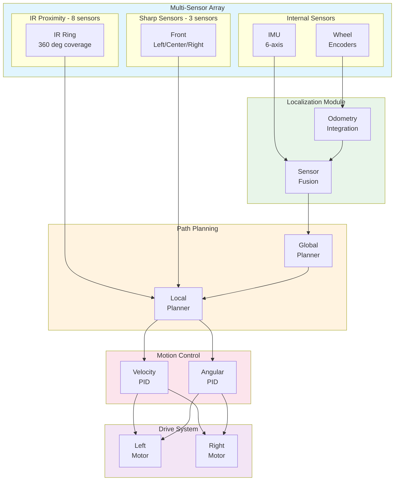
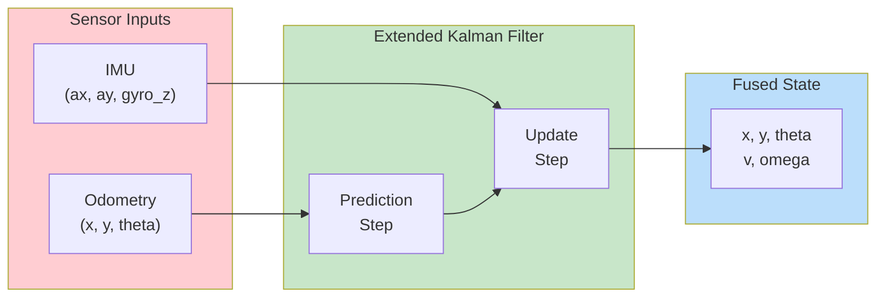
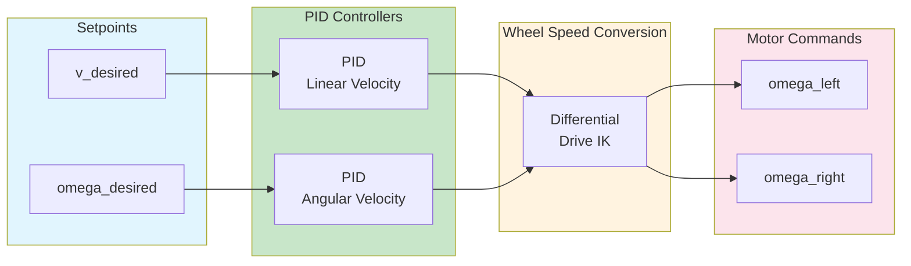
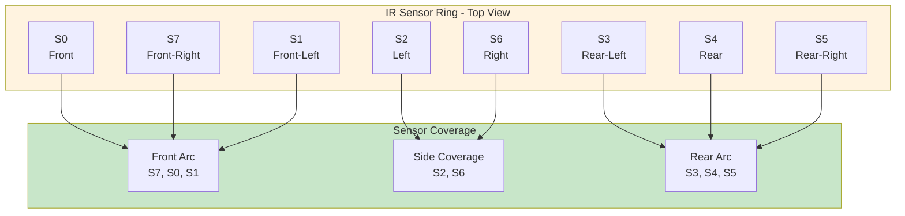

# Firebird 6 Mobile Robot

This example demonstrates the Firebird 6 robot with MATLAB/Simulink.

---

## Overview

| Property | Value |
|----------|-------|
| **Type** | Mobile Research Platform |
| **Robot** | Nex Robotics Firebird 6 |
| **Difficulty** | Intermediate |
| **Control Method** | Differential Drive / PID |

---

## Features

- **8 IR Proximity Sensors**: Obstacle detection
- **3 Sharp Distance Sensors**: Long-range sensing
- **Wheel Encoders**: Odometry
- **IMU**: Orientation sensing

---

## Specifications

| Property | Value |
|----------|-------|
| Diameter | 195 mm |
| Height | 100 mm |
| Weight | 1.2 kg |
| Max Speed | 0.5 m/s |
| Wheel Radius | 25 mm |
| Wheel Base | 150 mm |

---

## Control Architecture

### System Block Diagram



### Sensor Fusion Architecture



### PID Velocity Controller



### IR Sensor Ring Configuration



---

## State-Space Model

### Differential Drive Kinematics

```matlab
% State vector: x = [x, y, theta]'
% Input vector: u = [omega_L, omega_R]'

% Robot parameters
r = 0.025;      % Wheel radius [m]
L = 0.150;      % Wheel base [m]

% Kinematic equations
% x_dot = (r/2)(omega_L + omega_R)cos(theta)
% y_dot = (r/2)(omega_L + omega_R)sin(theta)
% theta_dot = (r/L)(omega_R - omega_L)

% Body velocities
v = (r/2) * (omega_L + omega_R);      % Linear velocity
omega = (r/L) * (omega_R - omega_L);   % Angular velocity

% Transformation matrix
T = [cos(theta), 0;
     sin(theta), 0;
     0,          1];

x_dot = T * [v; omega];
```

### Dynamic Model with Inertia

```matlab
% Extended state: x = [x, y, theta, v, omega]'
% Input: u = [tau_L, tau_R]' (motor torques)

% Physical parameters
m = 1.2;        % Robot mass [kg]
I_z = 0.02;     % Yaw inertia [kg*m^2]
J_w = 0.0005;   % Wheel inertia [kg*m^2]
b = 0.05;       % Viscous friction [N*m*s]

% Motor model (DC motor)
K_t = 0.01;     % Torque constant [N*m/A]
K_e = 0.01;     % Back-EMF constant [V*s/rad]
R_m = 1.0;      % Motor resistance [Ohm]
L_m = 0.001;    % Motor inductance [H]

% State-space matrices (linearized)
A = zeros(5, 5);
A(1, 4) = 1;            % x from v (linearized at theta=0)
A(3, 5) = 1;            % theta from omega
A(4, 4) = -b / m;       % velocity damping
A(5, 5) = -b * L^2 / (4 * I_z);  % angular damping

B = zeros(5, 2);
B(4, 1) = r / (2 * m);  B(4, 2) = r / (2 * m);
B(5, 1) = -r / (L * I_z);  B(5, 2) = r / (L * I_z);

C = [1 0 0 0 0;   % x position
     0 1 0 0 0;   % y position
     0 0 1 0 0;   % theta
     0 0 0 1 0;   % velocity
     0 0 0 0 1];  % angular velocity

D = zeros(5, 2);
```

### Extended Kalman Filter

```matlab
function [x_est, P] = ekf_update(x_est, P, u, z, dt)
    % EKF for robot localization

    % State: [x, y, theta, v, omega]
    % Measurement: [x_odom, y_odom, theta_odom, ax, ay, gyro_z]

    % Process model
    f = @(x, u) [x(1) + x(4)*cos(x(3))*dt;
                 x(2) + x(4)*sin(x(3))*dt;
                 x(3) + x(5)*dt;
                 x(4);  % Assume constant velocity
                 x(5)]; % Assume constant angular velocity

    % Jacobian of process model
    F = [1, 0, -x_est(4)*sin(x_est(3))*dt, cos(x_est(3))*dt, 0;
         0, 1,  x_est(4)*cos(x_est(3))*dt, sin(x_est(3))*dt, 0;
         0, 0,  1,                         0,                dt;
         0, 0,  0,                         1,                0;
         0, 0,  0,                         0,                1];

    % Process noise
    Q = diag([0.01, 0.01, 0.001, 0.1, 0.1]);

    % Prediction
    x_pred = f(x_est, u);
    P_pred = F * P * F' + Q;

    % Measurement model
    H = [1, 0, 0, 0, 0;   % x from odometry
         0, 1, 0, 0, 0;   % y from odometry
         0, 0, 1, 0, 0;   % theta from odometry
         0, 0, 0, 0, 0;   % ax (not directly used)
         0, 0, 0, 0, 0;   % ay
         0, 0, 0, 0, 1];  % gyro_z

    % Measurement noise
    R = diag([0.05, 0.05, 0.01, 0.1, 0.1, 0.01]);

    % Update
    y = z - H * x_pred;          % Innovation
    S = H * P_pred * H' + R;     % Innovation covariance
    K = P_pred * H' / S;         % Kalman gain

    x_est = x_pred + K * y;
    P = (eye(5) - K * H) * P_pred;
end
```

---

## Control Design

### PID Velocity Controller

```matlab
function [omega_L, omega_R] = velocity_pid_control(v_des, omega_des, v_meas, omega_meas, params)
    % Dual PID controller for differential drive

    persistent v_integral omega_integral v_prev omega_prev
    if isempty(v_integral)
        v_integral = 0; omega_integral = 0;
        v_prev = 0; omega_prev = 0;
    end

    dt = params.dt;

    % Linear velocity PID
    v_error = v_des - v_meas;
    v_integral = v_integral + v_error * dt;
    v_derivative = (v_error - v_prev) / dt;

    v_cmd = params.Kp_v * v_error + ...
            params.Ki_v * v_integral + ...
            params.Kd_v * v_derivative;

    v_prev = v_error;

    % Angular velocity PID
    omega_error = omega_des - omega_meas;
    omega_integral = omega_integral + omega_error * dt;
    omega_derivative = (omega_error - omega_prev) / dt;

    omega_cmd = params.Kp_w * omega_error + ...
                params.Ki_w * omega_integral + ...
                params.Kd_w * omega_derivative;

    omega_prev = omega_error;

    % Convert to wheel speeds
    r = params.wheel_radius;
    L = params.wheel_base;

    omega_L = (v_cmd - omega_cmd * L/2) / r;
    omega_R = (v_cmd + omega_cmd * L/2) / r;

    % Saturation
    omega_max = params.omega_max;
    omega_L = max(-omega_max, min(omega_max, omega_L));
    omega_R = max(-omega_max, min(omega_max, omega_R));
end
```

### Waypoint Following

```matlab
function [v_des, omega_des] = waypoint_controller(x, y, theta, waypoint, params)
    % Pure pursuit waypoint following

    % Error to waypoint
    dx = waypoint(1) - x;
    dy = waypoint(2) - y;
    dist = sqrt(dx^2 + dy^2);

    % Angle to waypoint
    angle_to_wp = atan2(dy, dx);
    angle_error = angle_to_wp - theta;
    angle_error = atan2(sin(angle_error), cos(angle_error));  % Normalize

    % Control law
    if dist > params.goal_tolerance
        v_des = params.k_rho * min(dist, params.v_max / params.k_rho);
        omega_des = params.k_alpha * angle_error;
    else
        v_des = 0;
        omega_des = 0;
    end

    % Reduce speed when turning sharply
    if abs(angle_error) > pi/4
        v_des = v_des * 0.5;
    end

    % Saturation
    v_des = max(0, min(params.v_max, v_des));
    omega_des = max(-params.omega_max, min(params.omega_max, omega_des));
end
```

---

## Simulink Integration

### Initialization Script

```matlab
TIME_STEP = 16;

% Initialize IR proximity sensors
ir_sensors = zeros(1, 8);
for i = 0:7
    ir_sensors(i+1) = wb_robot_get_device(['ir' num2str(i)]);
    wb_distance_sensor_enable(ir_sensors(i+1), TIME_STEP);
end

% Initialize Sharp distance sensors
sharp_sensors = zeros(1, 3);
sharp_names = {'sharp_left', 'sharp_center', 'sharp_right'};
for i = 1:3
    sharp_sensors(i) = wb_robot_get_device(sharp_names{i});
    wb_distance_sensor_enable(sharp_sensors(i), TIME_STEP);
end

% Initialize IMU
imu = wb_robot_get_device('imu');
wb_inertial_unit_enable(imu, TIME_STEP);

gyro = wb_robot_get_device('gyro');
wb_gyro_enable(gyro, TIME_STEP);

accel = wb_robot_get_device('accelerometer');
wb_accelerometer_enable(accel, TIME_STEP);

% Initialize wheel encoders
left_encoder = wb_robot_get_device('left_encoder');
right_encoder = wb_robot_get_device('right_encoder');
wb_position_sensor_enable(left_encoder, TIME_STEP);
wb_position_sensor_enable(right_encoder, TIME_STEP);

% Initialize motors
left_motor = wb_robot_get_device('left_motor');
right_motor = wb_robot_get_device('right_motor');
wb_motor_set_position(left_motor, inf);
wb_motor_set_position(right_motor, inf);
wb_motor_set_velocity(left_motor, 0);
wb_motor_set_velocity(right_motor, 0);

% Control parameters
params.wheel_radius = 0.025;
params.wheel_base = 0.150;
params.Kp_v = 2.0; params.Ki_v = 0.1; params.Kd_v = 0.05;
params.Kp_w = 3.0; params.Ki_w = 0.1; params.Kd_w = 0.1;
params.v_max = 0.3;
params.omega_max = 2.0;
params.dt = TIME_STEP / 1000;
```

### Navigation Control Loop

```matlab
% State variables
x = 0; y = 0; theta = 0; v = 0; omega = 0;
prev_left_enc = 0; prev_right_enc = 0;
P = eye(5) * 0.1;  % EKF covariance

% Waypoints
waypoints = [1, 0; 1, 1; 0, 1; 0, 0];
current_wp = 1;

while wb_robot_step(TIME_STEP) ~= -1
    % Read sensors
    ir_values = zeros(1, 8);
    for i = 1:8
        ir_values(i) = wb_distance_sensor_get_value(ir_sensors(i));
    end

    sharp_values = zeros(1, 3);
    for i = 1:3
        sharp_values(i) = wb_distance_sensor_get_value(sharp_sensors(i));
    end

    orientation = wb_inertial_unit_get_roll_pitch_yaw(imu);
    angular_vel = wb_gyro_get_values(gyro);
    linear_accel = wb_accelerometer_get_values(accel);

    left_enc = wb_position_sensor_get_value(left_encoder);
    right_enc = wb_position_sensor_get_value(right_encoder);

    % Odometry update
    d_left = (left_enc - prev_left_enc) * params.wheel_radius;
    d_right = (right_enc - prev_right_enc) * params.wheel_radius;
    d_center = (d_left + d_right) / 2;
    d_theta = (d_right - d_left) / params.wheel_base;

    x_odom = x + d_center * cos(theta + d_theta/2);
    y_odom = y + d_center * sin(theta + d_theta/2);
    theta_odom = theta + d_theta;

    prev_left_enc = left_enc;
    prev_right_enc = right_enc;

    % Sensor fusion with EKF
    z = [x_odom; y_odom; theta_odom; linear_accel(1); linear_accel(2); angular_vel(3)];
    x_state = [x; y; theta; v; omega];
    [x_est, P] = ekf_update(x_state, P, [0; 0], z, params.dt);

    x = x_est(1); y = x_est(2); theta = x_est(3);
    v = x_est(4); omega = x_est(5);

    % Check waypoint arrival
    dist_to_wp = sqrt((waypoints(current_wp, 1) - x)^2 + (waypoints(current_wp, 2) - y)^2);
    if dist_to_wp < 0.1
        current_wp = mod(current_wp, size(waypoints, 1)) + 1;
    end

    % Waypoint following
    [v_des, omega_des] = waypoint_controller(x, y, theta, waypoints(current_wp, :), params);

    % Obstacle avoidance override
    if max(ir_values(1:3)) > 500 || max(ir_values(7:8)) > 500
        v_des = v_des * 0.3;
        if ir_values(1) > ir_values(3)
            omega_des = -1.0;  % Turn right
        else
            omega_des = 1.0;   % Turn left
        end
    end

    % Velocity control
    [omega_L, omega_R] = velocity_pid_control(v_des, omega_des, v, omega, params);

    % Apply commands
    wb_motor_set_velocity(left_motor, omega_L);
    wb_motor_set_velocity(right_motor, omega_R);
end
```

---

## Quick Start

1. **Open Webots** and load `examples/firebird6/worlds/firebird_arena.wbt`
2. **Configure MATLAB** controller
3. **Run simulation**

---

## Applications

| Application | Description |
|-------------|-------------|
| Navigation | Autonomous waypoint following |
| Mapping | SLAM implementation |
| Path Planning | A*, Dijkstra, RRT |
| Localization | EKF/UKF sensor fusion |

---

## References

- [Nex Robotics Firebird](https://www.nex-robotics.com/)
- Thrun, S. et al. (2005). "Probabilistic Robotics"
- Corke, P. (2017). "Robotics, Vision and Control"
