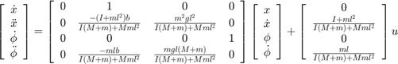
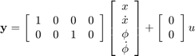

# Inverted Pendulum

The inverted pendulum is a classic example in control system literature due to its inherent instability when open loop. In this system, a pendulum is mounted on a motorized cart. The control objective is to balance the pendulum by applying a force to the cart.

---

## 1. Problem Setup and Design Requirements

- **System Description:**  
  A pendulum is mounted on a cart that can move horizontally. The system is unstable without control (the pendulum falls if not actively balanced).  
  **Inputs and Outputs:**
  - **Input:** Force \( F \) applied to the cart.
  - **Outputs:** Pendulum angle \( \theta \) and cart position \( x \).

- **Given Parameters:**
  - \( M \): Mass of the cart (0.5 kg)
  - \( m \): Mass of the pendulum (0.2 kg)
  - \( b \): Friction coefficient for the cart (0.1 N/m/s)
  - \( l \): Length to the pendulum's center of mass (0.3 m)
  - \( I \): Moment of inertia of the pendulum (0.006 kg·m²)

- **Design Criteria:**
  - **For single-input, single-output (SISO) control (pendulum angle control):**
    - Settling time for \( \theta \) less than 5 seconds.
    - After an impulse of 1 N·s, the pendulum deviates no more than 0.05 radians from vertical.
  - **For state-space design (SIMO) control:**
    - A 0.2 m step in cart position: settling time under 5 seconds and rise time under 0.5 seconds.
    - The pendulum angle deviation remains within 20° (0.35 radians) of the vertical.
    - Steady-state error less than 2% for both outputs.

---

## 2. State-Space

**Note:** It is recommended to use PID tuning to further refine the control performance of the inverted pendulum system.

---

## Reference

- **Title:** Inverted Pendulum: System Modeling  
- **Source:** University of Michigan Control Tutorials for MATLAB and Simulink (CTMS)  
- **URL:** [https://ctms.engin.umich.edu/CTMS/index.php?example=InvertedPendulum&section=SystemModeling](https://ctms.engin.umich.edu/CTMS/index.php?example=InvertedPendulum&section=SystemModeling)

**Purpose:**  
This reference serves as an educational resource for understanding the modeling of an inverted pendulum, a well-known unstable system. It explains how to derive the nonlinear equations of motion, linearize the system about its unstable equilibrium, and represent the system using both transfer functions and state-space models. Additionally, MATLAB code examples are provided for simulating the system and designing controllers, with PID tuning recommended as a means to improve control performance.
