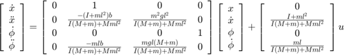
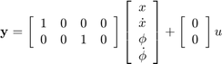
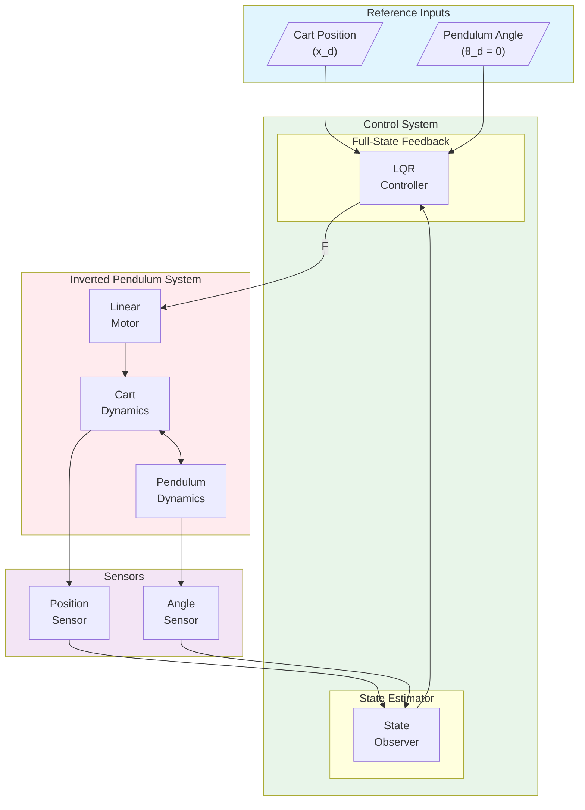
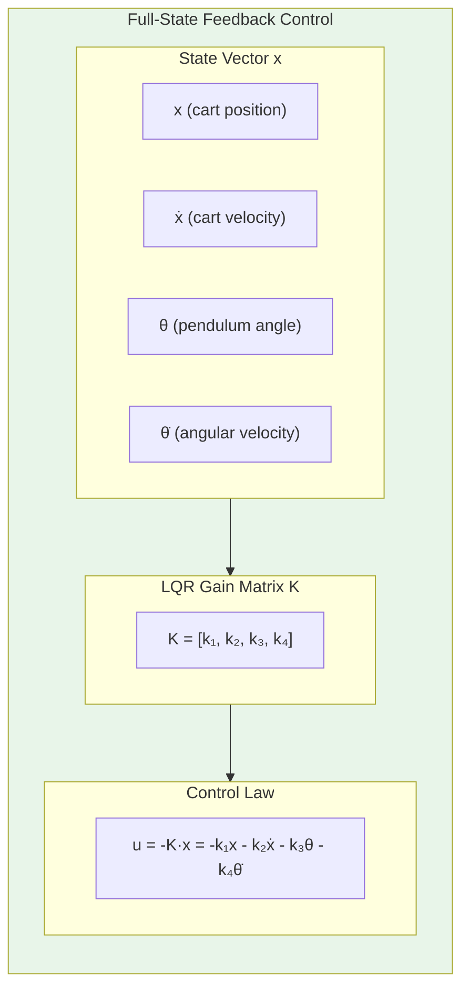
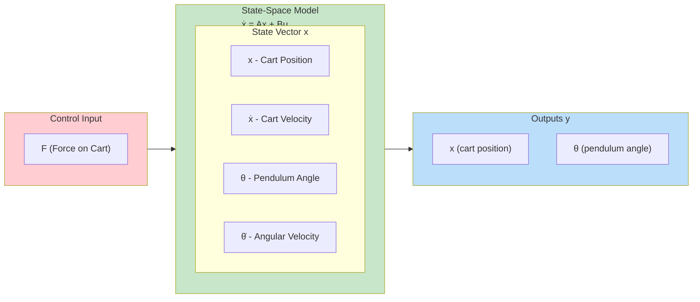
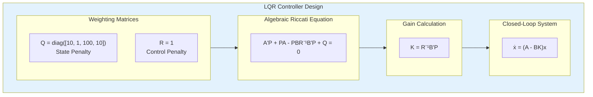
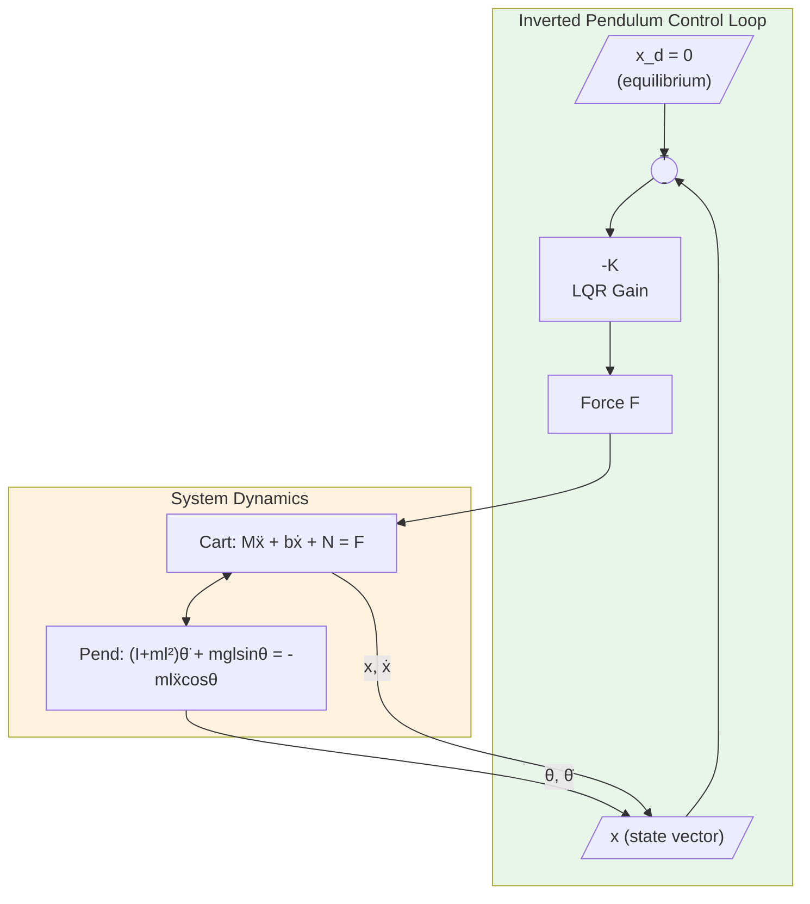
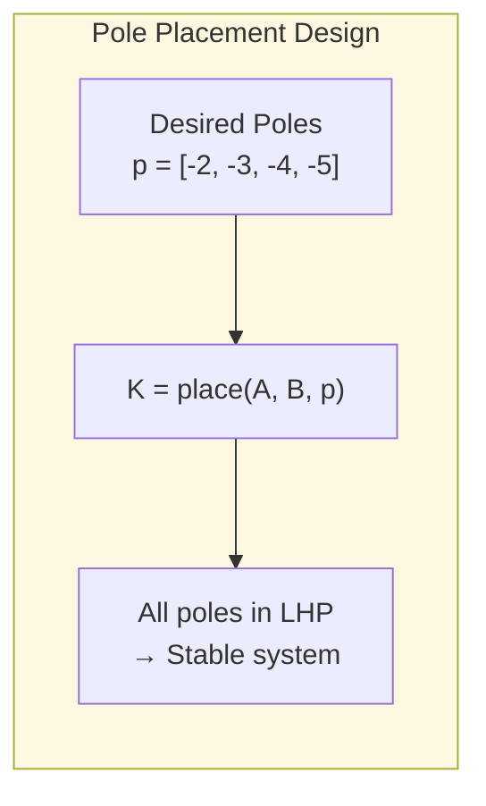

# Inverted Pendulum

The inverted pendulum is a classic example in control system literature due to its inherent instability when open loop. In this system, a pendulum is mounted on a motorized cart. The control objective is to balance the pendulum by applying a force to the cart.


---

## Overview

| Property | Value |
|----------|-------|
| **Type** | Control System Example |
| **Difficulty** | Beginner to Intermediate |
| **Control Method** | State-Space / PID |
| **DOF** | 2 (cart position, pendulum angle) |

---

## 1. Problem Setup and Design Requirements

### System Description

A pendulum is mounted on a cart that can move horizontally. The system is unstable without control (the pendulum falls if not actively balanced).

**Inputs and Outputs:**

- **Input:** Force \( F \) applied to the cart
- **Outputs:** Pendulum angle \( \theta \) and cart position \( x \)

### Physical Parameters

| Parameter | Symbol | Value | Unit |
|-----------|--------|-------|------|
| Cart mass | \( M \) | 1.0 | kg |
| Pendulum mass | \( m \) | 0.05 | kg |
| Friction coefficient | \( b \) | 0.000001 | N/m/s |
| Pendulum length | \( l \) | 0.3 | m |
| Moment of inertia | \( I \) | \( m \cdot l^2 \) | kg·m² |
| Gravity | \( g \) | 9.81 | m/s² |

### Design Criteria

**For single-input, single-output (SISO) control (pendulum angle control):**

- Settling time for \( \theta \) less than 5 seconds
- After an impulse of 1 N·s, the pendulum deviates no more than 0.05 radians from vertical

**For state-space design (SIMO) control:**

- A 0.2 m step in cart position: settling time under 5 seconds and rise time under 0.5 seconds
- The pendulum angle deviation remains within 20° (0.35 radians) of the vertical
- Steady-state error less than 2% for both outputs

---

## 2. Project Structure

```
inverted_pendulum/
├── controllers/
│   └── inverted_pendulum/
│       ├── inverted_pendulum_noncart.m      # Main MATLAB controller
│       ├── simulink_control.slx             # Simulink control model
│       ├── simulink_control_b.slx           # Alternative control model
│       ├── state_space_modeling.slx         # State-space model
│       ├── wb_motor_set_velocity.m          # Motor velocity control
│       ├── wb_motor_set_position.m          # Motor position control
│       ├── wb_motor_set_force.m             # Motor force control
│       ├── wb_gyro_get_values.m             # Gyroscope reading
│       ├── wb_accelerometer_get_values.m    # Accelerometer reading
│       ├── wb_position_sensor_get_value.m   # Position sensor reading
│       ├── wb_inertial_unit_get_roll_pitch_yaw.m
│       └── wb_robot_step.m                  # Simulation step
└── worlds/
    └── inverted_pendulum.wbt                # Webots world file
```

---

## 3. Mathematical Model

### Equations of Motion

The nonlinear equations of motion for the inverted pendulum system:

**Cart dynamics:**
$$M\ddot{x} + b\dot{x} + N = F$$

**Pendulum dynamics:**
$$(I + ml^2)\ddot{\theta} + mgl\sin\theta = -ml\ddot{x}\cos\theta$$

### Linearized State-Space Model

After linearization around the upright equilibrium (\(\theta = 0\)):

```matlab
% State vector: [x, x_dot, theta, theta_dot]
% From inverted_pendulum_noncart.m

M = 1;          % Cart mass
m = 0.05;       % Pendulum mass
b = 0.000001;   % Friction
g = 9.81;       % Gravity
l = 0.3;        % Pendulum length
I = m * l^2;    % Moment of inertia

p = I*(M+m) + M*m*l^2;

A = [0      1              0           0;
     0 -(I+m*l^2)*b/p  (m^2*g*l^2)/p   0;
     0      0              0           1;
     0 -(m*l*b)/p       m*g*l*(M+m)/p  0];

B = [     0;
     (I+m*l^2)/p;
          0;
        m*l/p];

C = [1 0 0 0;
     0 0 1 0];

D = [0;
     0];
```

---

## 4. State-Space Representation





### System Block Diagram


```mermaid
flowchart TB
    subgraph Reference["Reference Inputs"]
        R1[/"Cart Position<br/>(x_d)"/]
        R2[/"Pendulum Angle<br/>(θ_d = 0)"/]
    end

    subgraph Controller["Control System"]
        subgraph StateEstimator["State Estimator"]
            OBS[State<br/>Observer]
        end
        subgraph Feedback["Full-State Feedback"]
            LQR[LQR<br/>Controller]
        end
    end

    subgraph Plant["Inverted Pendulum System"]
        MOTOR[Linear<br/>Motor]
        CART[Cart<br/>Dynamics]
        PEND[Pendulum<br/>Dynamics]
    end

    subgraph Sensors["Sensors"]
        POS_S[Position<br/>Sensor]
        ANG_S[Angle<br/>Sensor]
    end

    R1 --> LQR
    R2 --> LQR
    OBS --> LQR
    LQR --> |"F"| MOTOR
    MOTOR --> CART
    CART <--> PEND

    CART --> POS_S
    PEND --> ANG_S

    POS_S --> OBS
    ANG_S --> OBS

    style Reference fill:#e1f5fe
    style Controller fill:#e8f5e9
    style Plant fill:#ffebee
    style Sensors fill:#f3e5f5
```

### Control Architecture


```mermaid
flowchart LR
    subgraph FullStateFeedback["Full-State Feedback Control"]
        subgraph States["State Vector x"]
            X["x (cart position)"]
            XDOT["ẋ (cart velocity)"]
            THETA["θ (pendulum angle)"]
            THETADOT["θ̇ (angular velocity)"]
        end

        subgraph Gains["LQR Gain Matrix K"]
            K["K = [k₁, k₂, k₃, k₄]"]
        end

        subgraph ControlLaw["Control Law"]
            CL["u = -K·x = -k₁x - k₂ẋ - k₃θ - k₄θ̇"]
        end
    end

    States --> Gains
    Gains --> ControlLaw

    style FullStateFeedback fill:#e8f5e9
```

### State-Space Model Diagram


```mermaid
flowchart LR
    subgraph Input["Control Input"]
        U["F (Force on Cart)"]
    end

    subgraph StateSpace["State-Space Model<br/>ẋ = Ax + Bu<br/>y = Cx"]
        subgraph StateVector["State Vector x"]
            S1["x - Cart Position"]
            S2["ẋ - Cart Velocity"]
            S3["θ - Pendulum Angle"]
            S4["θ̇ - Angular Velocity"]
        end
    end

    subgraph Output["Outputs y"]
        Y1["x (cart position)"]
        Y2["θ (pendulum angle)"]
    end

    Input --> StateSpace
    StateSpace --> Output

    style Input fill:#ffcdd2
    style StateSpace fill:#c8e6c9
    style Output fill:#bbdefb
```

### LQR Control Design


```mermaid
flowchart TB
    subgraph LQRDesign["LQR Controller Design"]
        subgraph Weights["Weighting Matrices"]
            Q["Q = diag([10, 1, 100, 10])<br/>State Penalty"]
            R["R = 1<br/>Control Penalty"]
        end

        subgraph Riccati["Algebraic Riccati Equation"]
            ARE["A'P + PA - PBR⁻¹B'P + Q = 0"]
        end

        subgraph GainCalc["Gain Calculation"]
            GAIN["K = R⁻¹B'P"]
        end

        subgraph ClosedLoop["Closed-Loop System"]
            CL["ẋ = (A - BK)x"]
        end
    end

    Weights --> Riccati
    Riccati --> GainCalc
    GainCalc --> ClosedLoop

    style LQRDesign fill:#e3f2fd
```

### Control Loop Detail


```mermaid
flowchart TB
    subgraph ControlLoop["Inverted Pendulum Control Loop"]
        X_D[/"x_d = 0<br/>(equilibrium)"/]
        X[/"x (state vector)"/]
        ERR((+<br/>-))
        K_GAIN["-K<br/>LQR Gain"]
        F["Force F"]

        X_D --> ERR
        X --> ERR
        ERR --> K_GAIN
        K_GAIN --> F
    end

    subgraph SystemDynamics["System Dynamics"]
        CART_DYN["Cart: Mẍ + bẋ + N = F"]
        PEND_DYN["Pend: (I+ml²)θ̈ + mglsinθ = -mlẍcosθ"]
    end

    F --> CART_DYN
    CART_DYN <--> PEND_DYN
    PEND_DYN --> |"θ, θ̇"| X
    CART_DYN --> |"x, ẋ"| X

    style ControlLoop fill:#e8f5e9
    style SystemDynamics fill:#fff3e0
```

### Pole Placement Alternative


```mermaid
flowchart LR
    subgraph PolePlacement["Pole Placement Design"]
        POLES["Desired Poles<br/>p = [-2, -3, -4, -5]"]
        PLACE["K = place(A, B, p)"]
        STABILITY["All poles in LHP<br/>→ Stable system"]
    end

    POLES --> PLACE
    PLACE --> STABILITY

    style PolePlacement fill:#fff8e1
```

### State Variables

| State | Symbol | Description |
|-------|--------|-------------|
| \( x_1 \) | \( x \) | Cart position |
| \( x_2 \) | \( \dot{x} \) | Cart velocity |
| \( x_3 \) | \( \theta \) | Pendulum angle |
| \( x_4 \) | \( \dot{\theta} \) | Pendulum angular velocity |

---

## 5. Sensors and Actuators

### Sensors

| Sensor | Webots Name | Purpose |
|--------|-------------|---------|
| Horizontal Position Sensor | `horizontal position sensor` | Measures cart position |
| Hip Position Sensor | `hip` | Measures pendulum angle |

### Actuators

| Actuator | Webots Name | Control |
|----------|-------------|---------|
| Linear Motor | `horizontal_motor` | Force applied to cart (max 100 N) |

---

## 6. Controller Implementation

### Initialization

```matlab
TIME_STEP = 16;

% Get devices
horizontal_position_sensor = wb_robot_get_device('horizontal position sensor');
wb_position_sensor_enable(horizontal_position_sensor, TIME_STEP);

hip = wb_robot_get_device('hip');
wb_position_sensor_enable(hip, TIME_STEP);

horizontal_motor = wb_robot_get_device('horizontal_motor');
```

### LQR Controller Design

```matlab
% Check controllability
Co = ctrb(A, B);
rank(Co)  % Should be 4 (full rank)

% Design LQR controller
Q = diag([10, 1, 100, 10]);  % State weights
R = 1;                        % Control weight

K = lqr(A, B, Q, R);

% Control law: u = -K * x
```

---

## 7. Quick Start

1. **Open Webots** and load `examples/inverted_pendulum/worlds/inverted_pendulum.wbt`

2. **Configure MATLAB** as the controller

3. **Run the simulation** - the controller will attempt to balance the pendulum

4. **Observe results** in the Simulink Scope or MATLAB workspace

---

## 8. Tuning Tips

- Increase Q(3,3) to reduce pendulum angle deviation
- Increase Q(1,1) to improve cart position tracking
- Decrease R to allow more aggressive control action
- Use PID tuning app in MATLAB for fine-tuning

**Note:** It is recommended to use PID tuning to further refine the control performance of the inverted pendulum system.

---

## 9. Control Strategies

### PID Control

- Simple to implement
- Suitable for basic balancing
- May struggle with large disturbances

### LQR Control

- Optimal for linear systems
- Better disturbance rejection
- Requires accurate state estimation

### Pole Placement

- Direct control over system dynamics
- Choose poles in left-half plane for stability
- Trade-off between speed and control effort

---

## Reference

- **Title:** Inverted Pendulum: System Modeling
- **Source:** University of Michigan Control Tutorials for MATLAB and Simulink (CTMS)
- **URL:** [https://ctms.engin.umich.edu/CTMS/index.php?example=InvertedPendulum&section=SystemModeling](https://ctms.engin.umich.edu/CTMS/index.php?example=InvertedPendulum&section=SystemModeling)

**Purpose:**
This reference serves as an educational resource for understanding the modeling of an inverted pendulum, a well-known unstable system. It explains how to derive the nonlinear equations of motion, linearize the system about its unstable equilibrium, and represent the system using both transfer functions and state-space models. Additionally, MATLAB code examples are provided for simulating the system and designing controllers, with PID tuning recommended as a means to improve control performance.
