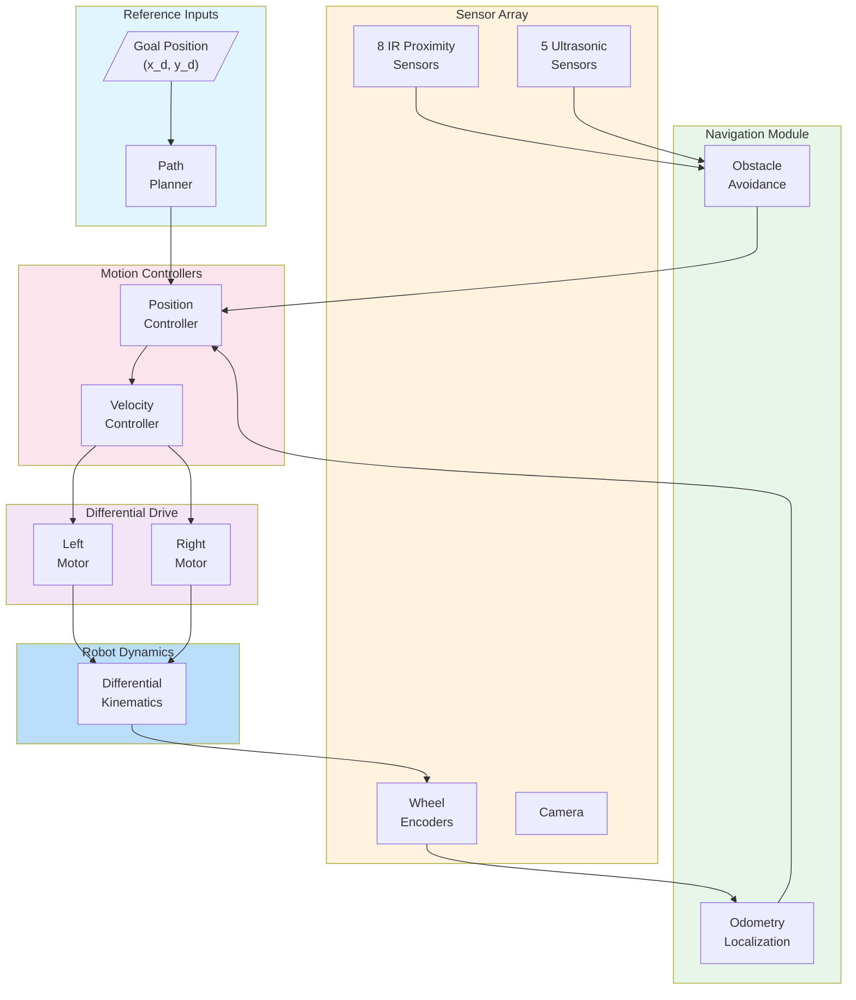
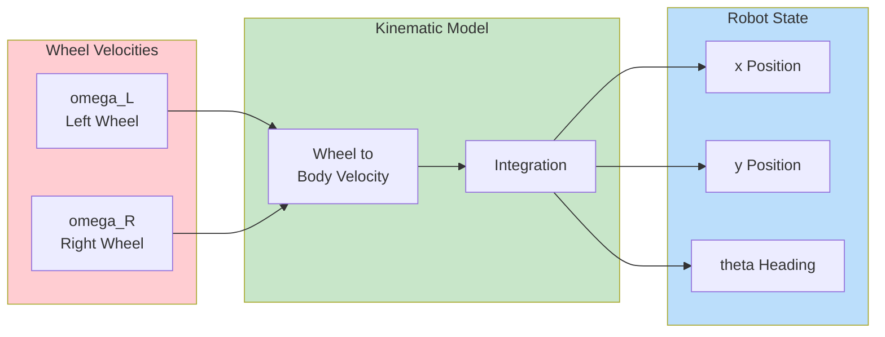
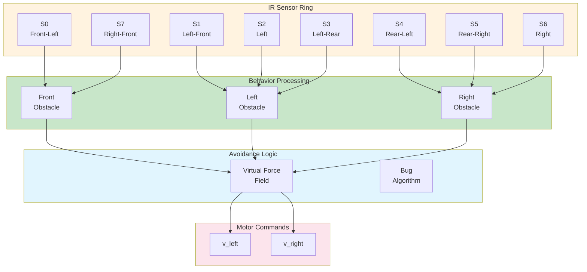

# Khepera IV Mobile Robot

This example demonstrates the Khepera IV mobile robot with MATLAB/Simulink.

---

## Overview

| Property | Value |
|----------|-------|
| **Type** | Differential Drive Mobile Robot |
| **Robot** | K-Team Khepera IV |
| **Difficulty** | Beginner to Intermediate |
| **Control Method** | Differential Drive / PID |

---

## Features

- **Compact Design**: 140mm diameter
- **IR Proximity Sensors**: 8 sensors
- **Ultrasonic Sensors**: 5 sensors
- **Camera**: Color vision
- **Odometry**: Wheel encoders

---

## Specifications

| Property | Value |
|----------|-------|
| Diameter | 140 mm |
| Height | 57 mm |
| Weight | 0.5 kg |
| Max Speed | 0.8 m/s |
| Wheel Radius | 21 mm |
| Wheel Base | 105 mm |

---

## Control Architecture

### System Block Diagram



### Differential Drive Model



### Obstacle Avoidance Architecture



---

## State-Space Model

### Differential Drive Kinematics

```matlab
% State vector: x = [x, y, theta]'
% Input vector: u = [omega_L, omega_R]'

% Robot parameters
r = 0.021;      % Wheel radius [m]
L = 0.105;      % Wheel base [m]

% Kinematic equations
% x_dot = (r/2)(omega_L + omega_R)cos(theta)
% y_dot = (r/2)(omega_L + omega_R)sin(theta)
% theta_dot = (r/L)(omega_R - omega_L)

% Alternative representation with v, omega
v = (r/2) * (omega_L + omega_R);      % Linear velocity
omega = (r/L) * (omega_R - omega_L);  % Angular velocity

% Jacobian for differential drive
J = [r/2, r/2;
     0,   0;
     -r/L, r/L];

% Inverse kinematics (v, omega to wheel speeds)
omega_L = (v - omega * L/2) / r;
omega_R = (v + omega * L/2) / r;
```

### Extended State Model with Dynamics

```matlab
% Extended state: x = [x, y, theta, v, omega]'
% Input: u = [tau_L, tau_R]' (motor torques)

% Motor + wheel dynamics
J_w = 0.001;    % Wheel inertia [kg*m^2]
b_w = 0.01;     % Wheel damping [N*m*s/rad]
m = 0.5;        % Robot mass [kg]
I_z = 0.002;    % Yaw inertia [kg*m^2]

% State-space matrices
A = zeros(5, 5);
A(1, 4) = 1;    % x from v (linearized at theta=0)
A(2, 3) = 1;    % y from theta (linearized)
A(3, 5) = 1;    % theta from omega

B = zeros(5, 2);
B(4, 1) = r / (2 * m);  B(4, 2) = r / (2 * m);
B(5, 1) = -r / (L * I_z);  B(5, 2) = r / (L * I_z);

C = eye(5);
D = zeros(5, 2);
```

---

## Control Design

### Position Controller

```matlab
function [v_cmd, omega_cmd] = position_controller(x, y, theta, x_goal, y_goal, params)
    % Simple position controller for goal reaching

    % Error to goal
    dx = x_goal - x;
    dy = y_goal - y;
    rho = sqrt(dx^2 + dy^2);        % Distance to goal
    alpha = atan2(dy, dx) - theta;   % Angle to goal
    alpha = atan2(sin(alpha), cos(alpha));  % Normalize

    % Control gains
    k_rho = params.k_rho;
    k_alpha = params.k_alpha;

    % Control law
    if rho > params.goal_tolerance
        v_cmd = k_rho * rho;
        omega_cmd = k_alpha * alpha;
    else
        v_cmd = 0;
        omega_cmd = 0;
    end

    % Saturation
    v_cmd = max(-params.v_max, min(params.v_max, v_cmd));
    omega_cmd = max(-params.omega_max, min(params.omega_max, omega_cmd));
end
```

### Obstacle Avoidance (VFF)

```matlab
function [v_cmd, omega_cmd] = vff_avoidance(ir_sensors, goal_dir, params)
    % Virtual Force Field obstacle avoidance

    % Sensor angles (Khepera IV configuration)
    sensor_angles = [1.27, 0.77, 0, -0.77, -1.27, pi, 2.36, -2.36];

    % Repulsive force from obstacles
    f_rep = [0; 0];
    for i = 1:8
        if ir_sensors(i) > params.threshold
            % Force magnitude proportional to sensor reading
            f_mag = params.k_rep * ir_sensors(i);
            % Force direction away from obstacle
            f_rep = f_rep - f_mag * [cos(sensor_angles(i)); sin(sensor_angles(i))];
        end
    end

    % Attractive force toward goal
    f_att = params.k_att * [cos(goal_dir); sin(goal_dir)];

    % Total force
    f_total = f_att + f_rep;

    % Convert to velocity commands
    v_cmd = params.v_nominal * cos(atan2(f_total(2), f_total(1)));
    omega_cmd = params.k_omega * atan2(f_total(2), f_total(1));

    % Saturation
    v_cmd = max(0, min(params.v_max, v_cmd));
    omega_cmd = max(-params.omega_max, min(params.omega_max, omega_cmd));
end
```

---

## Simulink Integration

### Initialization Script

```matlab
TIME_STEP = 32;

% Initialize IR proximity sensors
ir_sensors = zeros(1, 8);
for i = 0:7
    ir_sensors(i+1) = wb_robot_get_device(['ir' num2str(i)]);
    wb_distance_sensor_enable(ir_sensors(i+1), TIME_STEP);
end

% Initialize ultrasonic sensors
us_sensors = zeros(1, 5);
for i = 0:4
    us_sensors(i+1) = wb_robot_get_device(['us' num2str(i)]);
    wb_distance_sensor_enable(us_sensors(i+1), TIME_STEP);
end

% Initialize wheel encoders
left_encoder = wb_robot_get_device('left wheel sensor');
right_encoder = wb_robot_get_device('right wheel sensor');
wb_position_sensor_enable(left_encoder, TIME_STEP);
wb_position_sensor_enable(right_encoder, TIME_STEP);

% Initialize motors
left_motor = wb_robot_get_device('left wheel');
right_motor = wb_robot_get_device('right wheel');
wb_motor_set_position(left_motor, inf);
wb_motor_set_position(right_motor, inf);
wb_motor_set_velocity(left_motor, 0);
wb_motor_set_velocity(right_motor, 0);

% Control parameters
params.k_rho = 0.5;
params.k_alpha = 2.0;
params.v_max = 0.5;
params.omega_max = 3.0;
```

### Control Loop

```matlab
% Odometry variables
x = 0; y = 0; theta = 0;
prev_left = 0; prev_right = 0;

while wb_robot_step(TIME_STEP) ~= -1
    % Read sensors
    ir_values = zeros(1, 8);
    for i = 1:8
        ir_values(i) = wb_distance_sensor_get_value(ir_sensors(i));
    end

    % Read encoders
    left_pos = wb_position_sensor_get_value(left_encoder);
    right_pos = wb_position_sensor_get_value(right_encoder);

    % Odometry update
    d_left = (left_pos - prev_left) * r;
    d_right = (right_pos - prev_right) * r;
    d_center = (d_left + d_right) / 2;
    d_theta = (d_right - d_left) / L;

    x = x + d_center * cos(theta + d_theta/2);
    y = y + d_center * sin(theta + d_theta/2);
    theta = theta + d_theta;

    prev_left = left_pos;
    prev_right = right_pos;

    % Goal-reaching with obstacle avoidance
    [v_goal, omega_goal] = position_controller(x, y, theta, x_goal, y_goal, params);
    [v_avoid, omega_avoid] = vff_avoidance(ir_values, atan2(y_goal-y, x_goal-x), params);

    % Blend behaviors
    w_avoid = max(ir_values) / 1000;  % Weight based on obstacle proximity
    v_cmd = (1 - w_avoid) * v_goal + w_avoid * v_avoid;
    omega_cmd = (1 - w_avoid) * omega_goal + w_avoid * omega_avoid;

    % Convert to wheel speeds
    omega_L = (v_cmd - omega_cmd * L/2) / r;
    omega_R = (v_cmd + omega_cmd * L/2) / r;

    % Apply commands
    wb_motor_set_velocity(left_motor, omega_L);
    wb_motor_set_velocity(right_motor, omega_R);
end
```

---

## Quick Start

1. **Open Webots** and load `examples/khepera_iv/worlds/khepera_arena.wbt`
2. **Configure MATLAB** controller
3. **Run simulation**

---

## Applications

| Application | Description |
|-------------|-------------|
| SLAM | Mapping and localization |
| Path Planning | A*, RRT algorithms |
| Swarm | Multi-robot coordination |
| Education | Control systems teaching |

---

## References

- [K-Team Khepera IV](https://www.k-team.com/khepera-iv)
- [Webots Khepera IV](https://cyberbotics.com/doc/guide/khepera4)
- Siegwart, R. et al. (2011). "Introduction to Autonomous Mobile Robots"
