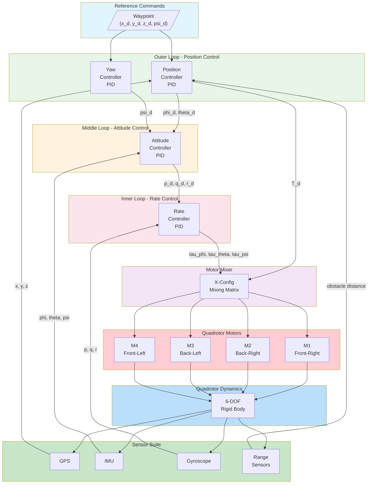
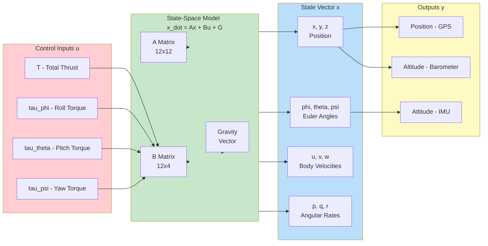
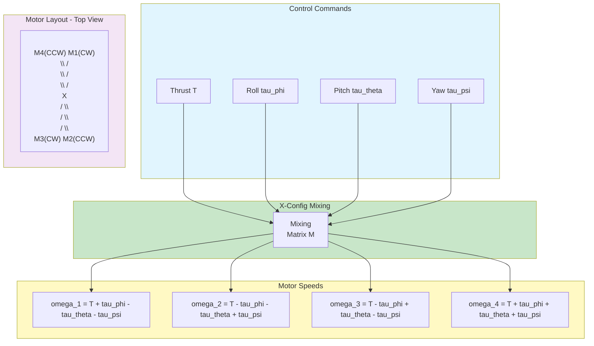
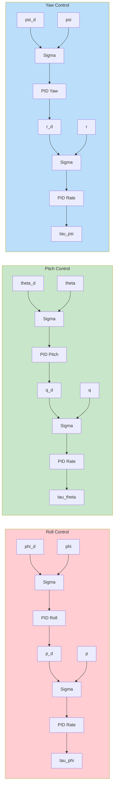

# Mavic 2 Pro Drone

This example demonstrates quadrotor drone control using the DJI Mavic 2 Pro with MATLAB/Simulink.

---

## Overview

| Property | Value |
|----------|-------|
| **Type** | Quadrotor UAV |
| **Robot** | DJI Mavic 2 Pro |
| **Difficulty** | Intermediate to Advanced |
| **Control Method** | 6-DOF Flight Control / PID |

---

## Features

- **6-DOF Flight Control**: Full attitude and position control
- **GPS Navigation**: Waypoint following and position hold
- **Obstacle Avoidance**: Front/bottom range sensors
- **Camera Gimbal**: 2-axis stabilized camera
- **Autonomous Flight**: Takeoff, landing, waypoint missions

---

## Specifications

| Property | Value |
|----------|-------|
| Diagonal Size | 354 mm |
| Weight | 907 g |
| Max Speed | 20 m/s |
| Motors | 4 (X configuration) |
| Sensors | IMU, GPS, Camera, Range sensors |

---

## Control Architecture

### Cascaded Control System



### State-Space Model



### Motor Mixing (X-Configuration)



### Attitude Control Loop Detail



---

## State-Space Model

### 12-State Quadrotor Model

```matlab
% State vector: x = [x, y, z, phi, theta, psi, u, v, w, p, q, r]'
% Input vector: u = [T, tau_phi, tau_theta, tau_psi]'

% Physical parameters
m = 0.907;          % Mass [kg]
g = 9.81;           % Gravity [m/s^2]
L = 0.177;          % Arm length [m]
Ixx = 0.0029;       % Roll inertia [kg*m^2]
Iyy = 0.0029;       % Pitch inertia [kg*m^2]
Izz = 0.0055;       % Yaw inertia [kg*m^2]

% Linearized A matrix at hover (12x12)
A = zeros(12, 12);
A(1:3, 7:9) = eye(3);           % Position from velocity
A(4:6, 10:12) = eye(3);         % Angles from angular rates
A(7, 5) = -g;                   % u from theta (gravity coupling)
A(8, 4) = g;                    % v from phi (gravity coupling)

% B matrix (12x4)
B = zeros(12, 4);
B(9, 1) = -1/m;                 % w from thrust
B(10, 2) = 1/Ixx;               % p from roll torque
B(11, 3) = 1/Iyy;               % q from pitch torque
B(12, 4) = 1/Izz;               % r from yaw torque

% C matrix - measured outputs
C = eye(12);

% D matrix - no direct feedthrough
D = zeros(12, 4);
```

### Motor Mixing Matrix

```matlab
% X-configuration motor mixing
% omega^2 = M * [T; tau_phi; tau_theta; tau_psi]

k_f = 1.28e-8;      % Thrust coefficient
k_m = 5.96e-10;     % Moment coefficient

M_inv = [
    1,  1,  1,  1;           % Thrust
    L, -L, -L,  L;           % Roll moment
   -L, -L,  L,  L;           % Pitch moment
   k_m/k_f, -k_m/k_f, k_m/k_f, -k_m/k_f  % Yaw moment
];

M = inv(M_inv);     % Mixing matrix

% Convert control commands to motor speeds
omega_squared = M * [T; tau_phi; tau_theta; tau_psi];
omega = sqrt(max(0, omega_squared));
```

---

## Control Design

### PID Gains

```matlab
% Position control gains
Kp_xy = 1.0;    Ki_xy = 0.0;    Kd_xy = 0.5;
Kp_z = 2.0;     Ki_z = 0.5;     Kd_z = 1.0;

% Attitude control gains
Kp_phi = 6.0;   Ki_phi = 0.0;   Kd_phi = 1.5;
Kp_theta = 6.0; Ki_theta = 0.0; Kd_theta = 1.5;
Kp_psi = 4.0;   Ki_psi = 0.0;   Kd_psi = 1.0;

% Rate control gains
Kp_p = 0.5;     Ki_p = 0.0;     Kd_p = 0.0;
Kp_q = 0.5;     Ki_q = 0.0;     Kd_q = 0.0;
Kp_r = 0.3;     Ki_r = 0.0;     Kd_r = 0.0;
```

### Position Controller

```matlab
function [phi_d, theta_d, T] = position_controller(pos, pos_d, vel, psi)
    % Position error
    e_pos = pos_d - pos;

    % Desired accelerations
    ax_d = Kp_xy * e_pos(1) - Kd_xy * vel(1);
    ay_d = Kp_xy * e_pos(2) - Kd_xy * vel(2);
    az_d = Kp_z * e_pos(3) - Kd_z * vel(3);

    % Thrust
    T = m * (g + az_d);

    % Desired angles (small angle approximation)
    phi_d = (1/g) * (ax_d * sin(psi) - ay_d * cos(psi));
    theta_d = (1/g) * (ax_d * cos(psi) + ay_d * sin(psi));

    % Saturation
    phi_d = max(-0.5, min(0.5, phi_d));
    theta_d = max(-0.5, min(0.5, theta_d));
end
```

---

## Simulink Integration

### Initialization Script

```matlab
TIME_STEP = 8;

% Initialize IMU
imu = wb_robot_get_device('inertial unit');
wb_inertial_unit_enable(imu, TIME_STEP);

% Initialize GPS
gps = wb_robot_get_device('gps');
wb_gps_enable(gps, TIME_STEP);

% Initialize Gyroscope
gyro = wb_robot_get_device('gyro');
wb_gyro_enable(gyro, TIME_STEP);

% Initialize Camera
camera = wb_robot_get_device('camera');
wb_camera_enable(camera, TIME_STEP);

% Initialize Range Sensors
range_front = wb_robot_get_device('range front');
wb_distance_sensor_enable(range_front, TIME_STEP);

% Initialize Motors
motors = cell(1, 4);
motor_names = {'front right propeller', 'rear right propeller', ...
               'rear left propeller', 'front left propeller'};
for i = 1:4
    motors{i} = wb_robot_get_device(motor_names{i});
    wb_motor_set_position(motors{i}, inf);
    wb_motor_set_velocity(motors{i}, 0);
end
```

### Control Loop

```matlab
while wb_robot_step(TIME_STEP) ~= -1
    % Read sensors
    orientation = wb_inertial_unit_get_roll_pitch_yaw(imu);
    position = wb_gps_get_values(gps);
    angular_rates = wb_gyro_get_values(gyro);

    phi = orientation(1);
    theta = orientation(2);
    psi = orientation(3);

    % Position control
    [phi_d, theta_d, T] = position_controller(position, pos_desired, vel, psi);

    % Attitude control
    tau_phi = Kp_phi * (phi_d - phi) - Kd_phi * angular_rates(1);
    tau_theta = Kp_theta * (theta_d - theta) - Kd_theta * angular_rates(2);
    tau_psi = Kp_psi * (psi_d - psi) - Kd_psi * angular_rates(3);

    % Motor mixing
    omega = motor_mixing(T, tau_phi, tau_theta, tau_psi);

    % Apply motor commands
    for i = 1:4
        wb_motor_set_velocity(motors{i}, omega(i));
    end
end
```

---

## Quick Start

1. **Open Webots** and load `examples/mavic_2_pro/worlds/mavic_flight.wbt`
2. **Configure MATLAB** path
3. **Run simulation** for autonomous flight demo
4. **Customize waypoints** in Simulink model

---

## Flight Modes

| Mode | Description |
|------|-------------|
| Hover | Maintain position and altitude |
| Position | GPS-based position control |
| Altitude | Maintain altitude, manual horizontal |
| Attitude | Direct attitude control |

---

## References

- [DJI Mavic 2 Pro](https://www.dji.com/mavic-2)
- [Webots Mavic](https://cyberbotics.com/doc/guide/mavic-2-pro)
- Quan, Q. (2017). "Introduction to Multicopter Design and Control"
- Mahony, R. et al. (2012). "Multirotor Aerial Vehicles"
