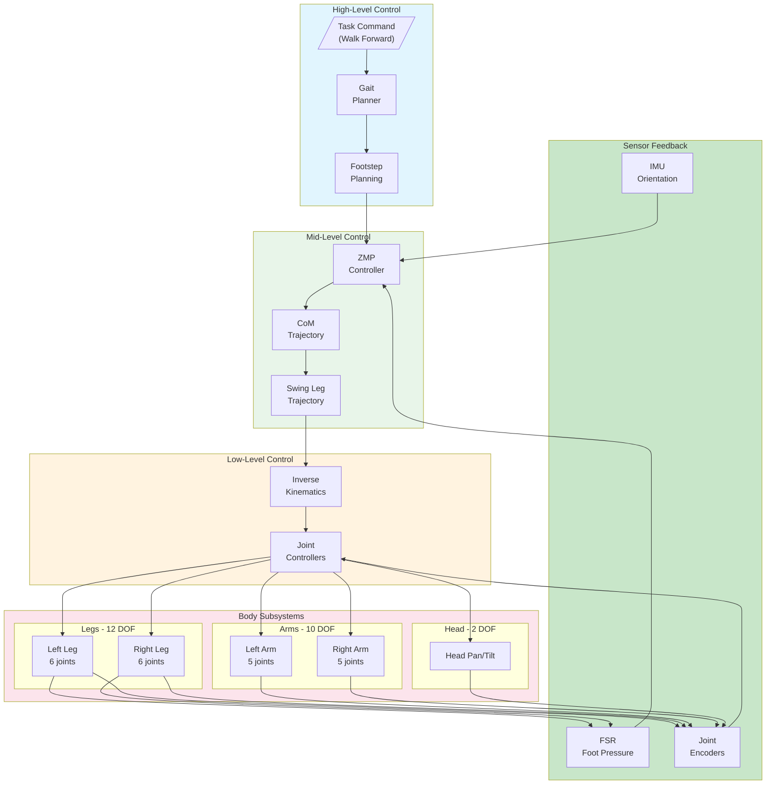
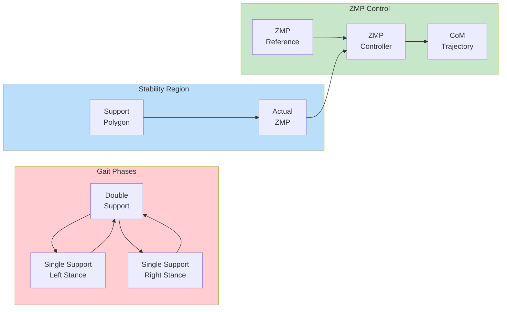
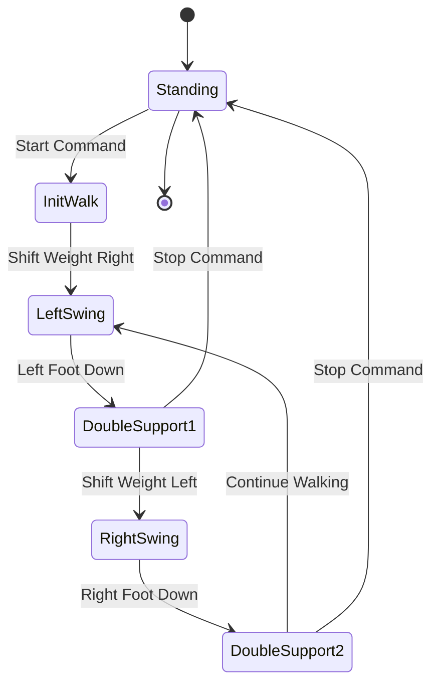
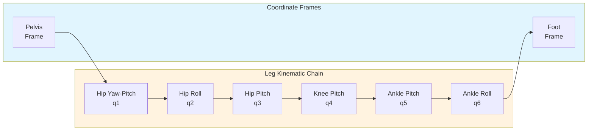

# NAO Humanoid Robot

This example demonstrates bipedal humanoid robot control using the SoftBank NAO with MATLAB/Simulink.

---

## Overview

| Property | Value |
|----------|-------|
| **Type** | Bipedal Humanoid Robot |
| **Robot** | SoftBank NAO V6 |
| **Difficulty** | Advanced |
| **Control Method** | Joint Control / Gait Planning |
| **DOF** | 25 (full body) |

---

## Features

- **Bipedal Walking**: Dynamic gait generation
- **Upper Body Control**: Arm gestures
- **Multi-Modal Sensing**: Cameras, microphones, touch
- **Balance Control**: IMU-based stabilization
- **25 DOF**: Full body articulation

---

## Specifications

| Property | Value |
|----------|-------|
| Height | 574 mm |
| Weight | 5.48 kg |
| DOF | 25 |
| Sensors | Cameras, IMU, FSR, Touch |

---

## Control Architecture

### Hierarchical Control System



### ZMP-Based Walking Control



### Bipedal State Machine



### Leg Kinematics



---

## State-Space Model

### Linear Inverted Pendulum Model (LIPM)

```matlab
% Simplified walking model: CoM dynamics on a plane
% State: x = [x_com, x_dot_com, y_com, y_dot_com]'
% Input: u = [zmp_x, zmp_y]'

z_c = 0.26;     % CoM height [m]
g = 9.81;       % Gravity [m/s^2]
omega = sqrt(g / z_c);  % Natural frequency

% State-space matrices (decoupled x and y)
A_x = [0, 1; omega^2, 0];
B_x = [0; -omega^2];
C_x = [1, 0];

% Full 4-state model
A = blkdiag(A_x, A_x);
B = blkdiag(B_x, B_x);
C = blkdiag(C_x, C_x);
D = zeros(2, 2);

% ZMP from state
% zmp_x = x_com - z_c * x_ddot_com / g
% zmp_y = y_com - z_c * y_ddot_com / g
```

### Full Body Dynamics

```matlab
% 25-DOF NAO Model
% State: q = [head(2), larm(5), rarm(5), lleg(6), rleg(6), trunk(1)]'

% Joint limits [rad]
q_min = [-2.08, -0.67, ...  % Head
         -2.08, -1.56, -2.08, -1.82, -1.82, ...  % Left arm
         -2.08, -0.31, -2.08, -1.82, -1.82, ...  % Right arm
         -1.15, -0.79, -1.57, 0, -1.19, -0.40, ... % Left leg
         -1.15, -0.38, -1.57, 0, -1.19, -0.77];    % Right leg

q_max = [2.08, 0.51, ...    % Head
         2.08, 0.31, 2.08, -0.003, 1.82, ...  % Left arm
         2.08, 1.56, 2.08, -0.003, 1.82, ...  % Right arm
         0.79, 0.38, 0.48, 2.11, 0.92, 0.77, ... % Left leg
         0.79, 0.79, 0.48, 2.11, 0.92, 0.40];    % Right leg

% Mass distribution
m_total = 5.48;  % kg
m_trunk = 1.04;
m_head = 0.52;
m_arm = 0.41;   % per arm
m_leg = 1.05;   % per leg
```

### ZMP Preview Controller

```matlab
function [com_ref, zmp_cmd] = zmp_preview_controller(zmp_ref, state, N_preview)
    % Preview control for ZMP tracking
    % N_preview: number of preview steps

    % Discretized LIPM
    T_s = 0.01;  % Sample time
    A_d = expm(A * T_s);
    B_d = (A_d - eye(4)) * inv(A) * B;

    % Preview gains (computed offline via Riccati equation)
    K_x = [1.0, 0.5];  % State feedback gain
    K_p = zeros(1, N_preview);  % Preview gains

    for i = 1:N_preview
        K_p(i) = compute_preview_gain(i, A_d, B_d, Q, R);
    end

    % Control computation
    u = -K_x * state(1:2) + K_p * zmp_ref(1:N_preview);
    zmp_cmd = u;

    % Integrate for CoM reference
    state_next = A_d * state + B_d * u;
    com_ref = state_next(1);
end
```

---

## Gait Generation

### Foot Trajectory (Cycloid)

```matlab
function [foot_pos, foot_vel] = cycloid_swing(t, T_swing, step_length, step_height)
    % Cycloid trajectory for swing foot
    % Provides smooth lift-off and touch-down

    phase = t / T_swing;  % Normalized phase [0, 1]

    % X position (forward)
    foot_pos(1) = step_length * (phase - sin(2*pi*phase) / (2*pi));

    % Z position (height)
    foot_pos(3) = step_height * (1 - cos(2*pi*phase)) / 2;

    % Y position (lateral, typically zero)
    foot_pos(2) = 0;

    % Velocities
    foot_vel(1) = step_length / T_swing * (1 - cos(2*pi*phase));
    foot_vel(3) = step_height * pi / T_swing * sin(2*pi*phase);
    foot_vel(2) = 0;
end
```

### Gait Parameters

```matlab
% Walking parameters
gait_params = struct();
gait_params.step_length = 0.04;     % [m]
gait_params.step_width = 0.07;      % [m]
gait_params.step_height = 0.02;     % [m]
gait_params.T_step = 0.5;           % Step period [s]
gait_params.T_double = 0.1;         % Double support time [s]
gait_params.com_height = 0.26;      % CoM height [m]
```

---

## Simulink Integration

### Initialization Script

```matlab
TIME_STEP = 10;

% Initialize IMU
imu = wb_robot_get_device('inertial unit');
wb_inertial_unit_enable(imu, TIME_STEP);

gyro = wb_robot_get_device('gyro');
wb_gyro_enable(gyro, TIME_STEP);

% Initialize FSR sensors
fsr_names = {'LFsrFL', 'LFsrFR', 'LFsrBL', 'LFsrBR', ...
             'RFsrFL', 'RFsrFR', 'RFsrBL', 'RFsrBR'};
fsr = zeros(1, 8);
for i = 1:8
    fsr(i) = wb_robot_get_device(fsr_names{i});
    wb_touch_sensor_enable(fsr(i), TIME_STEP);
end

% Initialize leg motors
leg_joints = {'LHipYawPitch', 'LHipRoll', 'LHipPitch', 'LKneePitch', 'LAnklePitch', 'LAnkleRoll', ...
              'RHipYawPitch', 'RHipRoll', 'RHipPitch', 'RKneePitch', 'RAnklePitch', 'RAnkleRoll'};

leg_motors = zeros(1, 12);
leg_sensors = zeros(1, 12);
for i = 1:12
    leg_motors(i) = wb_robot_get_device(leg_joints{i});
    leg_sensors(i) = wb_robot_get_device([leg_joints{i} 'S']);
    wb_position_sensor_enable(leg_sensors(i), TIME_STEP);
end
```

### Walking Control Loop

```matlab
% Gait state machine
state = 'STANDING';
phase = 0;

while wb_robot_step(TIME_STEP) ~= -1
    % Read sensors
    orientation = wb_inertial_unit_get_roll_pitch_yaw(imu);
    angular_vel = wb_gyro_get_values(gyro);

    % Read FSR for ground contact
    fsr_values = zeros(1, 8);
    for i = 1:8
        fsr_values(i) = wb_touch_sensor_get_value(fsr(i));
    end

    % Compute ZMP from FSR
    zmp_measured = compute_zmp_from_fsr(fsr_values);

    switch state
        case 'STANDING'
            if walk_command
                state = 'INIT_WALK';
            end

        case 'INIT_WALK'
            % Shift weight to right leg
            [com_ref, zmp_cmd] = shift_weight('right');
            state = 'LEFT_SWING';

        case 'LEFT_SWING'
            % Generate swing trajectory
            [foot_pos, ~] = cycloid_swing(phase, T_swing, step_length, step_height);
            phase = phase + TIME_STEP/1000;

            if phase >= T_swing
                state = 'DOUBLE_SUPPORT_1';
                phase = 0;
            end

        % ... continue state machine
    end

    % Inverse kinematics
    q_legs = leg_ik(com_ref, left_foot_pos, right_foot_pos);

    % Apply joint commands
    for i = 1:12
        wb_motor_set_position(leg_motors(i), q_legs(i));
    end
end
```

---

## Walking Control

- **ZMP-based Gait**: Zero Moment Point control
- **Balance Controller**: Real-time stability
- **Foot Trajectory**: Cycloid-based swing

---

## Quick Start

1. **Open Webots** and load `examples/nao_humanoid/worlds/nao_walking.wbt`
2. **Configure MATLAB** controller
3. **Run simulation** for walking demo
4. **Tune gait parameters** in Simulink

---

## Motion Primitives

| Primitive | Description |
|-----------|-------------|
| Stand | Static standing pose |
| Walk | Forward bipedal walking |
| Turn | In-place rotation |
| Side Step | Lateral walking |
| Kick | Soccer kick motion |

---

## References

- [SoftBank NAO](https://www.softbankrobotics.com/emea/en/nao)
- [Webots NAO](https://cyberbotics.com/doc/guide/nao)
- Kajita, S. et al. (2003). "Biped Walking Pattern Generation"
- Vukobratovic, M. (2004). "Zero-Moment Point"
