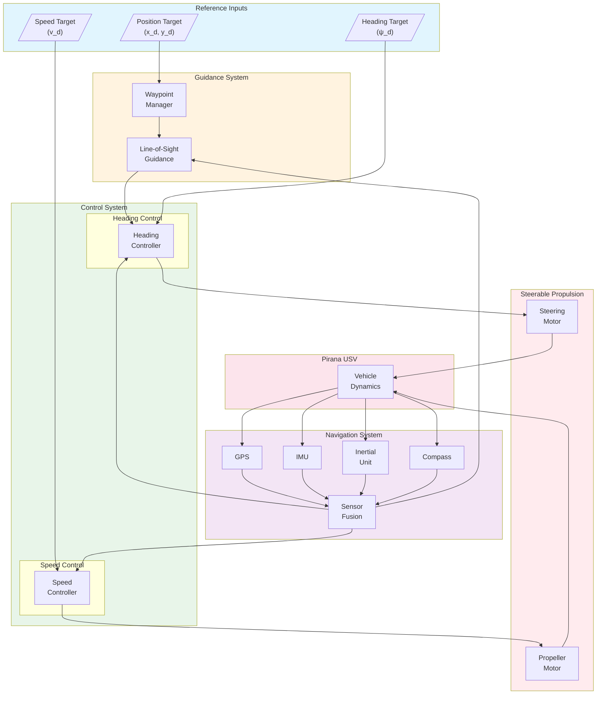
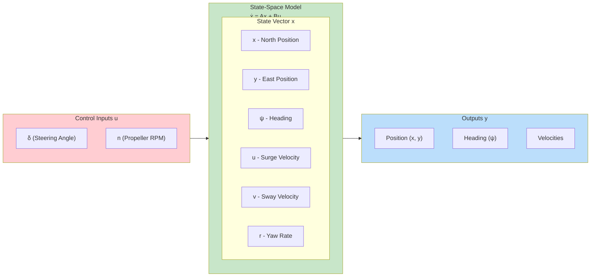
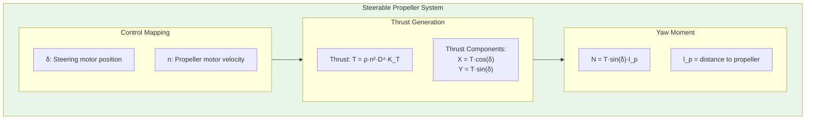
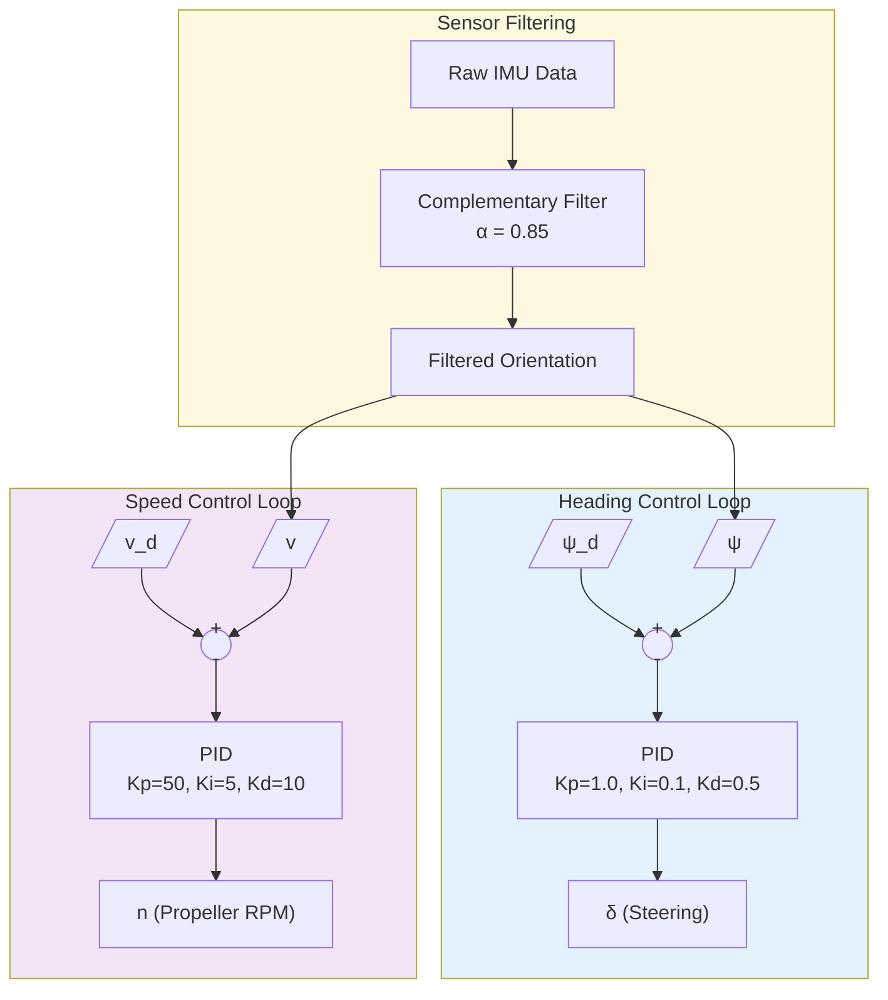
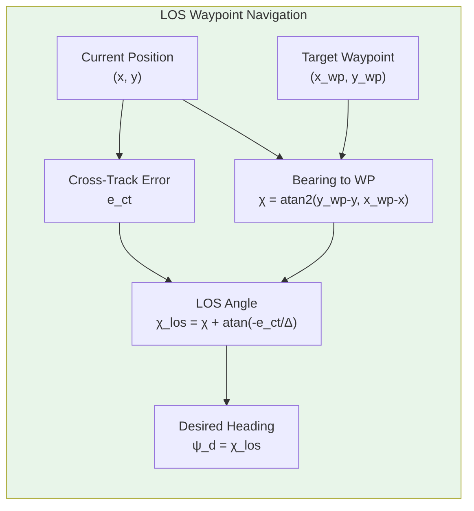

# Pirana USV


The Pirana USV (Unmanned Surface Vehicle) is a versatile autonomous marine platform developed by MKE (Mechanical and Chemical Industry Corporation) for various surface operations. Designed for both civilian and defense applications, the Pirana USV features advanced navigation, remote control capabilities, and modular payload options.

---

## System Overview

The Pirana is a single-hull unmanned surface vehicle featuring a steerable propulsion system that provides both thrust and directional control. The simulation includes realistic water dynamics and obstacle avoidance scenarios.

### Key Features

- **Autonomous Navigation**: GPS and IMU-based path following
- **Steerable Propulsion**: Combined thrust and steering motor system
- **Sensor Suite**: Accelerometer, gyroscope, GPS, and inertial unit
- **Fluid Dynamics**: Realistic water simulation with viscosity and damping
- **Obstacle Scenarios**: Oil barrel obstacles for collision avoidance testing

### Specifications

| Parameter | Value |
|-----------|-------|
| Control Type | Steerable propeller |
| Propulsion | Single rotational motor with propeller |
| Steering | Rotational motor for propeller direction |
| Fluid Viscosity | 0.01 (water simulation) |
| Physics Density | 450 kg/m³ |

---

## Components

### Propulsion System

| Component | Device Name | Description |
|-----------|-------------|-------------|
| Steering Motor | `rotational_motor` | Controls propeller direction |
| Propeller Motor | `rotational_motor_propeller` | Provides thrust |
| Position Sensor | `position_sensor` | Steering angle feedback |

### Sensors

| Sensor | Device Name | Description |
|--------|-------------|-------------|
| Accelerometer | `accelerometer` | 3-axis linear acceleration |
| Gyroscope | `gyro` | 3-axis angular velocity |
| GPS | `gps` | Global positioning |
| Inertial Unit | `inertial_unit` | Roll, pitch, yaw orientation |
| Compass | `compass` | Magnetic heading |

---

## Simulink Integration

### Available MATLAB Functions

**Motor Control:**
```matlab
wb_motor_set_velocity(tag, velocity)    % Set motor speed
wb_motor_set_position(tag, position)    % Set steering angle
wb_motor_set_torque(tag, torque)        % Set motor torque
```

**Sensor Reading:**
```matlab
wb_accelerometer_get_values(tag)        % Get acceleration [x, y, z]
wb_gyro_get_values(tag)                 % Get angular velocity [x, y, z]
wb_gps_get_values(tag)                  % Get GPS position [x, y, z]
wb_inertial_unit_get_roll_pitch_yaw(tag) % Get orientation [roll, pitch, yaw]
```

**Simulation Control:**
```matlab
wb_robot_step(TIME_STEP)                % Advance simulation
```

### Initialization Script

The `simulink_control_app.m` initializes the Pirana system:

```matlab
TIME_STEP = 16;

% Filter coefficients for sensor smoothing
alpha_pitch = 0.85;
alpha_roll = 0.85;
alpha_yaw = 0.85;

% Initialize sensors
accelerometer_sensor = wb_robot_get_device('accelerometer');
wb_accelerometer_enable(accelerometer_sensor, TIME_STEP);

gyro_sensor = wb_robot_get_device('gyro');
wb_gyro_enable(gyro_sensor, TIME_STEP);

gps_sensor = wb_robot_get_device('gps');
wb_gps_enable(gps_sensor, TIME_STEP);

inertial_unit = wb_robot_get_device('inertial_unit');
wb_inertial_unit_enable(inertial_unit, TIME_STEP);

% Initialize motors
rotational_motor = wb_robot_get_device('rotational_motor');
rotational_motor_propeller = wb_robot_get_device('rotational_motor_propeller');

% Steering position sensor
position_sensor = wb_robot_get_device('position_sensor');

% Load Simulink model
open_system('simulink_control');
load_system('simulink_control');
```

---

## Control System Design

### System Block Diagram



### State-Space Model



### Steerable Propeller Kinematics



### State-Space Matrices

```matlab
%% Pirana USV State-Space Model
% State vector: x = [x, y, psi, u, v, r]'
% Input vector: u = [delta, n]' (steering angle, propeller RPM)

% Physical Parameters
m = 50;               % Mass [kg]
Iz = 15;              % Yaw moment of inertia [kg*m^2]
l_p = 0.8;            % Distance to propeller [m]

% Hydrodynamic parameters
Xu = -10;             % Surge damping [N*s/m]
Yv = -30;             % Sway damping [N*s/m]
Nr = -5;              % Yaw damping [N*m*s/rad]

% Added mass
Xu_dot = -5;          % Surge added mass [kg]
Yv_dot = -20;         % Sway added mass [kg]
Nr_dot = -3;          % Yaw added mass [kg*m^2]

% Effective parameters
m_u = m - Xu_dot;
m_v = m - Yv_dot;
Iz_r = Iz - Nr_dot;

% Propeller parameters
rho = 1000;           % Water density [kg/m^3]
D = 0.15;             % Propeller diameter [m]
K_T = 0.4;            % Thrust coefficient

% Linearized model at operating point (delta_0=0, n_0=10 rps)
delta_0 = 0;
n_0 = 10;
T_0 = rho * n_0^2 * D^4 * K_T;  % Nominal thrust

% A matrix (6x6)
A = [0, 0, 0, 1, 0, 0;
     0, 0, 0, 0, 1, 0;
     0, 0, 0, 0, 0, 1;
     0, 0, 0, Xu/m_u, 0, 0;
     0, 0, 0, 0, Yv/m_v, 0;
     0, 0, 0, 0, 0, Nr/Iz_r];

% B matrix (6x2) - Linearized input
% dT/ddelta = T_0 (for small delta)
% dT/dn = 2*rho*n_0*D^4*K_T

dT_ddelta = T_0;
dT_dn = 2 * rho * n_0 * D^4 * K_T;

B = [0, 0;
     0, 0;
     0, 0;
     0, dT_dn/m_u;
     dT_ddelta/m_v, 0;
     dT_ddelta*l_p/Iz_r, 0];

% C matrix
C = eye(6);

% D matrix
D = zeros(6, 2);

% Create state-space system
sys = ss(A, B, C, D);
sys.StateName = {'x', 'y', 'psi', 'u', 'v', 'r'};
sys.InputName = {'delta', 'n'};
```

### Control Loop Architecture



### Line-of-Sight Guidance



### Steerable Propulsion Control

The Pirana uses a unique steerable propeller system where:

1. **Steering Motor** (`rotational_motor`): Rotates the propeller housing to change thrust direction
2. **Propeller Motor** (`rotational_motor_propeller`): Provides forward/reverse thrust

```matlab
% Example control logic
function [steer_cmd, thrust_cmd] = heading_control(current_heading, desired_heading, speed)
    % Heading error
    heading_error = desired_heading - current_heading;

    % Steering command (P controller)
    Kp_steer = 1.0;
    steer_cmd = Kp_steer * heading_error;
    steer_cmd = max(min(steer_cmd, 0.5), -0.5);  % Limit steering angle

    % Thrust command
    thrust_cmd = speed;
end
```

### Sensor Filtering

The initialization includes low-pass filter coefficients for sensor smoothing:

```matlab
% Complementary filter for orientation
alpha = 0.85;
filtered_value = alpha * sensor_value + (1 - alpha) * previous_filtered;
```

### Marine Vehicle Dynamics

The simulation includes realistic marine dynamics:

- **Fluid viscosity**: 0.01 for water-like behavior
- **Linear damping**: 0.5 for hull resistance
- **Angular damping**: 0.6 for rotational resistance
- **Center of mass**: Lowered for stability

---

## Usage Examples

### Basic Operation

1. **Load World**: Open `pirana_usv/worlds/ocean.wbt` in Webots
2. **Set Controller**: Verify `simulink_control_app` is selected
3. **Open Simulink**: Load `simulink_control.slx` in MATLAB
4. **Run Simulation**: Start both Webots and Simulink

### Waypoint Navigation Example

```matlab
% Define waypoints (GPS coordinates)
waypoints = [
    0, 0;      % Start
    10, 0;     % Point 1
    10, 10;    % Point 2
    0, 10;     % Point 3
    0, 0       % Return
];

% Navigation loop
for i = 1:size(waypoints, 1)
    target = waypoints(i, :);
    while ~reached(target)
        current_pos = wb_gps_get_values(gps_sensor);
        heading = wb_inertial_unit_get_roll_pitch_yaw(inertial_unit);

        [steer, thrust] = compute_control(current_pos, heading, target);

        wb_motor_set_position(rotational_motor, steer);
        wb_motor_set_velocity(rotational_motor_propeller, thrust);

        wb_robot_step(TIME_STEP);
    end
end
```

### Obstacle Avoidance

The world includes oil barrel obstacles for testing collision avoidance:

```matlab
% Simple distance-based avoidance
function avoid_obstacle(gps_pos, obstacle_pos)
    distance = norm(gps_pos(1:2) - obstacle_pos);
    if distance < SAFETY_RADIUS
        % Execute avoidance maneuver
        steer_away();
    end
end
```

---

## Applications

### Defense and Security

- **Surveillance**: Coastal and harbor monitoring
- **Reconnaissance**: Intelligence gathering
- **Maritime Security**: Patrol and inspection

### Civilian Applications

- **Environmental Monitoring**: Water quality assessment
- **Search and Rescue**: Surface search operations
- **Research**: Marine data collection

### Educational Use

- **Marine Robotics**: USV control concepts
- **Control Systems**: Heading and path controllers
- **Sensor Fusion**: GPS/IMU integration

---

## File Structure

```
pirana_usv/
├── controllers/
│   ├── pirana_controller/           # Python keyboard controller
│   │   └── pirana_controller.py
│   └── simulink_control_app/        # Simulink integration
│       ├── simulink_control_app.m   # Initialization script
│       ├── simulink_control.slx     # Main Simulink model
│       ├── state_space_modeling.slx # State-space model
│       └── wb_*.m                   # MATLAB wrapper functions
└── worlds/
    └── ocean.wbt                    # Webots world with water simulation
```

---

## References

- [MKE Pirana USV](https://www.mkek.gov.tr/)
- [Marine Vehicle Dynamics](https://doi.org/10.1002/9781118647172)
- [Webots Fluid Simulation](https://cyberbotics.com/doc/reference/fluid)

**Educational Purpose:**
The Pirana USV simulation provides a platform for learning marine vehicle control, steerable propulsion systems, and autonomous navigation in realistic water environments with obstacle scenarios.
