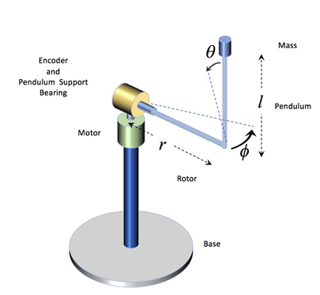
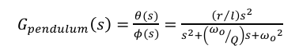

## System Modeling

### Description of a Rotary Inverted Pendulum System

A rotary inverted pendulum is a type of dynamic system that consists of a rotating bar with an inverted pendulum attached to its end. The system is often used as a benchmark for control systems and robotics research due to its non-linear and unstable dynamics.

The rotary inverted pendulum has two degrees of freedom: the rotation of the bar around its vertical axis, and the swing of the pendulum around its pivot point. This results in a complex dynamic behavior that can be challenging to model and control.

### Components

* Rotary Bar: The rotating part of the system, which supports the pendulum.
* Inverted Pendulum: The swinging part of the system, attached to the end of the rotary bar.
* Actuators: Motors or other devices responsible for controlling the rotation of the bar and the swing of the pendulum.

### Characteristics

* Non-linear dynamics
* Unstable equilibrium point
* Coupled degrees of freedom (rotation and swing)
* High sensitivity to initial conditions

## Mathematical Model

The mathematical model of a rotary inverted pendulum system can be described using the following equations:

1. **Equilibrium Point**: The system has an unstable equilibrium point, where both the rotation and swing are at their maximum values.
2. **Dynamics**: The dynamics of the system can be modeled as a second-order differential equation, which describes how the system responds to changes in its state variables (rotation and swing).

## Control Strategy
To stabilize the rotary inverted pendulum system, we can use a control strategy that minimizes the error between the desired and actual states of the system. This can be achieved using feedback control techniques, such as proportional-integral-derivative (PID) control or other adaptive control methods.

## Implementation
The implementation of the rotary inverted pendulum system involves designing a controller that can stabilize its behavior based on the given mathematical model and control strategy. The controller should be able to adjust the input signals to the actuators in real-time, taking into account the current state of the system and adjusting the control parameters accordingly.

## Conclusion
The rotary inverted pendulum system is a challenging problem that requires advanced control techniques and mathematical modeling to solve. By understanding the dynamics of the system and designing an appropriate controller, we can stabilize its behavior and achieve desired outcomes in real-world applications.

## References

- [Rotary Inverted Pendulum System](https://www.st.com/content/dam/AME/2019/Educational%20Curriculums/motor-control/Introduction_to_Integrated_Rotary_Inverted_Pendulum_v2.pdf)

