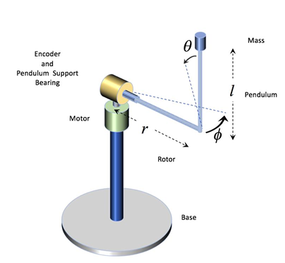
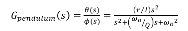
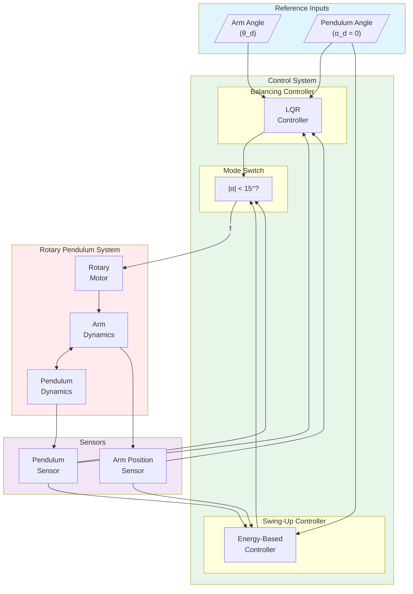
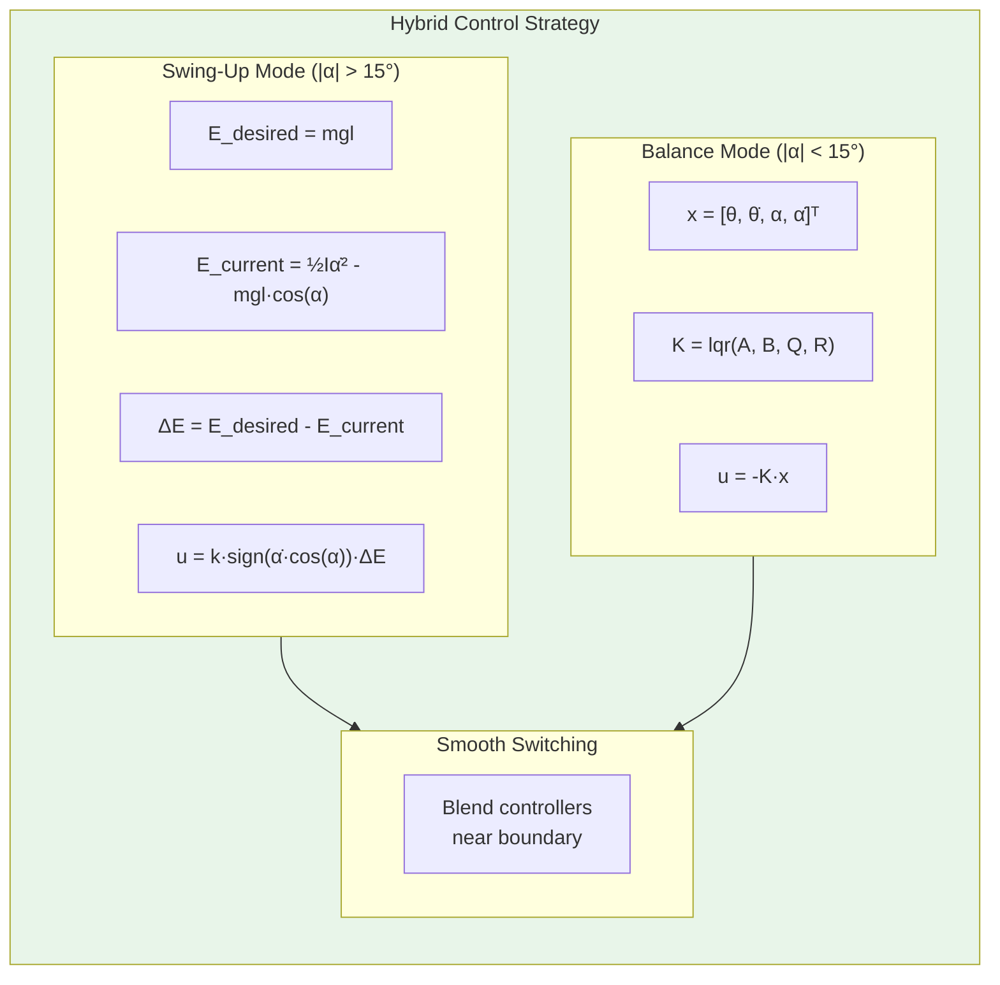
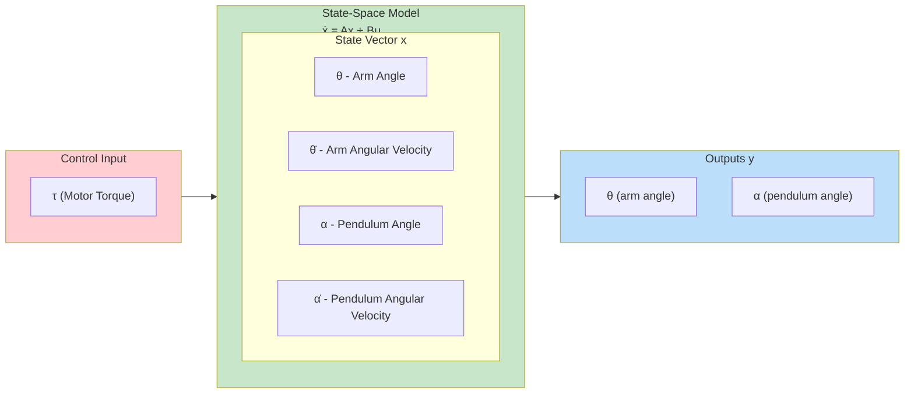
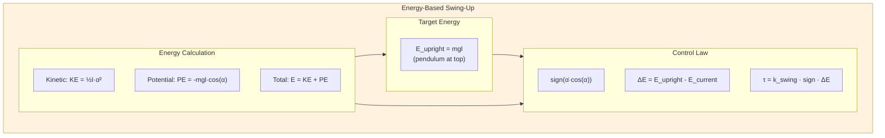
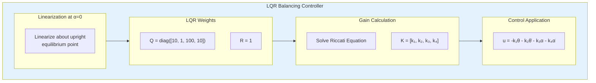
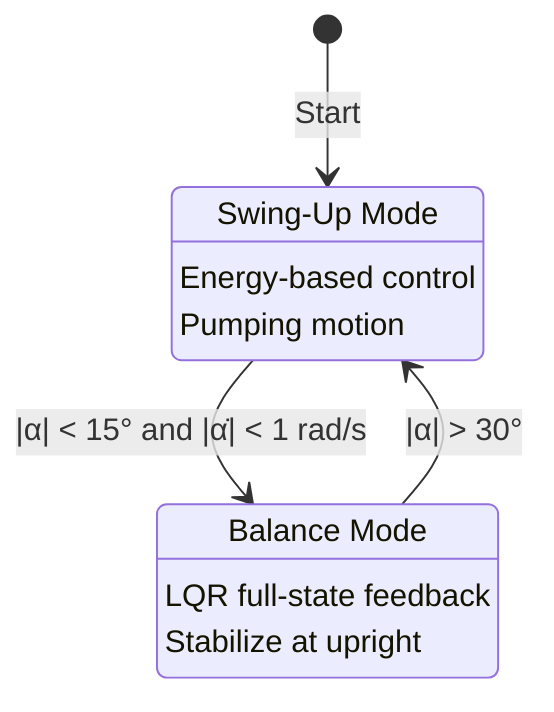

# Rotary Inverted Pendulum

The rotary inverted pendulum (also known as Furuta pendulum) is a more complex variant of the classic inverted pendulum. Instead of a cart moving linearly, the pendulum is attached to a rotating arm, creating a challenging nonlinear control problem.

---

## Overview

| Property | Value |
|----------|-------|
| **Type** | Advanced Control System |
| **Difficulty** | Intermediate to Advanced |
| **Control Method** | State-Space / LQR / Swing-up |
| **DOF** | 2 (arm rotation, pendulum swing) |

---

## System Modeling



### Simulation Video


---

## 1. System Description

A rotary inverted pendulum is a type of dynamic system that consists of a rotating bar with an inverted pendulum attached to its end. The system is often used as a benchmark for control systems and robotics research due to its non-linear and unstable dynamics.

The rotary inverted pendulum has two degrees of freedom:
- **Arm rotation** around its vertical axis
- **Pendulum swing** around its pivot point

This results in complex dynamic behavior that is challenging to model and control.

---

## 2. Project Structure

```
rotary_inverted_pendulum/
├── controllers/
│   └── rotary_inverted_pendulum/
│       ├── inverted_pendulum_noncart.m      # Main MATLAB controller
│       ├── simulink_control.slx             # Simulink control model
│       ├── simulink_control_b.slx           # Alternative control model
│       ├── state_space_modeling.slx         # State-space model
│       ├── wb_motor_set_velocity.m          # Motor velocity control
│       ├── wb_motor_set_position.m          # Motor position control
│       ├── wb_motor_set_force.m             # Motor force control
│       ├── wb_gyro_get_values.m             # Gyroscope reading
│       ├── wb_accelerometer_get_values.m    # Accelerometer reading
│       ├── wb_position_sensor_get_value.m   # Position sensor reading
│       ├── wb_inertial_unit_get_roll_pitch_yaw.m
│       └── wb_robot_step.m                  # Simulation step
└── worlds/
    └── rotary_inverted_pendulum.wbt         # Webots world file
```

---

## 3. Components

### Physical Components

| Component | Description |
|-----------|-------------|
| **Rotary Arm** | The rotating part of the system, which supports the pendulum |
| **Inverted Pendulum** | The swinging part, attached to the end of the rotary arm |
| **DC Motor** | Controls the rotation of the arm |
| **Position Sensors** | Measure arm angle and pendulum angle |

### System Characteristics

- Non-linear dynamics
- Unstable equilibrium point
- Coupled degrees of freedom (rotation and swing)
- High sensitivity to initial conditions
- Under-actuated system (1 input, 2 outputs)

---

## 4. Physical Parameters

| Parameter | Symbol | Value | Unit |
|-----------|--------|-------|------|
| Arm mass | \( M \) | 1.0 | kg |
| Pendulum mass | \( m \) | 0.05 | kg |
| Friction coefficient | \( b \) | 0.000001 | N·m·s/rad |
| Pendulum length | \( l \) | 0.3 | m |
| Moment of inertia | \( I \) | \( m \cdot l^2 \) | kg·m² |
| Gravity | \( g \) | 9.81 | m/s² |

---

## 5. Mathematical Model

### Dynamics Diagrams




### System Block Diagram


```mermaid
flowchart TB
    subgraph Reference["Reference Inputs"]
        R1[/"Arm Angle<br/>(θ_d)"/]
        R2[/"Pendulum Angle<br/>(α_d = 0)"/]
    end

    subgraph Controller["Control System"]
        subgraph SwingUp["Swing-Up Controller"]
            ENERGY[Energy-Based<br/>Controller]
        end
        subgraph Balance["Balancing Controller"]
            LQR[LQR<br/>Controller]
        end
        subgraph Switch["Mode Switch"]
            SW["|α| < 15°?"]
        end
    end

    subgraph Plant["Rotary Pendulum System"]
        MOTOR[Rotary<br/>Motor]
        ARM[Arm<br/>Dynamics]
        PEND[Pendulum<br/>Dynamics]
    end

    subgraph Sensors["Sensors"]
        ARM_S[Arm Position<br/>Sensor]
        PEND_S[Pendulum<br/>Sensor]
    end

    R1 --> LQR
    R2 --> LQR
    R2 --> ENERGY

    ENERGY --> SW
    LQR --> SW
    SW --> |"τ"| MOTOR

    MOTOR --> ARM
    ARM <--> PEND

    ARM --> ARM_S
    PEND --> PEND_S

    ARM_S --> ENERGY
    ARM_S --> LQR
    PEND_S --> ENERGY
    PEND_S --> LQR
    PEND_S --> SW

    style Reference fill:#e1f5fe
    style Controller fill:#e8f5e9
    style Plant fill:#ffebee
    style Sensors fill:#f3e5f5
```

### Control Architecture


```mermaid
flowchart LR
    subgraph HybridControl["Hybrid Control Strategy"]
        subgraph SwingUpMode["Swing-Up Mode (|α| > 15°)"]
            E_DES["E_desired = mgl"]
            E_CUR["E_current = ½Iα̇² - mgl·cos(α)"]
            E_ERR["ΔE = E_desired - E_current"]
            U_SW["u = k·sign(α̇·cos(α))·ΔE"]
        end

        subgraph BalanceMode["Balance Mode (|α| < 15°)"]
            STATE["x = [θ, θ̇, α, α̇]ᵀ"]
            K_LQR["K = lqr(A, B, Q, R)"]
            U_BAL["u = -K·x"]
        end

        subgraph Switching["Smooth Switching"]
            SWITCH["Blend controllers<br/>near boundary"]
        end
    end

    SwingUpMode --> Switching
    BalanceMode --> Switching

    style HybridControl fill:#e8f5e9
```

### State-Space Model Diagram


```mermaid
flowchart LR
    subgraph Input["Control Input"]
        U["τ (Motor Torque)"]
    end

    subgraph StateSpace["State-Space Model<br/>ẋ = Ax + Bu"]
        subgraph StateVector["State Vector x"]
            S1["θ - Arm Angle"]
            S2["θ̇ - Arm Angular Velocity"]
            S3["α - Pendulum Angle"]
            S4["α̇ - Pendulum Angular Velocity"]
        end
    end

    subgraph Output["Outputs y"]
        Y1["θ (arm angle)"]
        Y2["α (pendulum angle)"]
    end

    Input --> StateSpace
    StateSpace --> Output

    style Input fill:#ffcdd2
    style StateSpace fill:#c8e6c9
    style Output fill:#bbdefb
```

### Swing-Up Control


```mermaid
flowchart TB
    subgraph EnergyControl["Energy-Based Swing-Up"]
        subgraph EnergyCalc["Energy Calculation"]
            KE["Kinetic: KE = ½I·α̇²"]
            PE["Potential: PE = -mgl·cos(α)"]
            TE["Total: E = KE + PE"]
        end

        subgraph TargetEnergy["Target Energy"]
            E_UP["E_upright = mgl<br/>(pendulum at top)"]
        end

        subgraph ControlLaw["Control Law"]
            SIGN["sign(α̇·cos(α))"]
            DELTA["ΔE = E_upright - E_current"]
            TORQUE["τ = k_swing · sign · ΔE"]
        end
    end

    EnergyCalc --> TargetEnergy
    TargetEnergy --> ControlLaw
    EnergyCalc --> ControlLaw

    style EnergyControl fill:#fff3e0
```

### LQR Balancing Control


```mermaid
flowchart TB
    subgraph LQRBalance["LQR Balancing Controller"]
        subgraph Linearization["Linearization at α=0"]
            LIN["Linearize about upright<br/>equilibrium point"]
        end

        subgraph Weights["LQR Weights"]
            Q_MAT["Q = diag([10, 1, 100, 10])"]
            R_MAT["R = 1"]
        end

        subgraph GainCalc["Gain Calculation"]
            SOLVE["Solve Riccati Equation"]
            K_GAIN["K = [k₁, k₂, k₃, k₄]"]
        end

        subgraph Control["Control Application"]
            U_CTRL["u = -k₁θ - k₂θ̇ - k₃α - k₄α̇"]
        end
    end

    Linearization --> Weights
    Weights --> GainCalc
    GainCalc --> Control

    style LQRBalance fill:#e3f2fd
```

### Mode Switching Logic


```mermaid
stateDiagram-v2
    [*] --> SwingUp: Start

    SwingUp --> Balancing: |α| < 15° and |α̇| < 1 rad/s
    Balancing --> SwingUp: |α| > 30°

    SwingUp: Swing-Up Mode
    SwingUp: Energy-based control
    SwingUp: Pumping motion

    Balancing: Balance Mode
    Balancing: LQR full-state feedback
    Balancing: Stabilize at upright
```

The mathematical model of a rotary inverted pendulum system can be described using the following equations:

1. **Equilibrium Point**: The system has an unstable equilibrium point, where both the rotation and swing are at their maximum values.
2. **Dynamics**: The dynamics of the system can be modeled as a second-order differential equation, which describes how the system responds to changes in its state variables (rotation and swing).

### State-Space Representation

```matlab
% State vector: [theta_arm, theta_arm_dot, alpha, alpha_dot]
% From inverted_pendulum_noncart.m

M = 1;          % Arm equivalent mass
m = 0.05;       % Pendulum mass
b = 0.000001;   % Friction coefficient
g = 9.81;       % Gravity
l = 0.3;        % Pendulum length
I = m * l^2;    % Pendulum moment of inertia

p = I*(M+m) + M*m*l^2;

A = [0      1              0           0;
     0 -(I+m*l^2)*b/p  (m^2*g*l^2)/p   0;
     0      0              0           1;
     0 -(m*l*b)/p       m*g*l*(M+m)/p  0];

B = [     0;
     (I+m*l^2)/p;
          0;
        m*l/p];

C = [1 0 0 0;
     0 0 1 0];

D = [0;
     0];
```

### State Variables

| State | Symbol | Description |
|-------|--------|-------------|
| \( x_1 \) | \( \theta \) | Arm angle |
| \( x_2 \) | \( \dot{\theta} \) | Arm angular velocity |
| \( x_3 \) | \( \alpha \) | Pendulum angle from vertical |
| \( x_4 \) | \( \dot{\alpha} \) | Pendulum angular velocity |

---

## 6. Sensors and Actuators

### Sensors

| Sensor | Webots Name | Purpose |
|--------|-------------|---------|
| Arm Position Sensor | `horizontal position sensor` | Measures arm rotation angle |
| Pendulum Position Sensor | `hip` | Measures pendulum swing angle |

### Actuators

| Actuator | Webots Name | Control Mode |
|----------|-------------|--------------|
| Rotary Motor | `horizontal_motor` | Torque/Velocity control |

---

## 7. Control Strategy

To stabilize the rotary inverted pendulum system, we can use a control strategy that minimizes the error between the desired and actual states of the system. This can be achieved using feedback control techniques, such as proportional-integral-derivative (PID) control or other adaptive control methods.

### Equilibrium Points

1. **Unstable Equilibrium**: Pendulum pointing upward (control objective)
2. **Stable Equilibrium**: Pendulum hanging downward

### LQR Controller (Balancing)

Used when the pendulum is near the upright position:

```matlab
% Check controllability
Co = ctrb(A, B);
rank(Co)  % Should be 4 (full rank)

% LQR Design
Q = diag([10, 1, 100, 10]);  % State weights
R = 1;                        % Control weight

K = lqr(A, B, Q, R);

% Control law
u = -K * x;
```

### Swing-Up Controller

Used to bring the pendulum from hanging to upright position:

```matlab
% Energy-based swing-up
E_desired = m * g * l;  % Energy at upright position
E_current = 0.5 * I * alpha_dot^2 - m * g * l * cos(alpha);

% Swing-up control law
u_swing = k_swing * sign(alpha_dot * cos(alpha)) * (E_desired - E_current);
```

---

## 8. Implementation

The implementation of the rotary inverted pendulum system involves designing a controller that can stabilize its behavior based on the given mathematical model and control strategy. The controller should be able to adjust the input signals to the actuators in real-time, taking into account the current state of the system and adjusting the control parameters accordingly.

### Initialization

```matlab
TIME_STEP = 16;

% Initialize sensors
horizontal_position_sensor = wb_robot_get_device('horizontal position sensor');
wb_position_sensor_enable(horizontal_position_sensor, TIME_STEP);

hip = wb_robot_get_device('hip');
wb_position_sensor_enable(hip, TIME_STEP);

% Initialize actuator
horizontal_motor = wb_robot_get_device('horizontal_motor');

% Load Simulink model
open_system('simulink_control');
load_system('simulink_control');
```

---

## 9. Quick Start

1. **Open Webots** and load `examples/rotary_inverted_pendulum/worlds/rotary_inverted_pendulum.wbt`

2. **Configure MATLAB** as the external controller

3. **Run the simulation**:
   - The pendulum starts in hanging position
   - Swing-up controller brings it upright
   - LQR controller maintains balance

4. **Observe results** in Simulink Scope or MATLAB workspace

---

## 10. Tuning Guidelines

### LQR Weights

| Weight | Effect |
|--------|--------|
| Q(1,1) | Arm position regulation |
| Q(2,2) | Arm velocity damping |
| Q(3,3) | Pendulum angle regulation (most important) |
| Q(4,4) | Pendulum velocity damping |
| R | Control effort limitation |

### Tips

- Start with high Q(3,3) to prioritize pendulum balancing
- Increase R if motor saturation occurs
- Add integral action for steady-state error correction
- Consider gain scheduling for different operating regions

---

## 11. Advanced Topics

### State Estimation

When not all states are measurable, use an observer:

```matlab
% Full-state observer design
L = place(A', C', observer_poles)';

% Observer equations
x_hat_dot = A * x_hat + B * u + L * (y - C * x_hat);
```

### Nonlinear Control Techniques

For better performance across the full operating range:

- Feedback linearization
- Sliding mode control
- Model predictive control (MPC)

---

## Conclusion

The rotary inverted pendulum system is a challenging problem that requires advanced control techniques and mathematical modeling to solve. By understanding the dynamics of the system and designing an appropriate controller, we can stabilize its behavior and achieve desired outcomes in real-world applications.

---

## References

- [Rotary Inverted Pendulum System - ST Microelectronics](https://www.st.com/content/dam/AME/2019/Educational%20Curriculums/motor-control/Introduction_to_Integrated_Rotary_Inverted_Pendulum_v2.pdf)
- Åström, K. J., & Furuta, K. (2000). *Swinging up a pendulum by energy control*. Automatica, 36(2), 287-295.
- Control Tutorials for MATLAB and Simulink (CTMS), University of Michigan
