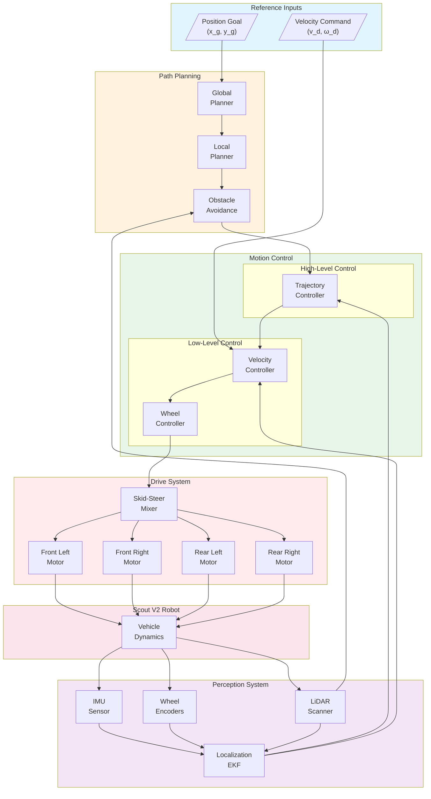
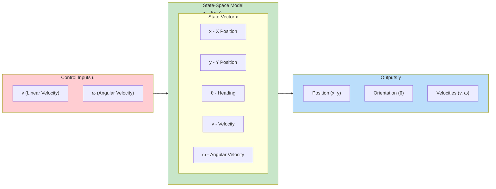
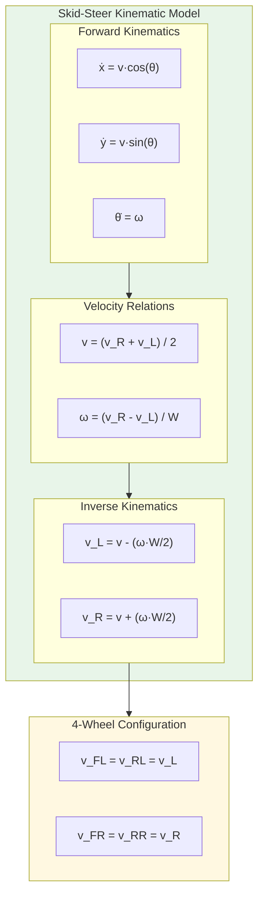
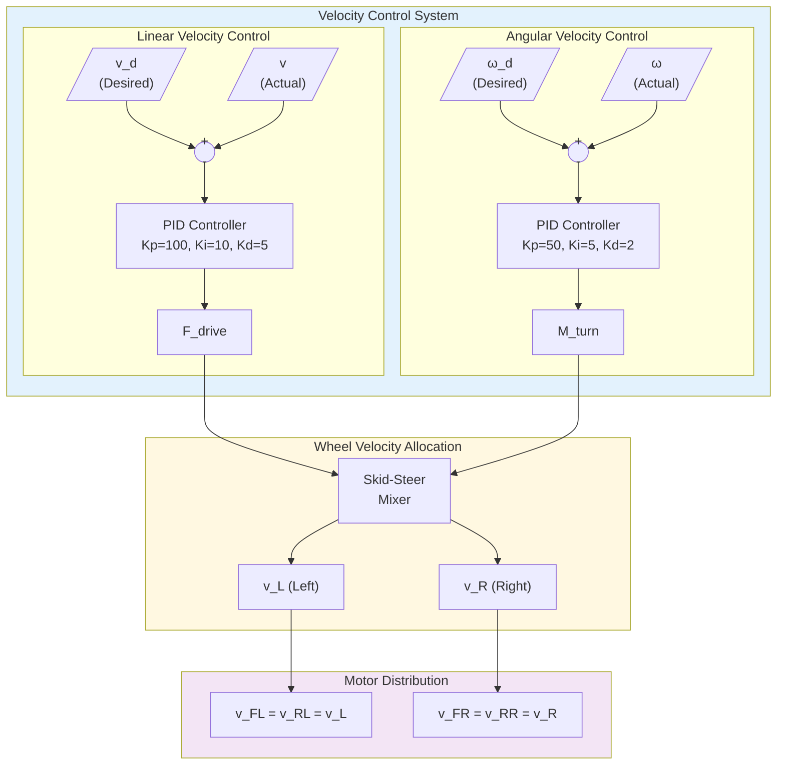
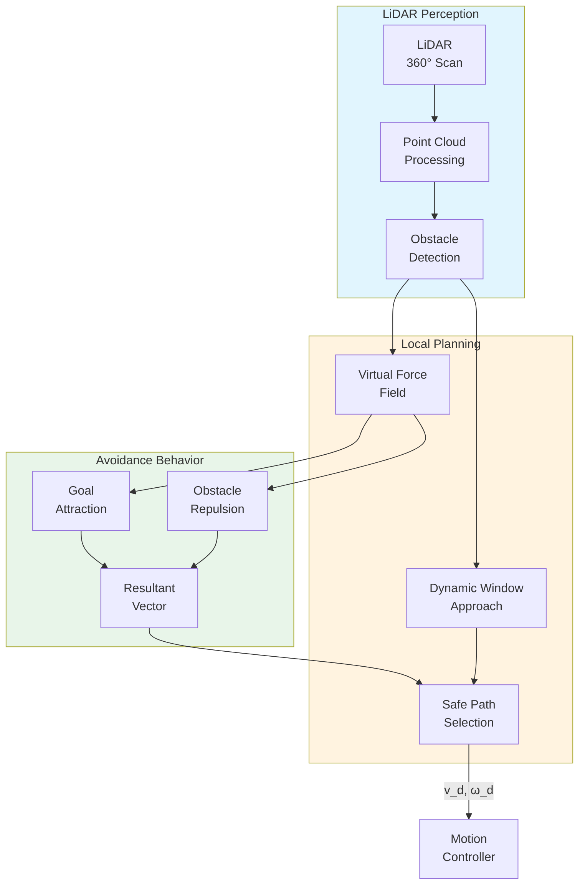

# Scout V2.0 Mobile Robot

The Scout V2.0 is a four-wheeled mobile robot platform developed by AgileX Robotics, commonly used for autonomous navigation research and development. It features a robust design with differential drive capabilities and sensor mounting options.


---

## System Overview

The Scout V2.0 is a rugged, mid-sized unmanned ground vehicle (UGV) designed for both indoor and outdoor applications. It serves as an excellent platform for testing navigation algorithms, SLAM (Simultaneous Localization and Mapping), and autonomous control systems.

### Key Features

- **Four-wheel Drive System**: Independent control of left and right wheel pairs
- **Robust Design**: Weather-resistant construction suitable for outdoor use
- **Sensor Integration**: Multiple mounting points for LiDAR, cameras, and other sensors
- **High Payload Capacity**: Can carry additional computing hardware and sensors
- **Differential Drive**: Skid-steering mechanism for precise maneuvering

### Specifications

- **Dimensions**: 925mm (L) × 380mm (W) × 210mm (H)
- **Weight**: ~40 kg (base platform)
- **Max Speed**: Variable (configurable, default ~3 m/s in simulation)
- **Wheel Configuration**: 4-wheel independent drive
- **Control Interface**: ROS/ROS2 compatible, Simulink integration available

---

## Components

### Drive System
- **Motors**: Four independent wheel motors (front_left, front_right, rear_left, rear_right)
- **Control Mode**: Velocity control with position feedback
- **Drive Type**: Skid-steering differential drive

### Sensors (Available in Examples)
- **LiDAR**: RP LiDAR A2 for 2D scanning
- **Advanced LiDAR**: SICK LMS-291 for precision navigation
- **IMU**: Gyroscope for orientation sensing
- **Extension Slots**: Customizable sensor mounting points

### Control System
The Scout V2.0 can be controlled through multiple interfaces:
- **Keyboard Control**: Manual operation using WASD keys
- **Simulink Control**: Advanced control algorithms via MATLAB/Simulink
- **ROS/ROS2**: Integration with robotics middleware

---

## Simulink Integration

### Available Functions

The Scout V2.0 example includes several MATLAB functions for Simulink integration:

- `wb_robot_step.m` - Main simulation step function
- `wb_motor_set_velocity.m` - Motor velocity control
- `wb_motor_set_position.m` - Motor position control  
- `wb_motor_set_torque.m` - Motor torque control
- `wb_gyro_get_values.m` - IMU data acquisition
- `wb_lidar_get_range_image.m` - LiDAR data processing
- `wb_lidar_get_horizontal_resolution.m` - LiDAR resolution settings

### State-Space Model

The system includes a Simulink model (`state_space_modeling.slx`) for:
- **Navigation Control**: Path planning and following
- **Obstacle Avoidance**: Using LiDAR sensor data
- **Localization**: Position and orientation estimation
- **Motion Control**: Velocity and trajectory control

---

## Control Architecture

### System Block Diagram



### State-Space Model Diagram



### Skid-Steer Kinematics



### State-Space Matrices

```matlab
%% Scout V2.0 State-Space Model
% State vector: x = [x, y, theta, v, omega]'
% x, y: Position [m]
% theta: Heading angle [rad]
% v: Linear velocity [m/s]
% omega: Angular velocity [rad/s]

% Physical Parameters
m = 40;           % Mass [kg]
Iz = 8;           % Yaw moment of inertia [kg*m^2]
W = 0.38;         % Track width [m]
L = 0.925;        % Wheelbase [m]
r = 0.165;        % Wheel radius [m]

% Friction and damping coefficients
mu_l = 0.8;       % Longitudinal friction
mu_s = 0.5;       % Lateral (skid) friction
b_v = 5;          % Linear velocity damping [N*s/m]
b_omega = 3;      % Angular velocity damping [N*m*s/rad]

% Linearized State-Space (at operating point v0, omega0 = 0)
% State: [x, y, theta, v, omega]'
% Input: [F_drive, M_turn]' (total drive force and turning moment)

A = [0, 0, 0, 1, 0;
     0, 0, 0, 0, 0;
     0, 0, 0, 0, 1;
     0, 0, 0, -b_v/m, 0;
     0, 0, 0, 0, -b_omega/Iz];

B = [0, 0;
     0, 0;
     0, 0;
     1/m, 0;
     0, 1/Iz];

C = eye(5);

D = zeros(5, 2);

% Alternative: Velocity-input model
% Input: [v_cmd, omega_cmd]'
% First-order velocity dynamics

tau_v = 0.2;      % Velocity time constant [s]
tau_omega = 0.15; % Angular velocity time constant [s]

A_vel = [0, 0, 0, 1, 0;
         0, 0, 0, 0, 0;
         0, 0, 0, 0, 1;
         0, 0, 0, -1/tau_v, 0;
         0, 0, 0, 0, -1/tau_omega];

B_vel = [0, 0;
         0, 0;
         0, 0;
         1/tau_v, 0;
         0, 1/tau_omega];

% Create state-space system
sys = ss(A_vel, B_vel, C, D);
sys.StateName = {'x', 'y', 'theta', 'v', 'omega'};
sys.InputName = {'v_cmd', 'omega_cmd'};
```

### Velocity Control Loop



### Obstacle Avoidance Architecture



---

## Control Algorithms

### Basic Movement Control

```python
# Forward movement
left_speed = -MAX_SPEED
right_speed = MAX_SPEED

# Turn left (rotate counterclockwise)
left_speed = MAX_SPEED
right_speed = MAX_SPEED

# Turn right (rotate clockwise)  
left_speed = -MAX_SPEED
right_speed = -MAX_SPEED
```

### Advanced Control Features

1. **Path Following**: Implementation of pure pursuit and stanley controllers
2. **SLAM Integration**: Real-time mapping and localization
3. **Obstacle Detection**: LiDAR-based collision avoidance
4. **Autonomous Navigation**: Goal-based navigation with dynamic path planning

---

## Usage Examples

### Basic Keyboard Control
1. Load the world file: `scout_v2.0/worlds/world.wbt`
2. Set controller to `my_controller`
3. Use WASD keys for manual control:
   - **W**: Move forward
   - **S**: Move backward  
   - **A**: Turn left
   - **D**: Turn right

### Simulink Control
1. Open the Simulink model: `state_space_modeling.slx`
2. Configure sensor parameters and control gains
3. Set controller to `simulink_control_app`
4. Run simulation with real-time data exchange

---

## Applications

The Scout V2.0 platform is ideal for:

- **Autonomous Navigation Research**
- **SLAM Algorithm Development**
- **Multi-robot Systems**
- **Outdoor Exploration Tasks**
- **Security and Surveillance Applications**
- **Agricultural Automation**
- **Industrial Inspection Tasks**

---

## References

- [AgileX Robotics Scout Series](https://global.agilex.ai/products/scout-2)
- [ROS Scout Driver Package](https://github.com/agilexrobotics/scout_ros)
- [Webots Mobile Robotics Documentation](https://cyberbotics.com/doc/guide/mobile-robots)

**Educational Purpose:**
This Scout V2.0 simulation serves as a comprehensive platform for learning mobile robotics concepts, including differential drive kinematics, sensor fusion, path planning, and autonomous navigation algorithms. The integration with Simulink allows for rapid prototyping and testing of control strategies before deployment on physical hardware.