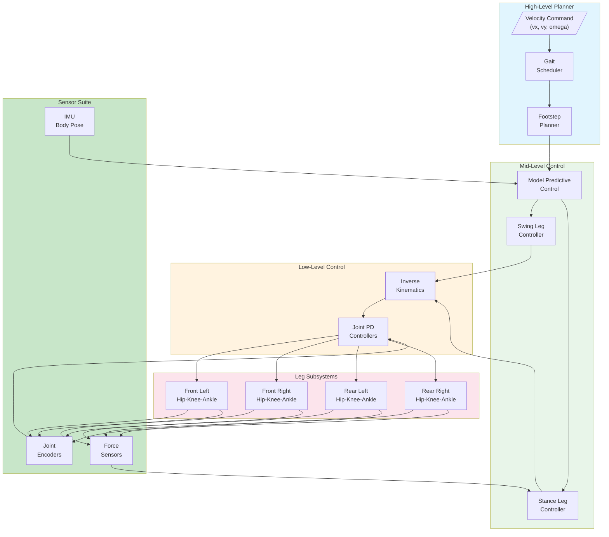
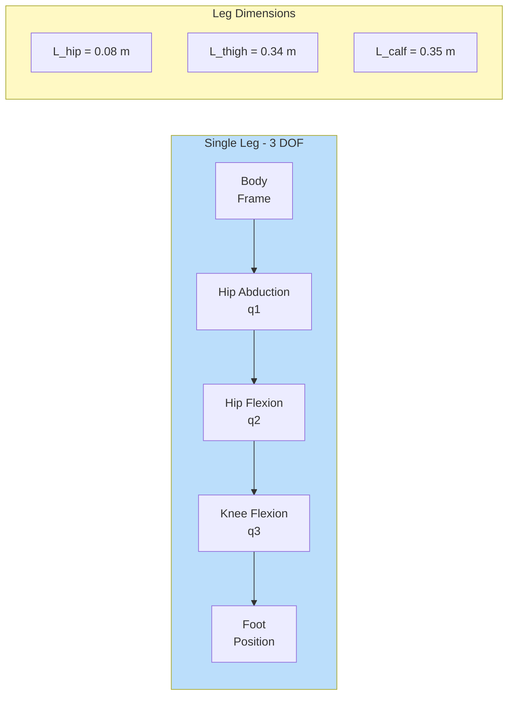
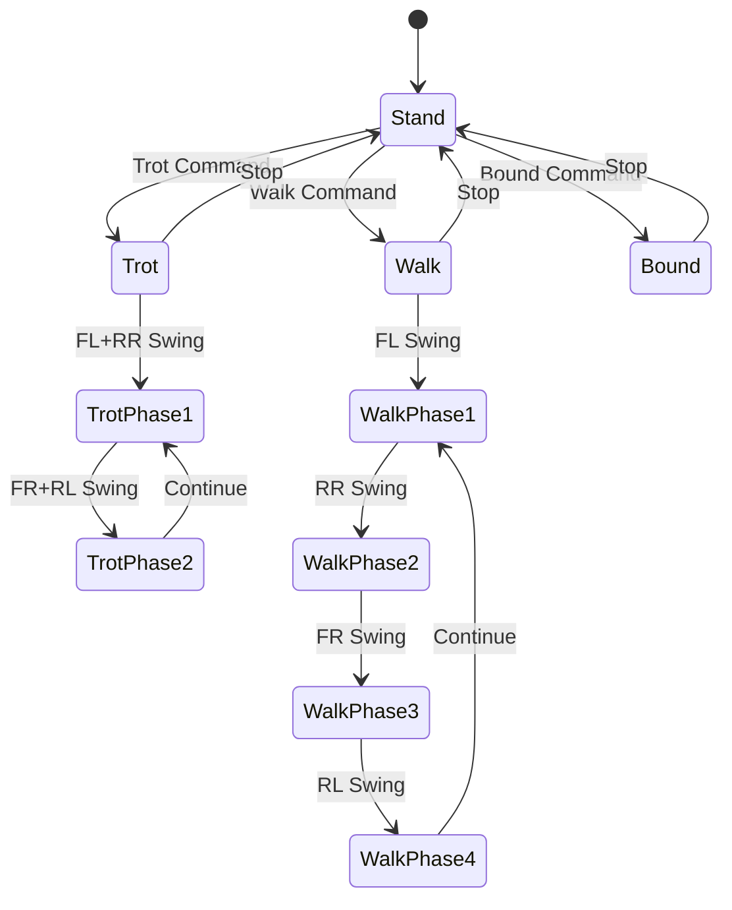
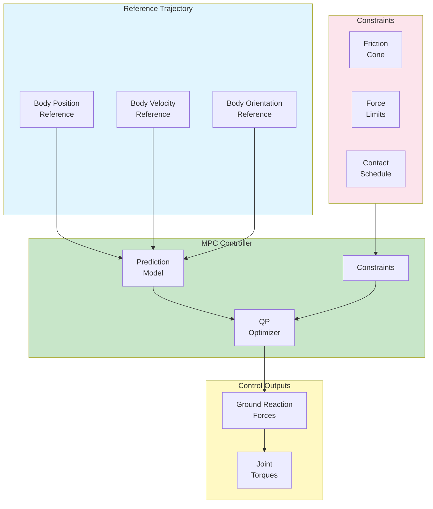

# Spot Quadruped Robot

This example demonstrates quadruped robot control inspired by Boston Dynamics Spot with MATLAB/Simulink.

---

## Overview

| Property | Value |
|----------|-------|
| **Type** | Quadruped Robot |
| **Difficulty** | Advanced |
| **Control Method** | Gait Control / MPC |
| **DOF** | 12 (3 per leg) |

---

## Features

- **Dynamic Walking**: Trot, walk, bound gaits
- **Terrain Adaptation**: Uneven ground navigation
- **Balance Control**: Real-time stability
- **12-DOF Control**: Hip, knee, ankle per leg

---

## Specifications

| Property | Value |
|----------|-------|
| Body Length | 1.1 m |
| Body Width | 0.5 m |
| Standing Height | 0.6 m |
| Mass | 32 kg |
| DOF | 12 (3 per leg) |

---

## Control Architecture

### Hierarchical Locomotion Control



### Leg Kinematic Structure



### Gait State Machine



### MPC Control Structure



---

## State-Space Model

### Single Rigid Body Dynamics

```matlab
% State vector: x = [p, theta, v, omega]' (13 states)
% p: body position [x, y, z]
% theta: body orientation [roll, pitch, yaw]
% v: body velocity [vx, vy, vz]
% omega: angular velocity [wx, wy, wz]

% Physical parameters
m = 32;             % Body mass [kg]
g = 9.81;           % Gravity [m/s^2]

% Body inertia tensor
Ixx = 0.946;        % [kg*m^2]
Iyy = 1.756;
Izz = 2.012;
I_body = diag([Ixx, Iyy, Izz]);

% Continuous-time dynamics
% m * v_dot = sum(f_i) + m*g
% I * omega_dot = sum(r_i x f_i)

% Linearized state-space (hover/standing)
A = zeros(12, 12);
A(1:3, 7:9) = eye(3);       % Position from velocity
A(4:6, 10:12) = eye(3);     % Orientation from angular rate

B = zeros(12, 12);          % 4 legs x 3 force components
for i = 1:4
    B(7:9, (i-1)*3+1:i*3) = eye(3) / m;  % Linear acceleration from forces
    % Angular acceleration requires Jacobian (configuration dependent)
end

% MPC uses this model for prediction
```

### Leg Inverse Kinematics

```matlab
function q = leg_ik(p_foot, leg_id)
    % Inverse kinematics for single leg
    % p_foot: foot position in body frame [x, y, z]
    % leg_id: 'FL', 'FR', 'RL', 'RR'

    % Leg parameters
    L_hip = 0.08;       % Hip offset [m]
    L_thigh = 0.34;     % Thigh length [m]
    L_calf = 0.35;      % Calf length [m]

    % Sign conventions for left/right
    if strcmp(leg_id, 'FL') || strcmp(leg_id, 'RL')
        sign_y = 1;
    else
        sign_y = -1;
    end

    % Position relative to hip
    x = p_foot(1);
    y = p_foot(2) - sign_y * L_hip;
    z = p_foot(3);

    % Hip abduction angle
    q(1) = atan2(y, -z);

    % Distance from hip to foot in sagittal plane
    L = sqrt(y^2 + z^2);
    d = sqrt(x^2 + L^2);

    % Knee angle (law of cosines)
    cos_knee = (L_thigh^2 + L_calf^2 - d^2) / (2 * L_thigh * L_calf);
    q(3) = pi - acos(max(-1, min(1, cos_knee)));

    % Hip flexion angle
    alpha = atan2(x, L);
    beta = acos((L_thigh^2 + d^2 - L_calf^2) / (2 * L_thigh * d));
    q(2) = alpha + beta;
end
```

### Swing Leg Trajectory

```matlab
function [p_foot, v_foot] = swing_trajectory(phase, p_start, p_end, swing_height)
    % Bezier curve swing trajectory
    % phase: normalized time [0, 1]

    % Control points for Bezier curve
    p0 = p_start;
    p1 = p_start + [0; 0; swing_height];
    p2 = p_end + [0; 0; swing_height];
    p3 = p_end;

    % Cubic Bezier
    t = phase;
    p_foot = (1-t)^3 * p0 + 3*(1-t)^2*t * p1 + 3*(1-t)*t^2 * p2 + t^3 * p3;

    % Bezier derivative for velocity
    v_foot = 3*(1-t)^2 * (p1-p0) + 6*(1-t)*t * (p2-p1) + 3*t^2 * (p3-p2);
end
```

---

## Gait Patterns

### Gait Timing Diagram

```
Trot Gait:
Time:    0%   25%   50%   75%   100%
FL:      [SWING    ][STANCE    ]
FR:      [STANCE   ][SWING     ]
RL:      [STANCE   ][SWING     ]
RR:      [SWING    ][STANCE    ]

Walk Gait:
Time:    0%   25%   50%   75%   100%
FL:      [SW][STANCE         ]
FR:      [STANCE   ][SW][STANCE]
RL:      [STANCE      ][SW][ST]
RR:      [ST][STANCE      ][SW]

Bound Gait:
Time:    0%   25%   50%   75%   100%
FL:      [SWING    ][STANCE    ]
FR:      [SWING    ][STANCE    ]
RL:      [STANCE   ][SWING     ]
RR:      [STANCE   ][SWING     ]
```

### Gait Parameters

```matlab
% Trot gait parameters
trot_params = struct();
trot_params.stance_duration = 0.3;    % [s]
trot_params.swing_duration = 0.2;     % [s]
trot_params.swing_height = 0.08;      % [m]
trot_params.step_length = 0.15;       % [m]
trot_params.phase_offset = [0, 0.5, 0.5, 0];  % FL, FR, RL, RR

% Walk gait parameters
walk_params = struct();
walk_params.stance_duration = 0.4;
walk_params.swing_duration = 0.15;
walk_params.swing_height = 0.06;
walk_params.step_length = 0.12;
walk_params.phase_offset = [0, 0.5, 0.75, 0.25];
```

---

## MPC Formulation

### Convex MPC

```matlab
function [f_opt, status] = convex_mpc(x0, x_ref, contact_schedule, params)
    % Convex MPC for quadruped locomotion
    % Optimizes ground reaction forces

    N = params.horizon;     % Prediction horizon
    dt = params.dt;         % Time step
    mu = params.friction;   % Friction coefficient

    % Decision variables: forces at each leg for each timestep
    n_forces = 12 * N;      % 4 legs x 3 forces x N steps

    % Build QP matrices
    % min (1/2) * f' * H * f + g' * f
    % subject to: A_eq * f = b_eq
    %             A_ineq * f <= b_ineq

    % Cost: tracking error + force regularization
    Q = blkdiag(params.Q_pos, params.Q_vel, params.Q_ori, params.Q_omega);
    R = params.R_force * eye(12);

    H = zeros(n_forces, n_forces);
    g = zeros(n_forces, 1);

    x = x0;
    for k = 1:N
        % Propagate dynamics
        [A_k, B_k] = get_linearized_dynamics(x, contact_schedule(:, k));

        % Add to cost
        idx = (k-1)*12 + 1 : k*12;
        H(idx, idx) = H(idx, idx) + B_k' * Q * B_k + R;
        g(idx) = g(idx) + B_k' * Q * (A_k * x - x_ref(:, k));

        x = A_k * x;
    end

    % Friction cone constraints (linearized)
    A_fric = [];
    b_fric = [];
    for k = 1:N
        for leg = 1:4
            if contact_schedule(leg, k)
                idx = (k-1)*12 + (leg-1)*3 + 1;
                % |fx| <= mu * fz, |fy| <= mu * fz, fz >= 0
                A_fric = [A_fric;
                          1, 0, -mu;
                         -1, 0, -mu;
                          0, 1, -mu;
                          0,-1, -mu;
                          0, 0, -1];
                b_fric = [b_fric; zeros(5, 1)];
            end
        end
    end

    % Solve QP
    options = optimoptions('quadprog', 'Display', 'off');
    [f_opt, ~, status] = quadprog(H, g, A_fric, b_fric, [], [], [], [], [], options);
end
```

---

## Simulink Integration

### Initialization Script

```matlab
TIME_STEP = 2;  % Fast update for dynamic locomotion

% Initialize IMU
imu = wb_robot_get_device('imu');
wb_inertial_unit_enable(imu, TIME_STEP);

gyro = wb_robot_get_device('gyro');
wb_gyro_enable(gyro, TIME_STEP);

accel = wb_robot_get_device('accelerometer');
wb_accelerometer_enable(accel, TIME_STEP);

% Initialize leg motors (12 total)
leg_names = {'front_left', 'front_right', 'rear_left', 'rear_right'};
joint_names = {'hip_abduction', 'hip_flexion', 'knee_flexion'};

motors = cell(4, 3);
sensors = cell(4, 3);

for i = 1:4
    for j = 1:3
        name = [leg_names{i} '_' joint_names{j}];
        motors{i, j} = wb_robot_get_device(name);
        sensors{i, j} = wb_robot_get_device([name '_sensor']);
        wb_position_sensor_enable(sensors{i, j}, TIME_STEP);
    end
end

% Initialize force sensors
force_sensors = cell(1, 4);
for i = 1:4
    force_sensors{i} = wb_robot_get_device([leg_names{i} '_force']);
    wb_touch_sensor_enable(force_sensors{i}, TIME_STEP);
end

% Gait parameters
gait = 'trot';
gait_phase = 0;
```

### Locomotion Control Loop

```matlab
while wb_robot_step(TIME_STEP) ~= -1
    % Read body state
    orientation = wb_inertial_unit_get_roll_pitch_yaw(imu);
    angular_vel = wb_gyro_get_values(gyro);
    linear_accel = wb_accelerometer_get_values(accel);

    % Read joint states
    q = zeros(12, 1);
    for i = 1:4
        for j = 1:3
            q((i-1)*3 + j) = wb_position_sensor_get_value(sensors{i, j});
        end
    end

    % Read contact forces
    contact = zeros(4, 1);
    for i = 1:4
        contact(i) = wb_touch_sensor_get_value(force_sensors{i}) > 10;
    end

    % Gait scheduler
    [swing_legs, stance_legs] = gait_scheduler(gait, gait_phase);

    % MPC for stance legs (compute ground reaction forces)
    x_state = [position; orientation; velocity; angular_vel];
    f_grf = convex_mpc(x_state, x_ref, stance_legs, mpc_params);

    % Swing leg controller
    for leg = swing_legs
        [p_foot_des, v_foot_des] = swing_trajectory(phase(leg), ...
            p_foot_start(leg), p_foot_end(leg), swing_height);
        q_leg = leg_ik(p_foot_des, leg);
        q_des((leg-1)*3+1 : leg*3) = q_leg;
    end

    % Stance leg controller (force to torque)
    for leg = stance_legs
        J_leg = leg_jacobian(q((leg-1)*3+1 : leg*3), leg);
        tau((leg-1)*3+1 : leg*3) = J_leg' * f_grf((leg-1)*3+1 : leg*3);
    end

    % Apply joint commands
    for i = 1:4
        for j = 1:3
            wb_motor_set_torque(motors{i, j}, tau((i-1)*3 + j));
        end
    end

    % Update gait phase
    gait_phase = mod(gait_phase + TIME_STEP/1000 / gait_period, 1);
end
```

---

## Quick Start

1. **Open Webots** and load `examples/spot_quadruped/worlds/spot_terrain.wbt`
2. **Configure MATLAB** controller
3. **Run simulation** for locomotion demo

---

## Gait Comparison

| Gait | Speed | Stability | Terrain | Energy |
|------|-------|-----------|---------|--------|
| Walk | Slow | High | Rough | Low |
| Trot | Medium | Medium | Moderate | Medium |
| Bound | Fast | Low | Flat | High |

---

## References

- Boston Dynamics Spot
- Raibert, M. (1986). "Legged Robots That Balance"
- Di Carlo, J. et al. (2018). "Dynamic Locomotion in the MIT Cheetah 3"
- Kim, D. et al. (2019). "Highly Dynamic Quadruped Locomotion via Whole-Body Impulse Control"
