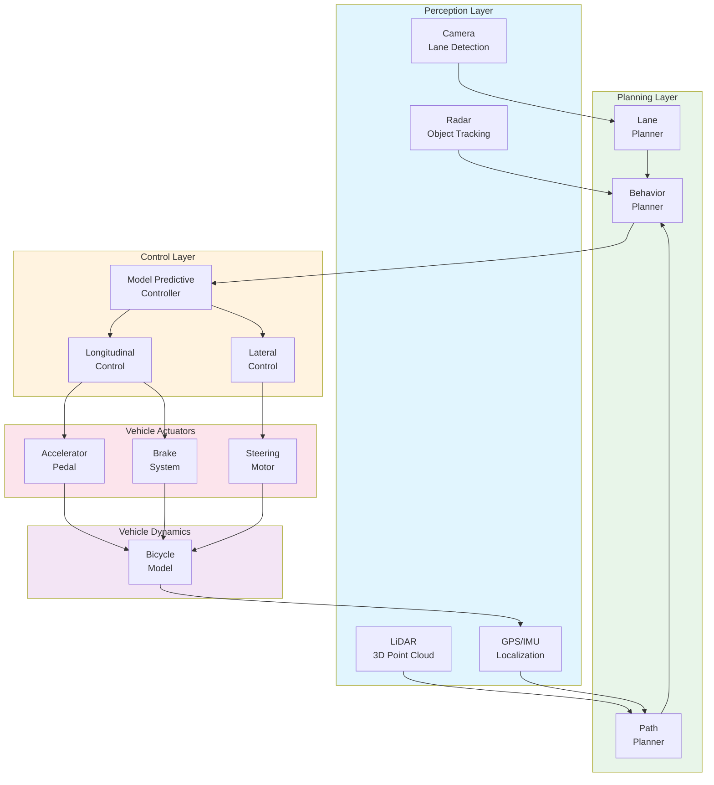
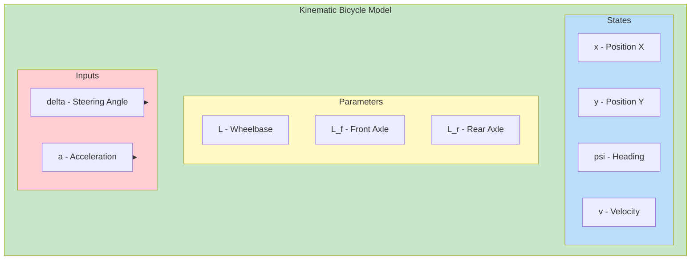
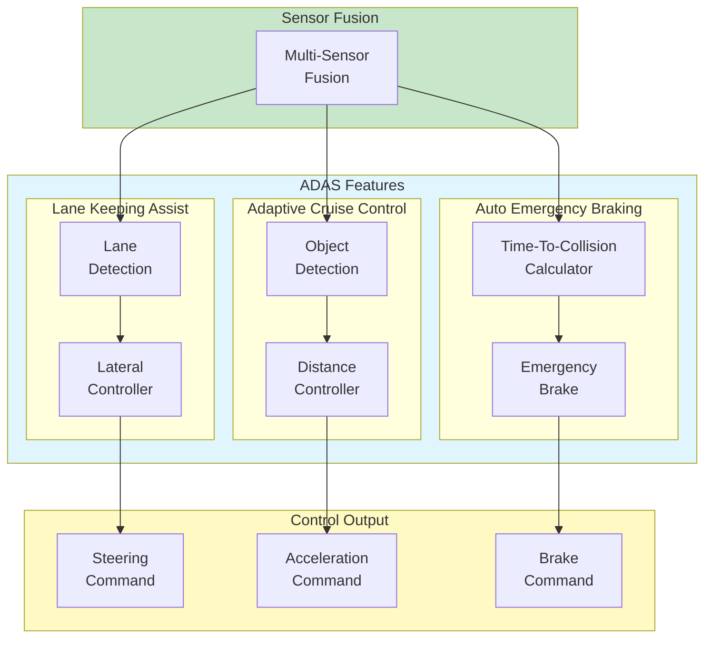
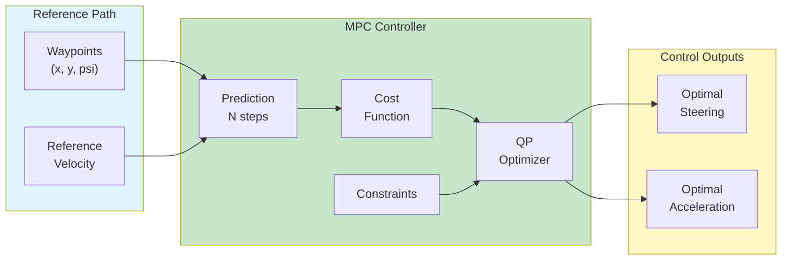

# Tesla Model 3 Autonomous Vehicle

This example demonstrates autonomous vehicle control using the Tesla Model 3 with MATLAB/Simulink.

---

## Overview

| Property | Value |
|----------|-------|
| **Type** | Autonomous Electric Vehicle |
| **Robot** | Tesla Model 3 |
| **Difficulty** | Intermediate to Advanced |
| **Control Method** | Ackermann Steering / MPC |

---

## Features

- **Autonomous Driving**: Level 2+ ADAS
- **Lane Keeping**: Camera-based detection
- **Adaptive Cruise Control**: Radar-based
- **Automatic Emergency Braking**: Obstacle detection

---

## Specifications

| Property | Value |
|----------|-------|
| Length | 4.694 m |
| Wheelbase | 2.875 m |
| Track Width | 1.58 m |
| Max Speed | 60 m/s (216 km/h) |
| Sensors | Camera, LiDAR, Radar, GPS |

---

## Control Architecture

### Autonomous Driving System



### Bicycle Model



### ADAS Feature Architecture



### MPC Path Tracking



---

## State-Space Model

### Kinematic Bicycle Model

```matlab
% State vector: x = [X, Y, psi, v]'
% Input vector: u = [delta, a]'

% Vehicle parameters
L = 2.875;          % Wheelbase [m]
L_f = 1.5;          % CG to front axle [m]
L_r = L - L_f;      % CG to rear axle [m]

% Kinematic equations (rear-axle reference)
% X_dot = v * cos(psi)
% Y_dot = v * sin(psi)
% psi_dot = v * tan(delta) / L
% v_dot = a

% Linearized model at operating point (v0, psi0)
A = [0, 0, -v0*sin(psi0), cos(psi0);
     0, 0,  v0*cos(psi0), sin(psi0);
     0, 0,  0,            tan(delta0)/L;
     0, 0,  0,            0];

B = [0,               0;
     0,               0;
     v0/(L*cos(delta0)^2), 0;
     0,               1];

C = eye(4);
D = zeros(4, 2);
```

### Dynamic Bicycle Model

```matlab
% Extended state: x = [X, Y, psi, v, beta]'
% beta: slip angle at CG

% Tire parameters (Pacejka Magic Formula simplified)
C_f = 80000;        % Front cornering stiffness [N/rad]
C_r = 80000;        % Rear cornering stiffness [N/rad]
m = 1847;           % Vehicle mass [kg]
I_z = 3300;         % Yaw inertia [kg*m^2]

% Slip angles
alpha_f = delta - atan2(v*sin(beta) + L_f*psi_dot, v*cos(beta));
alpha_r = -atan2(v*sin(beta) - L_r*psi_dot, v*cos(beta));

% Lateral forces
F_yf = -C_f * alpha_f;
F_yr = -C_r * alpha_r;

% Dynamic equations
v_dot = (F_yf*cos(delta) + F_yr) / m - v*psi_dot*sin(beta) + a*cos(beta);
psi_ddot = (L_f*F_yf*cos(delta) - L_r*F_yr) / I_z;
beta_dot = (F_yf*cos(delta) + F_yr) / (m*v) - psi_dot;
```

### Discretized Model for MPC

```matlab
function [A_d, B_d] = discretize_bicycle(v, delta, dt)
    % Discretize bicycle model for MPC

    L = 2.875;

    % Continuous A, B at operating point
    A_c = [0, 0, 0, 1;
           0, 0, v, 0;
           0, 0, 0, tan(delta)/L;
           0, 0, 0, 0];

    B_c = [0,               0;
           0,               0;
           v/(L*cos(delta)^2), 0;
           0,               1];

    % Forward Euler discretization
    A_d = eye(4) + A_c * dt;
    B_d = B_c * dt;
end
```

---

## Control Design

### MPC Path Tracking

```matlab
function [delta_opt, a_opt] = mpc_path_tracking(x0, path_ref, v_ref, params)
    % MPC for path tracking
    % x0: current state [X, Y, psi, v]
    % path_ref: reference path (N x 4)
    % v_ref: reference velocity

    N = params.horizon;
    dt = params.dt;

    % Decision variables: [delta_0, a_0, ..., delta_{N-1}, a_{N-1}]
    n_u = 2 * N;

    % State constraints
    delta_max = deg2rad(30);    % Max steering angle
    a_max = 3.0;                % Max acceleration
    a_min = -5.0;               % Max deceleration

    % Cost weights
    Q = diag([10, 10, 5, 1]);   % State tracking
    R = diag([1, 0.1]);         % Control effort
    R_delta = diag([10, 1]);    % Control rate

    % Build QP
    H = zeros(n_u);
    f = zeros(n_u, 1);

    x = x0;
    for k = 1:N
        [A_k, B_k] = discretize_bicycle(x(4), 0, dt);

        % Cost contribution
        idx = 2*(k-1) + 1 : 2*k;
        e = x - path_ref(k, :)';
        H(idx, idx) = B_k' * Q * B_k + R;
        f(idx) = B_k' * Q * (A_k * x - path_ref(k, :)');

        x = A_k * x + B_k * [0; 0];  % Predict with zero input
    end

    % Input constraints
    lb = repmat([-delta_max; a_min], N, 1);
    ub = repmat([delta_max; a_max], N, 1);

    % Solve QP
    options = optimoptions('quadprog', 'Display', 'off');
    u_opt = quadprog(H, f, [], [], [], [], lb, ub, [], options);

    delta_opt = u_opt(1);
    a_opt = u_opt(2);
end
```

### Lane Keeping Controller

```matlab
function delta = lane_keeping_controller(e_lat, e_heading, v, params)
    % Stanley controller for lane keeping
    % e_lat: lateral error [m]
    % e_heading: heading error [rad]
    % v: velocity [m/s]

    k = params.k_stanley;   % Gain
    k_soft = 1.0;           % Softening factor

    % Stanley control law
    delta = e_heading + atan2(k * e_lat, k_soft + v);

    % Saturation
    delta_max = deg2rad(30);
    delta = max(-delta_max, min(delta_max, delta));
end
```

### Adaptive Cruise Control

```matlab
function a = adaptive_cruise_control(v_ego, v_lead, d_rel, params)
    % ACC with constant time gap policy
    % v_ego: ego vehicle velocity
    % v_lead: lead vehicle velocity
    % d_rel: relative distance

    t_gap = params.time_gap;        % Desired time gap [s]
    d_min = params.min_distance;    % Minimum distance [m]
    v_set = params.set_speed;       % Set speed [m/s]

    % Desired distance
    d_des = d_min + t_gap * v_ego;

    % Distance error
    e_d = d_rel - d_des;

    % Velocity error
    e_v = v_lead - v_ego;

    % Control law
    k_d = 0.5;
    k_v = 1.0;
    a = k_d * e_d + k_v * e_v;

    % If no lead vehicle, track set speed
    if d_rel > 100
        a = 0.5 * (v_set - v_ego);
    end

    % Saturation
    a = max(-5, min(3, a));
end
```

---

## Simulink Integration

### Initialization Script

```matlab
TIME_STEP = 10;

% Initialize sensors
camera = wb_robot_get_device('camera');
wb_camera_enable(camera, TIME_STEP);

lidar = wb_robot_get_device('lidar');
wb_lidar_enable(lidar, TIME_STEP);

gps = wb_robot_get_device('gps');
wb_gps_enable(gps, TIME_STEP);

imu = wb_robot_get_device('inertial unit');
wb_inertial_unit_enable(imu, TIME_STEP);

gyro = wb_robot_get_device('gyro');
wb_gyro_enable(gyro, TIME_STEP);

% Initialize actuators
steering = wb_robot_get_device('steering');
throttle = wb_robot_get_device('throttle');
brake = wb_robot_get_device('brake');

% Vehicle parameters
vehicle_params = struct();
vehicle_params.wheelbase = 2.875;
vehicle_params.max_steer = deg2rad(30);
```

### Autonomous Driving Loop

```matlab
while wb_robot_step(TIME_STEP) ~= -1
    % Read sensors
    position = wb_gps_get_values(gps);
    orientation = wb_inertial_unit_get_roll_pitch_yaw(imu);
    angular_vel = wb_gyro_get_values(gyro);
    speed = wb_gps_get_speed(gps);

    % Current state
    psi = orientation(3);
    x_state = [position(1); position(2); psi; speed];

    % Get reference path (from path planner)
    path_ref = get_path_reference(position, global_path);

    % MPC path tracking
    [delta_cmd, a_cmd] = mpc_path_tracking(x_state, path_ref, v_ref, mpc_params);

    % Lane keeping assist (override if needed)
    [e_lat, e_heading] = compute_lane_error(position, psi, lane_center);
    delta_lka = lane_keeping_controller(e_lat, e_heading, speed, lka_params);

    % Adaptive cruise control
    [d_rel, v_lead] = detect_lead_vehicle(lidar_data);
    a_acc = adaptive_cruise_control(speed, v_lead, d_rel, acc_params);

    % Automatic emergency braking
    ttc = d_rel / max(0.1, speed - v_lead);
    if ttc < 2.0 && ttc > 0
        a_cmd = min(a_cmd, -5);  % Emergency brake
    end

    % Apply controls
    wb_motor_set_position(steering, delta_cmd);

    if a_cmd >= 0
        set_throttle(throttle, a_cmd / 3.0);
        set_brake(brake, 0);
    else
        set_throttle(throttle, 0);
        set_brake(brake, -a_cmd / 5.0);
    end
end
```

---

## ADAS Features

- **Lane Keeping Assist (LKA)**: Camera-based lane detection and steering
- **Adaptive Cruise Control (ACC)**: Radar-based distance control
- **Automatic Emergency Braking (AEB)**: Collision avoidance

---

## Quick Start

1. **Open Webots** and load `examples/tesla_model3/worlds/highway.wbt`
2. **Configure MATLAB** controller
3. **Run simulation** for autonomous driving

---

## Performance Metrics

| Metric | Target |
|--------|--------|
| Lateral Error | < 0.1 m |
| Heading Error | < 2 deg |
| Speed Tracking | +/- 1 m/s |
| TTC Threshold | > 2 s |

---

## References

- Tesla Autopilot
- [Webots Automobile](https://cyberbotics.com/doc/automobile/car)
- Rajamani, R. (2011). "Vehicle Dynamics and Control"
- Kong, J. et al. (2015). "Kinematic and Dynamic Vehicle Models for Autonomous Driving"
