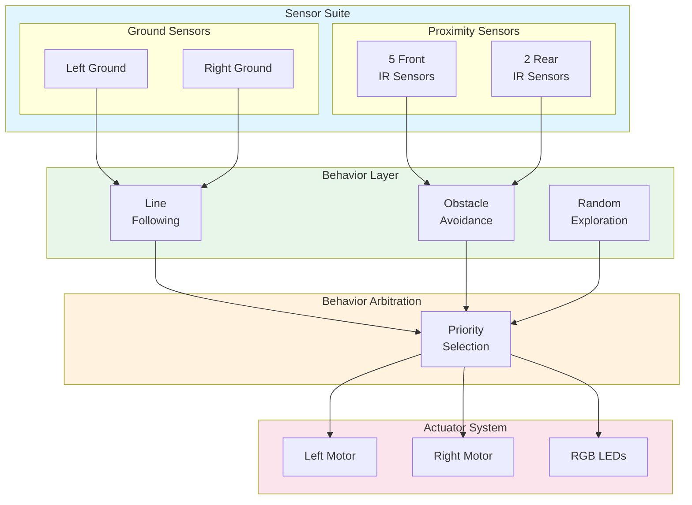
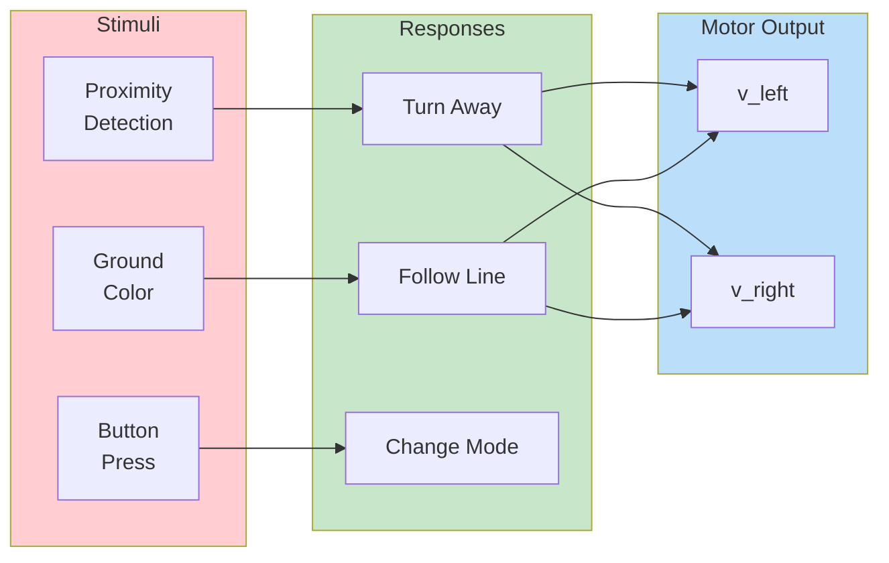
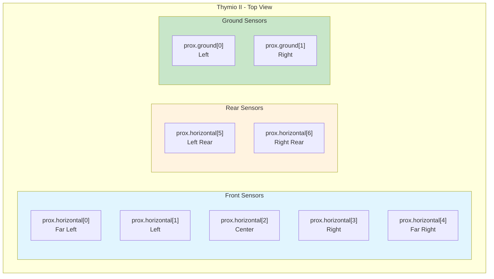
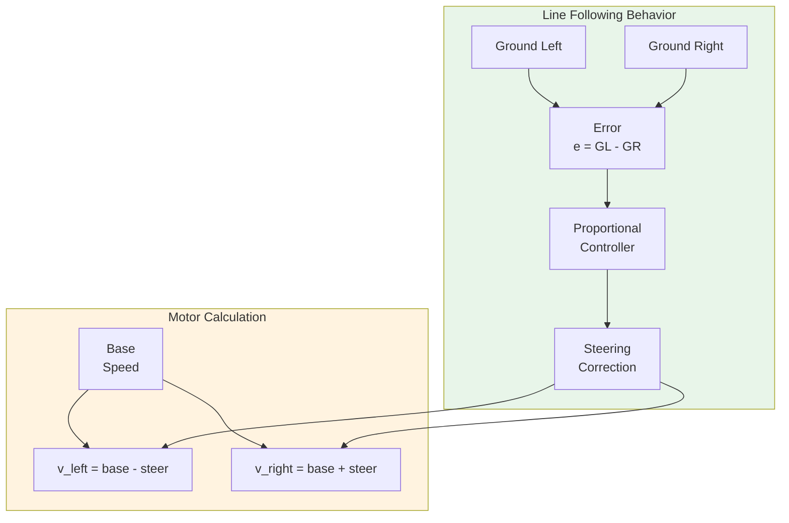

# Thymio II Educational Robot

This example demonstrates the Thymio II robot with MATLAB/Simulink.

---

## Overview

| Property | Value |
|----------|-------|
| **Type** | Educational Mobile Robot |
| **Robot** | Mobsya Thymio II |
| **Difficulty** | Beginner |
| **Control Method** | Differential Drive / Reactive |

---

## Features

- **Educational Design**: Easy to learn
- **7 IR Proximity Sensors**: 5 front, 2 rear
- **Ground Sensors**: Line following
- **LED Feedback**: Visual indicators

---

## Specifications

| Property | Value |
|----------|-------|
| Dimensions | 112 x 117 x 53 mm |
| Weight | 270 g |
| Max Speed | 14 cm/s |
| Wheel Radius | 22 mm |
| Wheel Base | 95 mm |

---

## Control Architecture

### System Block Diagram



### Reactive Control Architecture



### Sensor Layout



---

## State-Space Model

### Differential Drive Kinematics

```matlab
% State vector: x = [x, y, theta]'
% Input vector: u = [v_left, v_right]'

% Thymio parameters
r = 0.022;      % Wheel radius [m]
L = 0.095;      % Wheel base [m]
v_max = 0.14;   % Max velocity [m/s]

% Kinematic equations
% x_dot = (v_left + v_right)/2 * cos(theta)
% y_dot = (v_left + v_right)/2 * sin(theta)
% theta_dot = (v_right - v_left) / L

% Linear and angular velocity
v = (v_left + v_right) / 2;       % Linear velocity [m/s]
omega = (v_right - v_left) / L;    % Angular velocity [rad/s]

% State derivatives
x_dot = v * cos(theta);
y_dot = v * sin(theta);
theta_dot = omega;
```

### Sensor Model

```matlab
% Proximity sensor model (returns 0-4500)
% Higher values = closer object

% Sensor angles (from robot frame)
prox_angles = [-40, -20, 0, 20, 40, 150, -150] * pi/180;  % [rad]

% Sensor range
prox_range = 0.12;  % 12 cm max range

% Ground sensor model (returns 0-1023)
% Higher values = white surface
% Lower values = black surface
ground_threshold = 400;  % Black line detection
```

---

## Behavior Design

### Line Following



### Line Following Controller

```matlab
function [v_left, v_right] = line_following(ground_left, ground_right, params)
    % Simple line following using ground sensors

    % Error: positive = line is to the left
    error = ground_left - ground_right;

    % Proportional control
    k_p = params.k_line;
    correction = k_p * error;

    % Base speed
    v_base = params.v_line;

    % Motor commands
    v_left = v_base - correction;
    v_right = v_base + correction;

    % Line lost detection
    if ground_left < params.threshold && ground_right < params.threshold
        % Both sensors see black - on the line
    elseif ground_left > params.threshold && ground_right > params.threshold
        % Both sensors see white - line lost, search
        v_left = v_base;
        v_right = -v_base;  % Turn in place
    end

    % Saturation
    v_max = params.v_max;
    v_left = max(-v_max, min(v_max, v_left));
    v_right = max(-v_max, min(v_max, v_right));
end
```

### Obstacle Avoidance

```matlab
function [v_left, v_right] = obstacle_avoidance(prox_sensors, params)
    % Braitenberg-style obstacle avoidance

    % Sensor weights for left motor
    w_left = [0.5, 0.25, -0.25, -0.5, -0.75, 0, 0];

    % Sensor weights for right motor
    w_right = [-0.75, -0.5, -0.25, 0.25, 0.5, 0, 0];

    % Normalize sensor values (0-1)
    prox_norm = prox_sensors / 4500;

    % Compute motor values
    v_left = params.v_base + sum(w_left .* prox_norm) * params.k_avoid;
    v_right = params.v_base + sum(w_right .* prox_norm) * params.k_avoid;

    % Saturation
    v_left = max(0, min(params.v_max, v_left));
    v_right = max(0, min(params.v_max, v_right));
end
```

---

## Simulink Integration

### Initialization Script

```matlab
TIME_STEP = 100;  % Thymio uses slower update rate

% Initialize proximity sensors
prox = zeros(1, 7);
for i = 0:6
    prox(i+1) = wb_robot_get_device(['prox.horizontal.' num2str(i)]);
    wb_distance_sensor_enable(prox(i+1), TIME_STEP);
end

% Initialize ground sensors
ground = zeros(1, 2);
for i = 0:1
    ground(i+1) = wb_robot_get_device(['prox.ground.' num2str(i)]);
    wb_distance_sensor_enable(ground(i+1), TIME_STEP);
end

% Initialize motors
left_motor = wb_robot_get_device('motor.left');
right_motor = wb_robot_get_device('motor.right');
wb_motor_set_position(left_motor, inf);
wb_motor_set_position(right_motor, inf);
wb_motor_set_velocity(left_motor, 0);
wb_motor_set_velocity(right_motor, 0);

% Behavior parameters
params.v_max = 7.0;           % Max motor speed (Thymio units)
params.v_base = 4.0;          % Base speed
params.k_line = 0.005;        % Line following gain
params.k_avoid = 0.02;        % Obstacle avoidance gain
params.threshold = 400;       % Ground sensor threshold
```

### Behavior-Based Control Loop

```matlab
% Behavior state
current_behavior = 'explore';

while wb_robot_step(TIME_STEP) ~= -1
    % Read proximity sensors
    prox_values = zeros(1, 7);
    for i = 1:7
        prox_values(i) = wb_distance_sensor_get_value(prox(i));
    end

    % Read ground sensors
    ground_values = zeros(1, 2);
    for i = 1:2
        ground_values(i) = wb_distance_sensor_get_value(ground(i));
    end

    % Behavior selection (priority-based)
    front_obstacle = max(prox_values(1:5)) > 1000;
    line_detected = ground_values(1) < params.threshold || ...
                    ground_values(2) < params.threshold;

    % Priority: Obstacle > Line > Explore
    if front_obstacle
        [v_left, v_right] = obstacle_avoidance(prox_values, params);
        current_behavior = 'avoid';
    elseif line_detected
        [v_left, v_right] = line_following(ground_values(1), ground_values(2), params);
        current_behavior = 'line';
    else
        [v_left, v_right] = random_explore(params);
        current_behavior = 'explore';
    end

    % Apply motor commands
    wb_motor_set_velocity(left_motor, v_left);
    wb_motor_set_velocity(right_motor, v_right);
end

function [v_left, v_right] = random_explore(params)
    % Random walk behavior
    persistent timer turn_dir
    if isempty(timer)
        timer = 0;
        turn_dir = 1;
    end

    timer = timer + 1;
    if timer > 50  % Change direction periodically
        timer = 0;
        turn_dir = sign(randn);
    end

    v_left = params.v_base + turn_dir * 1;
    v_right = params.v_base - turn_dir * 1;
end
```

---

## Educational Activities

### Activity 1: Follow the Line

```matlab
% Simple line follower
while wb_robot_step(TIME_STEP) ~= -1
    g_left = wb_distance_sensor_get_value(ground(1));
    g_right = wb_distance_sensor_get_value(ground(2));

    % Both on line (black)
    if g_left < 400 && g_right < 400
        v_left = 4; v_right = 4;
    % Line to the left
    elseif g_left < 400
        v_left = 2; v_right = 5;
    % Line to the right
    elseif g_right < 400
        v_left = 5; v_right = 2;
    % Line lost
    else
        v_left = 3; v_right = -3;  % Turn to search
    end

    wb_motor_set_velocity(left_motor, v_left);
    wb_motor_set_velocity(right_motor, v_right);
end
```

### Activity 2: Wall Following

```matlab
% Right-wall follower
while wb_robot_step(TIME_STEP) ~= -1
    front = wb_distance_sensor_get_value(prox(3));
    right = wb_distance_sensor_get_value(prox(5));

    if front > 2000        % Obstacle in front
        v_left = 3; v_right = -3;  % Turn left
    elseif right > 1500    % Too close to wall
        v_left = 4; v_right = 2;   % Turn slightly left
    elseif right < 500     % Too far from wall
        v_left = 2; v_right = 4;   % Turn slightly right
    else                   % Good distance
        v_left = 4; v_right = 4;   % Go straight
    end

    wb_motor_set_velocity(left_motor, v_left);
    wb_motor_set_velocity(right_motor, v_right);
end
```

---

## Quick Start

1. **Open Webots** and load `examples/thymio2/worlds/thymio_playground.wbt`
2. **Configure MATLAB** controller
3. **Run simulation**

---

## LED Colors

| Color | Behavior |
|-------|----------|
| Green | Line Following |
| Red | Obstacle Detected |
| Blue | Exploring |
| Yellow | Searching |

---

## References

- [Thymio Official](https://www.thymio.org/)
- [Webots Thymio II](https://cyberbotics.com/doc/guide/thymio2)
- Mondada, F. et al. (2017). "Thymio: A Robot for Learning and Research"
