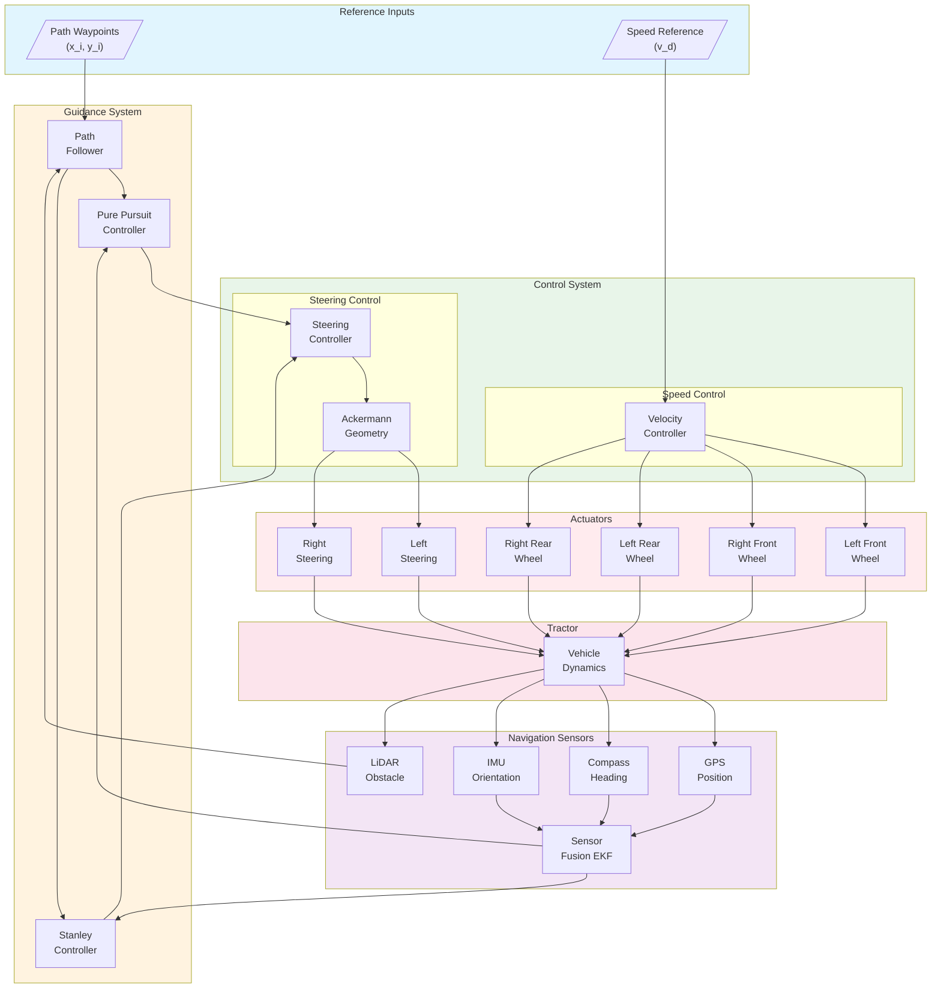
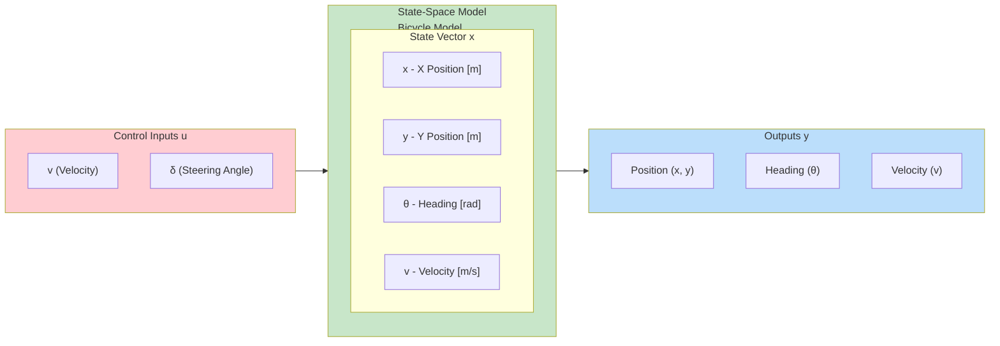
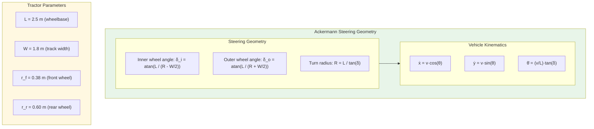
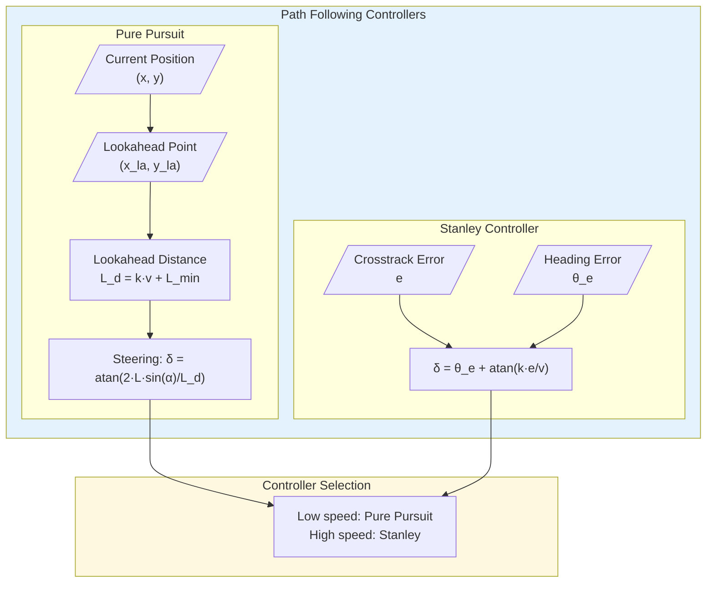
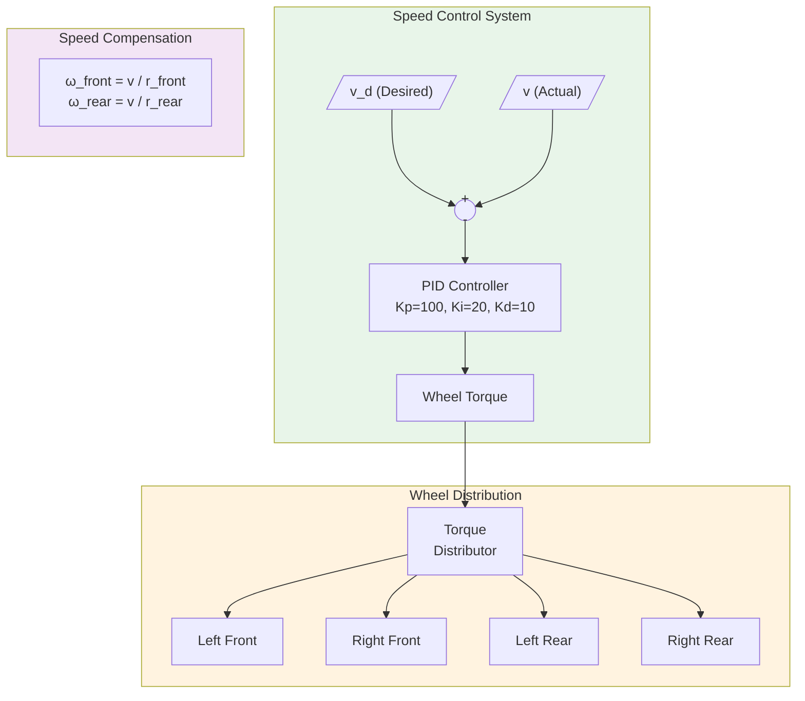

# Tractor (Boomer) Agricultural Vehicle

The Boomer Tractor is an agricultural vehicle simulation that demonstrates steering control and drive systems commonly found in farm equipment and utility vehicles.

---

## System Overview

The Boomer tractor simulation provides a realistic agricultural vehicle platform for developing and testing control algorithms applicable to precision agriculture and autonomous farming applications.

### Key Features

- **Four-Wheel Drive System**: Independent control of front and rear wheel pairs
- **Ackermann Steering**: Realistic front-wheel steering mechanism
- **Multiple Sensors**: LiDAR, GPS, IMU, and compass integration
- **Lighting System**: Work lights, road lights, flashers, and tail lights
- **Position Feedback**: Steering angle sensors for closed-loop control

### Specifications

- **Drive Configuration**: 4-wheel drive with different front/rear wheel sizes
- **Front Wheel Radius**: 0.38m
- **Rear Wheel Radius**: 0.6m
- **Steering Type**: Ackermann geometry with left and right steering control
- **Control Interface**: Simulink integration with MATLAB wrapper functions

---

## Components

### Drive System

| Component | Device Name | Description |
|-----------|-------------|-------------|
| Left Front Wheel | `left_front_wheel` | Front left drive motor |
| Right Front Wheel | `right_front_wheel` | Front right drive motor |
| Left Rear Wheel | `left_rear_wheel` | Rear left drive motor |
| Right Rear Wheel | `right_rear_wheel` | Rear right drive motor |
| Left Steering | `left_steer` | Left wheel steering actuator |
| Right Steering | `right_steer` | Right wheel steering actuator |

### Sensors

| Sensor | Device Name | Description |
|--------|-------------|-------------|
| Accelerometer | `accelerometer` | 3-axis acceleration measurement |
| Gyroscope | `gyro` | Angular velocity sensing |
| LiDAR | `Sick LMS 291` | 2D laser range scanner |
| Compass | `compass` | Magnetic heading sensor |
| GPS | `gps` | Global positioning system |
| Left Steer Sensor | `left_steer_sensor` | Left steering angle feedback |
| Right Steer Sensor | `right_steer_sensor` | Right steering angle feedback |

### Lighting System

| Light | Device Name | Description |
|-------|-------------|-------------|
| Left Flasher | `left_flasher` | Left turn indicator |
| Right Flasher | `right_flasher` | Right turn indicator |
| Tail Lights | `tail_lights` | Rear visibility lights |
| Work Head Lights | `work_head_lights` | Field work lighting |
| Road Head Lights | `road_head_lights` | Road driving lights |

---

## Simulink Integration

### Available MATLAB Functions

The tractor example includes comprehensive MATLAB wrapper functions:

**Motor Control:**
```matlab
wb_motor_set_velocity(tag, velocity)    % Set motor speed
wb_motor_set_position(tag, position)    % Set motor position
wb_motor_set_torque(tag, torque)        % Set motor torque
wb_motor_get_position_sensor(tag)       % Get position sensor value
```

**Sensor Reading:**
```matlab
wb_accelerometer_get_values(tag)        % Get accelerometer data [x, y, z]
wb_gyro_get_values(tag)                 % Get gyroscope data [x, y, z]
wb_compass_get_values(tag)              % Get compass heading
wb_inertial_unit_get_roll_pitch_yaw(tag) % Get orientation
wb_lidar_get_range_image(tag)           % Get LiDAR scan data
```

**Simulation Control:**
```matlab
wb_robot_step(TIME_STEP)                % Advance simulation
```

### Initialization Script

The `simulink_control_app.m` script initializes all sensors and actuators:

```matlab
TIME_STEP = 16;

% Wheel configuration
FRONT_WHEEL_RADIUS = 0.38;
REAR_WHEEL_RADIUS = 0.6;

% Initialize sensors
accelerometer_sensor = wb_robot_get_device('accelerometer');
wb_accelerometer_enable(accelerometer_sensor, TIME_STEP);

lidar_sensor = wb_robot_get_device('Sick LMS 291');
wb_lidar_enable(lidar_sensor, TIME_STEP);

gyro_sensor = wb_robot_get_device('gyro');
wb_gyro_enable(gyro_sensor, TIME_STEP);

gps_sensor = wb_robot_get_device('gps');
wb_gps_enable(gps_sensor, TIME_STEP);

% Initialize steering sensors
right_steer_sensor = wb_robot_get_device('right_steer_sensor');
left_steer_sensor = wb_robot_get_device('left_steer_sensor');
wb_position_sensor_enable(right_steer_sensor, TIME_STEP);
wb_position_sensor_enable(left_steer_sensor, TIME_STEP);

% Initialize wheel motors
left_front_wheel = wb_robot_get_device('left_front_wheel');
right_front_wheel = wb_robot_get_device('right_front_wheel');
left_rear_wheel = wb_robot_get_device('left_rear_wheel');
right_rear_wheel = wb_robot_get_device('right_rear_wheel');

% Initialize steering actuators
left_steer = wb_robot_get_device('left_steer');
right_steer = wb_robot_get_device('right_steer');
```

---

## Control System Design

### System Block Diagram



### State-Space Model Diagram



### Ackermann Steering Model



### State-Space Matrices

```matlab
%% Tractor (Boomer) State-Space Model
% Bicycle model with Ackermann steering
% State vector: x = [x, y, theta, v]'
% Input vector: u = [a, delta]' (acceleration, steering angle)

% Physical Parameters
L = 2.5;              % Wheelbase [m]
W = 1.8;              % Track width [m]
r_front = 0.38;       % Front wheel radius [m]
r_rear = 0.60;        % Rear wheel radius [m]
m = 1500;             % Vehicle mass [kg]
Iz = 2500;            % Yaw moment of inertia [kg*m^2]

% Tire parameters
C_f = 50000;          % Front cornering stiffness [N/rad]
C_r = 80000;          % Rear cornering stiffness [N/rad]

% Longitudinal parameters
c_drag = 50;          % Aerodynamic drag [N*s^2/m^2]
c_roll = 200;         % Rolling resistance [N]

% Linearized Bicycle Model (at velocity v0)
v0 = 5;  % Operating velocity [m/s]

% State: [y_error, psi_error, y_dot, psi_dot]'
% For lateral control / path following

a11 = 0;
a12 = v0;
a13 = 1;
a14 = 0;
a21 = 0;
a22 = 0;
a23 = 0;
a24 = 1;
a31 = 0;
a32 = 0;
a33 = -(C_f + C_r) / (m * v0);
a34 = -v0 - (C_f * L - C_r * L) / (m * v0);
a41 = 0;
a42 = 0;
a43 = -(C_f * L - C_r * L) / (Iz * v0);
a44 = -(C_f * L^2 + C_r * L^2) / (Iz * v0);

A = [a11, a12, a13, a14;
     a21, a22, a23, a24;
     a31, a32, a33, a34;
     a41, a42, a43, a44];

b1 = 0;
b2 = 0;
b3 = C_f / m;
b4 = C_f * L / Iz;

B = [b1; b2; b3; b4];

C = [1, 0, 0, 0;
     0, 1, 0, 0];

D = [0; 0];

% Create state-space system
sys = ss(A, B, C, D);
sys.StateName = {'y_error', 'psi_error', 'y_dot', 'psi_dot'};
sys.InputName = {'delta'};
sys.OutputName = {'y_error', 'psi_error'};

%% Ackermann Steering Function
function [delta_left, delta_right] = ackermannSteering(delta, L, W)
    % Calculate individual wheel angles for Ackermann geometry
    if abs(delta) < 1e-6
        delta_left = 0;
        delta_right = 0;
    else
        R = L / tan(delta);  % Turn radius to rear axle center
        delta_left = atan(L / (R - W/2));
        delta_right = atan(L / (R + W/2));
    end
end

%% Wheel Speed Calculation (different radii)
function [omega_front, omega_rear] = wheelSpeeds(v, r_front, r_rear)
    omega_front = v / r_front;  % Front wheel angular velocity
    omega_rear = v / r_rear;    % Rear wheel angular velocity
end
```

### Path Following Control



### Speed Control Loop



### Ackermann Steering Geometry

The tractor uses Ackermann steering for realistic turning behavior:

```matlab
% Calculate steering angles for a given turn radius
function [left_angle, right_angle] = ackermann_steering(turn_radius, wheelbase, track_width)
    % Inner wheel turns more than outer wheel
    if turn_radius > 0  % Turning right
        left_angle = atan(wheelbase / (turn_radius + track_width/2));
        right_angle = atan(wheelbase / (turn_radius - track_width/2));
    else  % Turning left
        turn_radius = abs(turn_radius);
        left_angle = -atan(wheelbase / (turn_radius - track_width/2));
        right_angle = -atan(wheelbase / (turn_radius + track_width/2));
    end
end
```

### Speed Control

Wheel speeds must account for different wheel radii:

```matlab
% Calculate wheel angular velocities for desired vehicle speed
function [front_speed, rear_speed] = calculate_wheel_speeds(vehicle_speed)
    FRONT_WHEEL_RADIUS = 0.38;
    REAR_WHEEL_RADIUS = 0.6;

    front_speed = vehicle_speed / FRONT_WHEEL_RADIUS;  % rad/s
    rear_speed = vehicle_speed / REAR_WHEEL_RADIUS;    % rad/s
end
```

---

## Usage Examples

### Basic Operation

1. **Load World**: Open `tractor/worlds/boomer.wbt` in Webots
2. **Set Controller**: Select `simulink_control_app` as the controller
3. **Open Simulink**: Load `simulink_control.slx` in MATLAB
4. **Run Simulation**: Start both Webots simulation and Simulink model

### Manual Control (Alternative Controller)

The `boomer` controller provides manual keyboard operation:

1. Set controller to `boomer` in Webots
2. Use keyboard for control:
   - **Arrow keys**: Steering and throttle
   - **Space**: Brake

### Autonomous Navigation

For autonomous operation, implement path following in Simulink:

1. Use GPS for position feedback
2. Calculate heading from compass
3. Implement pure pursuit or Stanley controller
4. Command steering and throttle accordingly

---

## Applications

### Precision Agriculture

- **Auto-steering**: GPS-guided parallel driving
- **Implement Control**: Coordinated implement operation
- **Field Coverage**: Optimized path planning for field operations

### Research Applications

- **Vehicle Dynamics**: Study of agricultural vehicle behavior
- **Control Algorithms**: Development of steering controllers
- **Sensor Fusion**: Integration of multiple sensors for localization

### Educational Use

- **Mobile Robotics**: Understanding of wheeled vehicle kinematics
- **Control Systems**: Practical application of control theory
- **Autonomous Systems**: Introduction to autonomous vehicle concepts

---

## File Structure

```
tractor/
├── controllers/
│   ├── boomer/                      # Manual control (C-based)
│   │   ├── boomer.c
│   │   └── Makefile
│   └── simulink_control_app/        # Simulink integration
│       ├── simulink_control_app.m   # Initialization script
│       ├── simulink_control.slx     # Main Simulink model
│       ├── state_space_modeling.slx # State-space model
│       └── wb_*.m                   # MATLAB wrapper functions
└── worlds/
    └── boomer.wbt                   # Webots world file
```

---

## References

- [Webots Vehicle Documentation](https://cyberbotics.com/doc/guide/vehicles)
- [Ackermann Steering Geometry](https://en.wikipedia.org/wiki/Ackermann_steering_geometry)
- [Precision Agriculture Systems](https://www.sciencedirect.com/topics/agricultural-and-biological-sciences/precision-agriculture)

**Educational Purpose:**
This tractor simulation provides a platform for learning agricultural vehicle dynamics, steering control systems, and autonomous navigation concepts applicable to precision agriculture and farm automation.
