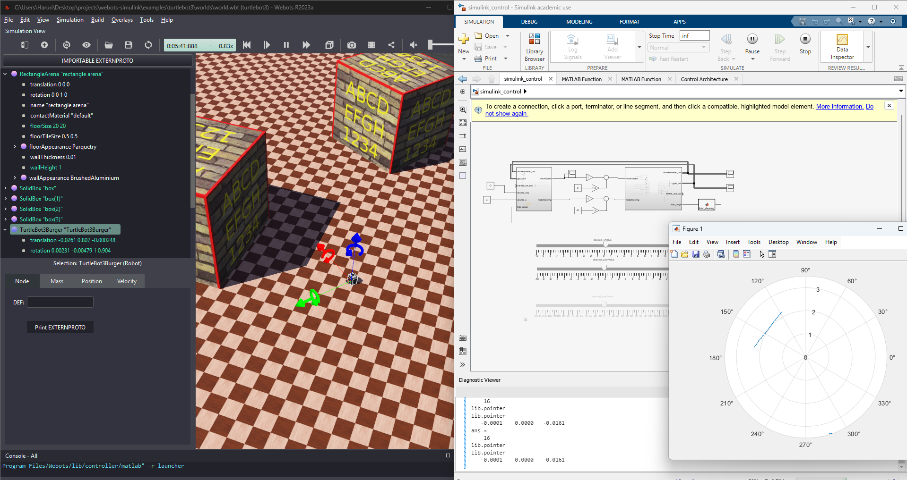
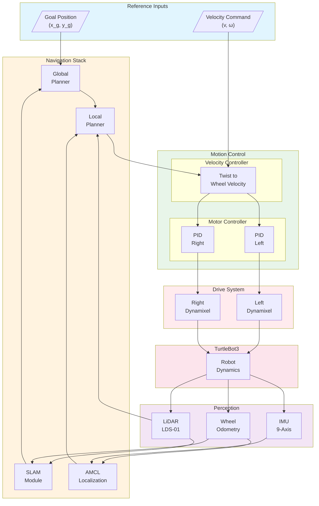
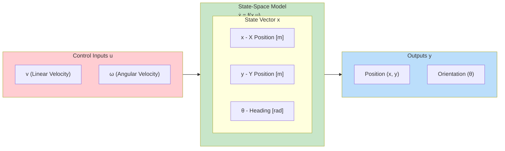
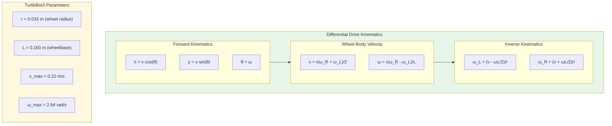
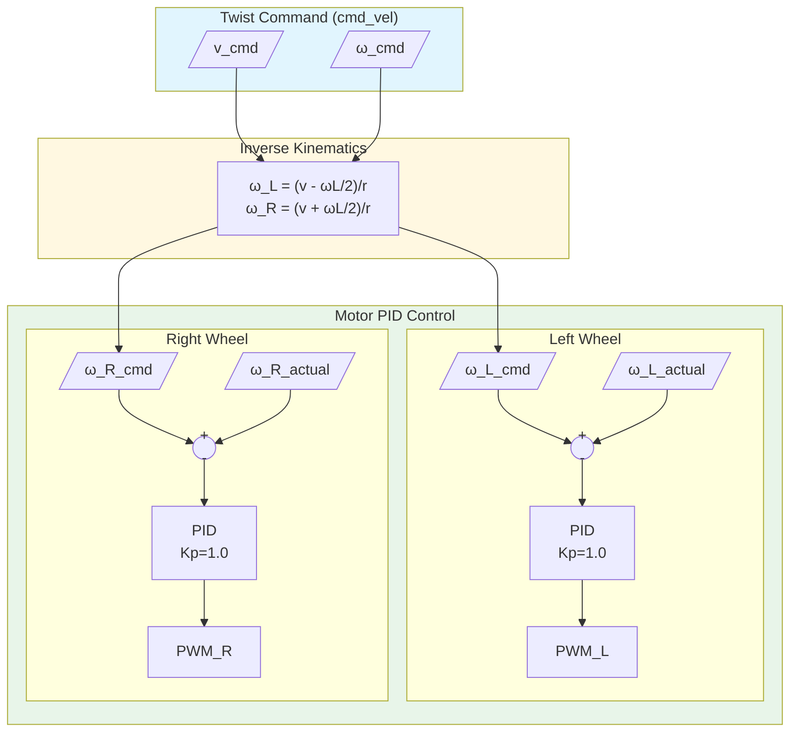
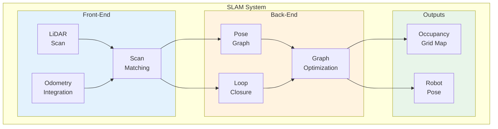

# TurtleBot3




The TurtleBot3 is a popular educational and research robot platform developed by ROBOTIS in collaboration with Open Robotics. It's widely used for learning robotics, SLAM, navigation, and autonomous systems development.

---

## System Overview

TurtleBot3 is a compact, affordable, and highly customizable mobile robot designed for education, research, and hobby applications. It features a modular design that supports various sensor configurations and computing platforms.

### Key Features

- **Compact Design**: Small footprint ideal for indoor navigation
- **Modular Architecture**: Customizable sensor and hardware configuration
- **ROS Native**: Full ROS/ROS2 integration and support
- **Educational Focus**: Extensive documentation and learning resources
- **Open Source**: Hardware and software designs freely available
- **Multiple Variants**: Burger, Waffle, and Waffle Pi configurations

### Specifications

- **Dimensions**: Approximately 178mm × 178mm × 192mm (Burger model)
- **Weight**: ~1kg (varies by model and configuration)
- **Max Speed**: ~0.22 m/s linear, ~2.84 rad/s angular
- **Battery Life**: ~2.5 hours (varies by usage)
- **Wheel Configuration**: 2-wheel differential drive
- **Computing**: Raspberry Pi or similar SBC

---

## Components

### Drive System
- **Motors**: Two servo motors (Dynamixel XL430-W250-T)
- **Wheels**: Two main drive wheels with omni-directional caster wheel
- **Encoders**: Built-in position feedback in Dynamixel servos
- **Drive Type**: Differential drive kinematics

### Standard Sensors
- **LiDAR**: 360-degree laser range finder (LDS-01 or LDS-02)
- **IMU**: 9-axis inertial measurement unit
- **Odometry**: Wheel encoder-based position estimation
- **Optional**: Camera (RealSense, Raspberry Pi camera)

### Computing Platform
- **Single Board Computer**: Raspberry Pi 3B+ or 4
- **Microcontroller**: OpenCR board for low-level control
- **Communication**: Wi-Fi, Ethernet, Serial interfaces

---

## Simulink Integration

### Available Functions

The TurtleBot3 example includes comprehensive MATLAB functions for Simulink integration:

- `wb_robot_step.m` - Main simulation step function
- `wb_motor_set_velocity.m` - Differential drive velocity control
- `wb_motor_set_position.m` - Motor position control
- `wb_motor_get_position_sensor.m` - Wheel encoder readings
- `wb_gyro_get_values.m` - IMU gyroscope data
- `wb_accelerometer_get_values.m` - IMU accelerometer data
- `wb_lidar_get_range_image.m` - LiDAR scan data processing
- `wb_lidar_get_horizontal_resolution.m` - LiDAR configuration

### State-Space Modeling

The included Simulink model (`state_space_modeling.slx`) provides:

- **Differential Drive Kinematics**: Forward and inverse kinematic models
- **Sensor Fusion**: IMU and odometry integration
- **Navigation Control**: Velocity and trajectory control
- **SLAM Integration**: Real-time mapping capabilities
- **Obstacle Avoidance**: LiDAR-based collision avoidance

---

## Control System Design

### Differential Drive Kinematics

The TurtleBot3 uses differential drive kinematics where linear and angular velocities are controlled through left and right wheel speeds:

```matlab
% Forward kinematics
v = (v_left + v_right) / 2;      % Linear velocity
w = (v_right - v_left) / L;      % Angular velocity

% Inverse kinematics  
v_left = v - (w * L) / 2;        % Left wheel velocity
v_right = v + (w * L) / 2;       % Right wheel velocity
```

Where:
- `v`: Linear velocity (m/s)
- `w`: Angular velocity (rad/s)
- `L`: Wheelbase distance (m)

### Control Architecture

1. **Low-level Control**: Motor velocity control with PID feedback
2. **Motion Control**: Velocity and trajectory following
3. **Navigation**: Path planning and execution
4. **SLAM**: Simultaneous localization and mapping
5. **Behavior**: Task-level behavior coordination

### System Block Diagram



### State-Space Model



### Differential Drive Model



### State-Space Matrices

```matlab
%% TurtleBot3 State-Space Model
% Nonlinear kinematic model (differential drive)
% State vector: x = [x, y, theta]'
% Input vector: u = [v, omega]'

% TurtleBot3 Burger Parameters
r = 0.033;        % Wheel radius [m]
L = 0.160;        % Wheelbase (wheel separation) [m]
v_max = 0.22;     % Maximum linear velocity [m/s]
omega_max = 2.84; % Maximum angular velocity [rad/s]

% Nonlinear dynamics (for simulation)
% dx/dt = v * cos(theta)
% dy/dt = v * sin(theta)
% dtheta/dt = omega

% Linearized model around operating point (theta_0)
% For small deviations from straight-line motion

theta_0 = 0;  % Operating point heading

A = [0, 0, 0;
     0, 0, 0;
     0, 0, 0];

B = [cos(theta_0), 0;
     sin(theta_0), 0;
     0, 1];

C = eye(3);
D = zeros(3, 2);

% Extended state-space with velocity dynamics
% State: [x, y, theta, v, omega]'
% Input: [v_cmd, omega_cmd]'

tau_v = 0.1;      % Velocity time constant [s]
tau_omega = 0.1;  % Angular velocity time constant [s]

A_ext = [0, 0, 0, 1, 0;
         0, 0, 0, 0, 0;
         0, 0, 0, 0, 1;
         0, 0, 0, -1/tau_v, 0;
         0, 0, 0, 0, -1/tau_omega];

B_ext = [0, 0;
         0, 0;
         0, 0;
         1/tau_v, 0;
         0, 1/tau_omega];

C_ext = [1, 0, 0, 0, 0;
         0, 1, 0, 0, 0;
         0, 0, 1, 0, 0];

D_ext = zeros(3, 2);

%% Wheel velocity to body velocity conversion
function [v, omega] = wheelToBody(omega_L, omega_R, r, L)
    v = r * (omega_R + omega_L) / 2;
    omega = r * (omega_R - omega_L) / L;
end

%% Body velocity to wheel velocity conversion
function [omega_L, omega_R] = bodyToWheel(v, omega, r, L)
    omega_L = (v - omega * L / 2) / r;
    omega_R = (v + omega * L / 2) / r;
end

%% Velocity saturation
function [v_sat, omega_sat] = saturateVelocity(v, omega, v_max, omega_max)
    v_sat = max(min(v, v_max), -v_max);
    omega_sat = max(min(omega, omega_max), -omega_max);
end
```

### Velocity Control Loop



### SLAM Architecture



---

## Navigation and SLAM

### Navigation Stack Components

- **Localization**: AMCL (Adaptive Monte Carlo Localization)
- **Global Planning**: A*, RRT*, or Dijkstra path planning algorithms
- **Local Planning**: DWA (Dynamic Window Approach) for obstacle avoidance
- **Costmaps**: Static and dynamic obstacle representation
- **Recovery Behaviors**: Stuck and obstacle recovery strategies

### SLAM Capabilities

- **Gmapping**: Grid-based SLAM using laser scan data
- **Cartographer**: Google's real-time SLAM solution
- **Hector SLAM**: Fast 2D SLAM without odometry requirement
- **RTAB-Map**: 3D RGB-D SLAM (with camera)

---

## Usage Examples

### Basic Movement Control

```python
# Move forward
linear_velocity = 0.2   # m/s
angular_velocity = 0.0  # rad/s

# Turn in place
linear_velocity = 0.0   # m/s  
angular_velocity = 0.5  # rad/s

# Arc movement
linear_velocity = 0.15  # m/s
angular_velocity = 0.3  # rad/s
```

### Simulink Control Setup

1. **Load World**: Open `turtlebot3/worlds/world.wbt`
2. **Configure Controller**: Set to `simulink_control_app`
3. **Open Model**: Load `state_space_modeling.slx` in MATLAB
4. **Set Parameters**: Configure PID gains and sensor settings
5. **Run Simulation**: Execute with real-time data exchange

### Common Applications

1. **Autonomous Navigation**: Goal-based navigation with obstacle avoidance
2. **SLAM Mapping**: Real-time environment mapping
3. **Follow-Me Robot**: Person following using camera or LiDAR
4. **Multi-Robot Systems**: Coordination of multiple TurtleBot3 units
5. **Educational Demos**: Teaching robotics concepts

---

## Educational Applications

### Learning Objectives

The TurtleBot3 platform is excellent for teaching:

- **Mobile Robot Kinematics**: Differential drive mathematics
- **Sensor Integration**: LiDAR, IMU, and encoder fusion
- **Control Systems**: PID control and feedback systems
- **Path Planning**: A*, RRT, and potential field methods
- **SLAM Algorithms**: Mapping and localization techniques
- **ROS Concepts**: Node communication and system architecture

### Laboratory Exercises

1. **Basic Movement**: Implement teleoperation and waypoint navigation
2. **Sensor Processing**: LiDAR data filtering and obstacle detection
3. **Mapping**: Create maps using different SLAM algorithms
4. **Navigation**: Implement autonomous navigation stack
5. **Multi-Robot**: Coordinate multiple robots for formation control

---

## Performance Characteristics

### Motion Capabilities
- **Max Linear Speed**: 0.22 m/s
- **Max Angular Speed**: 2.84 rad/s
- **Minimum Turning Radius**: Zero (turn in place)
- **Typical Operating Speed**: 0.1-0.15 m/s for navigation

### Sensor Performance
- **LiDAR Range**: 0.12m - 3.5m
- **LiDAR Accuracy**: ±3cm
- **Update Rate**: 10-15 Hz (typical navigation frequency)
- **IMU Drift**: <1°/hour (typical gyro drift)

---

## References

- [TurtleBot3 Official Documentation](https://emanual.robotis.com/docs/en/platform/turtlebot3/overview/)
- [TurtleBot3 ROS Packages](https://github.com/ROBOTIS-GIT/turtlebot3)
- [Webots TurtleBot3 Model](https://cyberbotics.com/doc/guide/turtlebot3)
- [ROS Navigation Stack](http://wiki.ros.org/navigation)

**Educational Purpose:**
The TurtleBot3 simulation provides a comprehensive platform for learning mobile robotics, SLAM, navigation, and control systems. Its integration with Simulink enables rapid prototyping of control algorithms and provides a bridge between theoretical concepts and practical implementation. The platform is widely used in robotics courses worldwide and serves as an excellent introduction to autonomous mobile robotics.