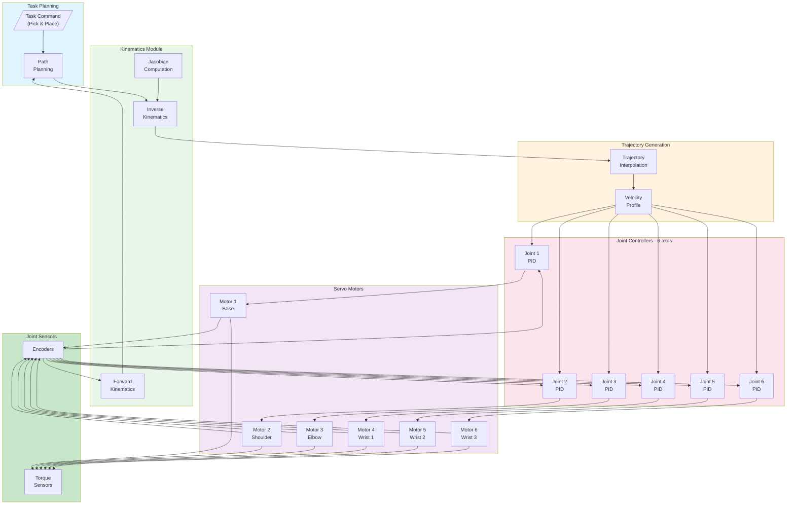
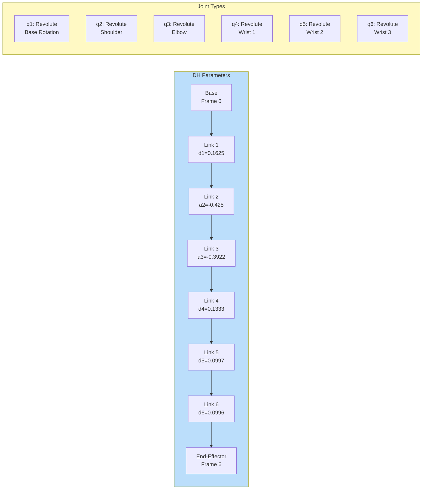
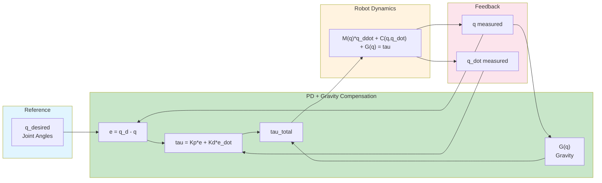
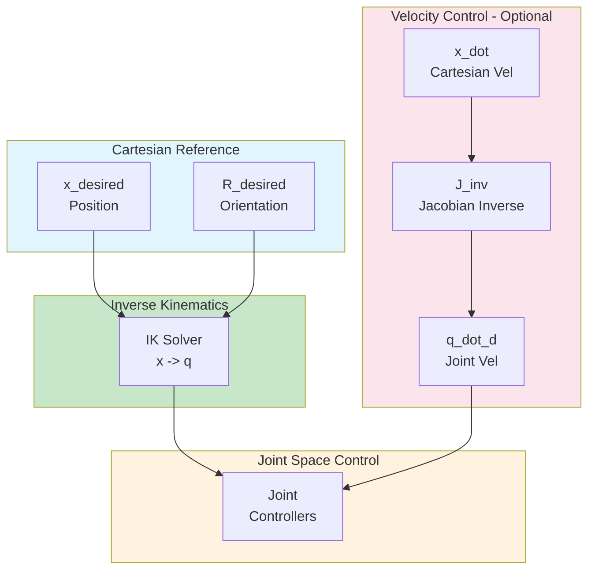

# UR5e Robot Arm

This example demonstrates industrial robot arm control using the Universal Robots UR5e with MATLAB/Simulink.

---

## Overview

| Property | Value |
|----------|-------|
| **Type** | 6-DOF Collaborative Robot Arm |
| **Robot** | Universal Robots UR5e |
| **Difficulty** | Intermediate to Advanced |
| **Control Method** | Joint Space / Cartesian / Trajectory |

---

## Features

- **6 Degrees of Freedom**: Full spatial manipulation
- **Joint Position Control**: Individual joint angle control
- **Inverse Kinematics**: Cartesian position to joint angles
- **Trajectory Planning**: Smooth motion profiles
- **Collaborative**: Safe human-robot interaction

---

## Specifications

| Property | Value |
|----------|-------|
| Weight | 20.6 kg |
| Payload | 5 kg |
| Reach | 850 mm |
| DOF | 6 |
| Repeatability | +/- 0.03 mm |

---

## Control Architecture

### System Block Diagram



### Kinematic Chain



### Joint Space Control



### Cartesian Space Control



---

## State-Space Model

### Joint Space Dynamics

```matlab
% State vector: x = [q1, q2, q3, q4, q5, q6, q1_dot, q2_dot, q3_dot, q4_dot, q5_dot, q6_dot]'
% Input vector: u = [tau1, tau2, tau3, tau4, tau5, tau6]'

% Robot dynamics: M(q)*q_ddot + C(q, q_dot)*q_dot + G(q) = tau

% DH Parameters (UR5e)
d = [0.1625, 0, 0, 0.1333, 0.0997, 0.0996];  % Link offsets [m]
a = [0, -0.425, -0.3922, 0, 0, 0];           % Link lengths [m]
alpha = [pi/2, 0, 0, pi/2, -pi/2, 0];        % Link twists [rad]

% Mass properties
m = [3.761, 8.058, 2.846, 1.37, 1.3, 0.365]; % Link masses [kg]

% Inertia matrices (diagonal approximation)
I = cell(1, 6);
I{1} = diag([0.0067, 0.0064, 0.0067]);
I{2} = diag([0.0149, 0.4054, 0.4054]);
I{3} = diag([0.0055, 0.0931, 0.0931]);
I{4} = diag([0.0013, 0.0013, 0.0018]);
I{5} = diag([0.0013, 0.0013, 0.0018]);
I{6} = diag([0.0001, 0.0001, 0.0001]);
```

### Forward Kinematics

```matlab
function T = forward_kinematics(q)
    % Compute transformation matrix from base to end-effector
    T = eye(4);
    for i = 1:6
        A_i = dh_matrix(a(i), alpha(i), d(i), q(i));
        T = T * A_i;
    end
end

function A = dh_matrix(a, alpha, d, theta)
    % DH transformation matrix
    A = [cos(theta), -sin(theta)*cos(alpha),  sin(theta)*sin(alpha), a*cos(theta);
         sin(theta),  cos(theta)*cos(alpha), -cos(theta)*sin(alpha), a*sin(theta);
         0,           sin(alpha),             cos(alpha),            d;
         0,           0,                      0,                     1];
end
```

### Inverse Kinematics

```matlab
function q = inverse_kinematics(T_desired, q_current)
    % Analytical IK for UR5e (closed-form solution)
    % Returns 8 possible solutions, choose closest to q_current

    p = T_desired(1:3, 4);  % Position
    R = T_desired(1:3, 1:3); % Orientation

    % Wrist center position
    p_wc = p - d(6) * R(:, 3);

    % Joint 1 (two solutions)
    q1_a = atan2(p_wc(2), p_wc(1)) + acos(d(4) / norm(p_wc(1:2))) + pi/2;
    q1_b = atan2(p_wc(2), p_wc(1)) - acos(d(4) / norm(p_wc(1:2))) + pi/2;

    % Continue with remaining joints...
    % (Full implementation requires geometric solution for all 6 joints)

    q = select_closest_solution(solutions, q_current);
end
```

### Jacobian Matrix

```matlab
function J = compute_jacobian(q)
    % Geometric Jacobian (6x6)
    J = zeros(6, 6);

    T = eye(4);
    z = zeros(3, 6);
    p = zeros(3, 6);

    for i = 1:6
        z(:, i) = T(1:3, 3);  % z-axis of frame i-1
        p(:, i) = T(1:3, 4);  % origin of frame i-1
        T = T * dh_matrix(a(i), alpha(i), d(i), q(i));
    end

    p_e = T(1:3, 4);  % End-effector position

    for i = 1:6
        J(1:3, i) = cross(z(:, i), p_e - p(:, i));  % Linear velocity
        J(4:6, i) = z(:, i);                         % Angular velocity
    end
end
```

---

## Trajectory Planning

### Quintic Polynomial

```matlab
function [q, q_dot, q_ddot] = quintic_trajectory(q0, qf, t, T)
    % 5th order polynomial for smooth trajectory
    % Boundary conditions: zero velocity and acceleration at start/end

    a0 = q0;
    a1 = 0;
    a2 = 0;
    a3 = (20*qf - 20*q0) / (2*T^3);
    a4 = (30*q0 - 30*qf) / (2*T^4);
    a5 = (12*qf - 12*q0) / (2*T^5);

    q = a0 + a1*t + a2*t^2 + a3*t^3 + a4*t^4 + a5*t^5;
    q_dot = a1 + 2*a2*t + 3*a3*t^2 + 4*a4*t^3 + 5*a5*t^4;
    q_ddot = 2*a2 + 6*a3*t + 12*a4*t^2 + 20*a5*t^3;
end
```

### Trapezoidal Velocity Profile

```matlab
function [q, q_dot] = trapezoidal_trajectory(q0, qf, v_max, a_max, t)
    % Trapezoidal velocity profile
    delta_q = qf - q0;
    t_acc = v_max / a_max;
    t_total = abs(delta_q) / v_max + t_acc;

    if t < t_acc
        % Acceleration phase
        q = q0 + 0.5 * a_max * sign(delta_q) * t^2;
        q_dot = a_max * sign(delta_q) * t;
    elseif t < t_total - t_acc
        % Constant velocity phase
        q = q0 + sign(delta_q) * (0.5 * a_max * t_acc^2 + v_max * (t - t_acc));
        q_dot = v_max * sign(delta_q);
    else
        % Deceleration phase
        t_rem = t_total - t;
        q = qf - 0.5 * a_max * sign(delta_q) * t_rem^2;
        q_dot = a_max * sign(delta_q) * t_rem;
    end
end
```

---

## Simulink Integration

### Initialization Script

```matlab
TIME_STEP = 16;

% Initialize joint motors
joint_names = {'shoulder_pan_joint', 'shoulder_lift_joint', 'elbow_joint', ...
               'wrist_1_joint', 'wrist_2_joint', 'wrist_3_joint'};

motors = zeros(1, 6);
sensors = zeros(1, 6);

for i = 1:6
    motors(i) = wb_robot_get_device(joint_names{i});
    sensors(i) = wb_robot_get_device([joint_names{i} '_sensor']);
    wb_position_sensor_enable(sensors(i), TIME_STEP);
end

% PD control gains
Kp = diag([100, 100, 80, 50, 50, 30]);
Kd = diag([10, 10, 8, 5, 5, 3]);
```

### Control Loop

```matlab
while wb_robot_step(TIME_STEP) ~= -1
    % Read joint positions
    q = zeros(6, 1);
    for i = 1:6
        q(i) = wb_position_sensor_get_value(sensors(i));
    end

    % Compute desired trajectory point
    [q_d, q_dot_d, ~] = quintic_trajectory(q_start, q_goal, t, T_total);

    % PD control with gravity compensation
    e = q_d - q;
    e_dot = q_dot_d - q_dot;
    tau = Kp * e + Kd * e_dot + gravity_compensation(q);

    % Apply torques
    for i = 1:6
        wb_motor_set_torque(motors(i), tau(i));
    end

    t = t + TIME_STEP / 1000;
end
```

---

## Quick Start

1. **Open Webots** and load `examples/ur5e_arm/worlds/ur5e_workspace.wbt`
2. **Configure MATLAB** controller
3. **Run simulation** for pick-and-place demo
4. **Program trajectories** in Simulink

---

## Control Modes

| Mode | Description |
|------|-------------|
| Joint Position | Direct joint angle control |
| Joint Velocity | Velocity-based control |
| Cartesian Position | End-effector position control |
| Cartesian Velocity | End-effector velocity control |
| Force/Torque | Compliant manipulation |

---

## References

- [Universal Robots UR5e](https://www.universal-robots.com/products/ur5-robot/)
- [Webots UR5e](https://cyberbotics.com/doc/guide/ure)
- Craig, J. J. (2005). "Introduction to Robotics: Mechanics and Control"
- Siciliano, B. et al. (2010). "Robotics: Modelling, Planning and Control"
