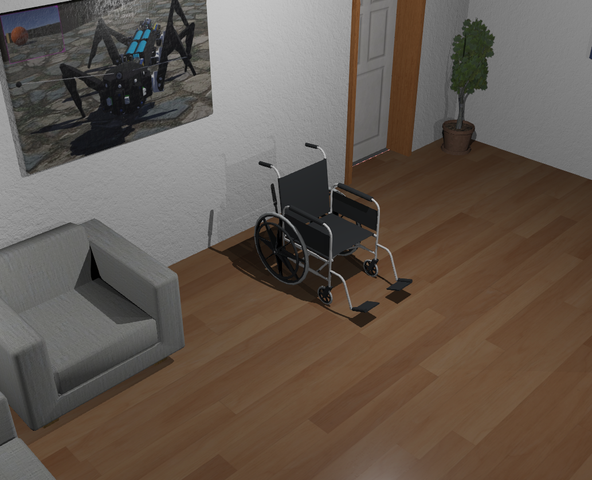

# WheelChair Example

## Introduction

In this tutorial how to we create simulation and simulation for a wheelchair. We will use the Webots simulator to create a virtual environment and simulate the behavior of a real-world wheelchair.
We will start by creating a simple model of the wheelchair, including its components such as wheels, motors, and sensors. Then we will add control laws that allow us to move the wheelchair in different directions based on user input or other external factors. Finally, we will simulate the behavior of the wheelchair in a virtual environment and analyze its performance. 

### Components

* Wheels: The wheels that the wheelchair will move on.
* Motors: The motors that will drive the wheels and allow the wheelchair to move.
* Sensors: The sensors that will allow the wheelchair to inertial sensor data, such as accelerometers or gyroscopes.
* Actuators: The actuators that will allow the wheelchair to move, such as motors or wheels.
  
We control the wheels by sending signals to the motors, which in turn move the wheels and allow the wheelchair to move. We can control the direction of movement by adjusting the speed of the motors or changing their position on the wheel. We can also adjust the speed and direction of movement by changing the position of the motors on the wheel.
We can also use sensors to measure the position and orientation of the wheelchair, such as accelerometers or gyroscopes. These measurements allow us to adjust the speed and direction of movement based on the current state of the system.

### Control System Design

To design a control system for the wheelchair, we need to consider several factors:
* The dynamics of the system: We need to model the non-linear and unstable behavior of the system.

* The sensors and actuators available to us: We need to consider the types of sensors we have access to, such as accelerometers or gyroscopes, and the type of motors we can use.

* The desired behavior of the system: We need to define what we want the wheelchair to do, such as moving forward or turning left.

* The constraints on the system: We need to consider any physical or mechanical limitations that may affect the behavior of the system.

We can use a variety of control techniques, such as proportional-integral-derivative (PID) control, to design a control system for the wheelchair. PID control is a widely used technique in robotics and automation because it provides a balance between stability and responsiveness. PID control works by adjusting the speed and direction of movement based on the error between the desired position and the current position. This allows us to achieve a smooth and stable motion, even in the presence of non-linear dynamics and mechanical constraints. PID control is a powerful tool that can be used to achieve a wide range of desired behaviors for the wheelchair.

### Control System Design Process

The process for designing a control system for the wheelchair can be broken down into several steps:
1. Define the desired behavior of the wheelchair: This involves defining what we want the wheelchair to do, such as moving forward or turning left.

2. Identify the constraints on the system: This involves considering any physical or mechanical limitations that may affect the behavior of the wheelchair. We can use a variety of control techniques, such as proportional-integral-derivative (PID) control, to design a control system for the wheelchair. PID control is a widely used technique in robotics and automation because it provides a balance between stability and responsiveness. PID control works by adjusting the speed and direction of movement based on the error between the desired position and the current position. This allows us to achieve a smooth and stable motion, even in the presence of non-linear dynamics and mechanical constraints. PID control is a powerful tool that can be used to achieve a wide range of desired behaviors for the wheelchair.

3. Evaluate the performance of the control system: Once we have designed a control system for the wheelchair, we need to evaluate its performance. This involves testing the system in real-world scenarios and measuring its response to different inputs. We can use various metrics to measure the performance of the control system, such as tracking error, velocity, and acceleration. We can also use simulation to test the performance of the control system under different conditions. Simulation allows us to predict how the control system will behave in real-world scenarios, and we can use this information to make improvements to the control system.

4. Optimize the control system: Based on our evaluation of the performance of the control system, we can make improvements to the control system to improve its performance. This may involve adjusting the parameters of the PID controller or using other control techniques such as adaptive control or model predictive control.

5. Test and validate the control system: Once we have optimized the control system, we need to test it in real-world scenarios to ensure that it is working correctly. We can use various methods to test the control system, such as manual testing, simulation, and field testing. Manual testing involves manually operating the wheelchair and measuring its response to different inputs. Simulation allows us to predict how the control system will behave in real-world scenarios, and we can use this information to make improvements to the control system. Field testing involves using the control system in a real-world scenario and measuring its performance.

6. Deploy the control system: Once we have tested and validated the control system, we can deploy it in real-world scenarios to improve the performance of the wheelchair.

7. Monitor and maintain the control system: After deployment, we need to monitor the performance of the control system and make any necessary adjustments as needed.

8. Continuous improvement and innovation: Finally, we need to continuously improve and innovate the control system to keep up with the latest advancements in robotics and control systems. This may involve exploring new control techniques or incorporating new technologies such as machine learning or artificial intelligence.

9.  Conclusion: In conclusion, the wheel chair control system is a complex and challenging task that requires a deep understanding of robotics, control systems, and human-machine interaction. By following these steps, we can develop an effective control system for the wheelchair that improves its performance in real-world scenarios.

### Wheelchair Control Examples

Here you can find example implementations of different wheelchair control systems:

- Example 1: Basic manual control
- Example 2: Automatic navigation system
- Example 3: Joystick interface integration

## References

[DrakerDG](https://github.com/DrakerDG/Webotz)
