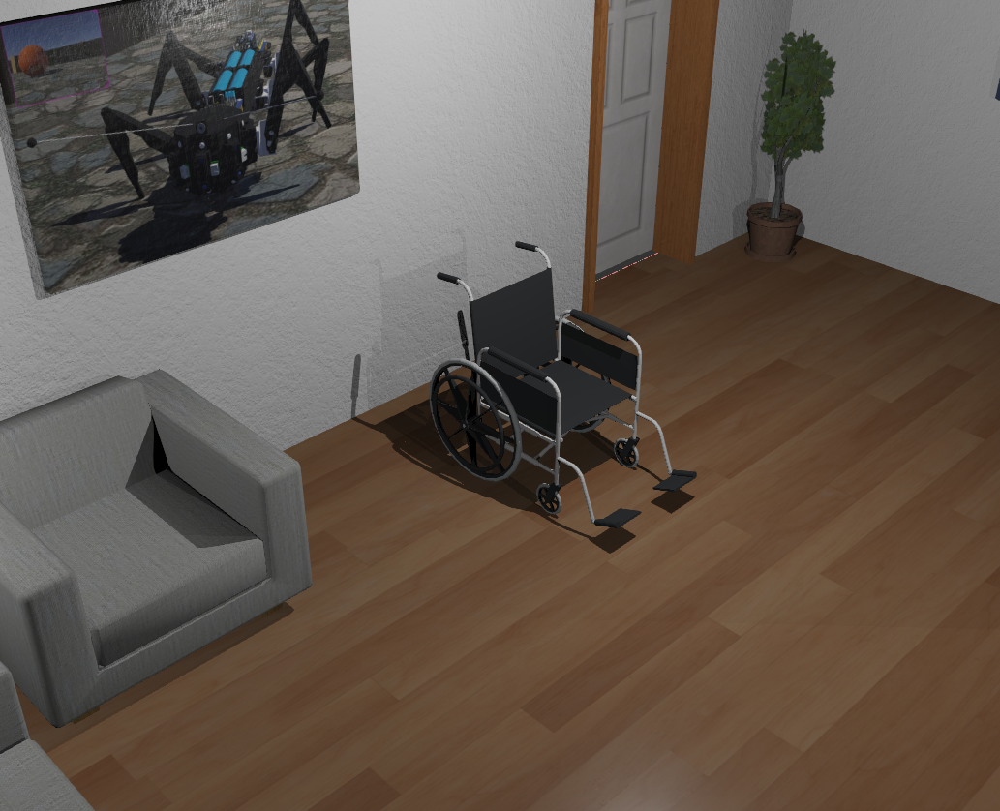

# WheelChair Example

## Introduction

This tutorial demonstrates how to create a simulation for a motorized wheelchair using the Webots simulator and MATLAB/Simulink for control system design. The wheelchair model includes differential drive, obstacle detection sensors, and inertial measurement for navigation.




---

## Overview

| Property | Value |
|----------|-------|
| **Type** | Assistive Mobility Platform |
| **Difficulty** | Beginner |
| **Control Method** | Differential Drive / PID |
| **Drive Type** | Two-wheel differential |
| **Sensors** | IR distance, IMU, Camera |

---

## 1. Project Structure

```
wheel_chair/
├── controllers/
│   ├── simulink_control_app/
│   │   ├── simulink_control_app.m        # Main MATLAB controller
│   │   ├── simulink_control.slx          # Simulink control model
│   │   ├── state_space_modeling.slx      # State-space model
│   │   ├── wb_motor_set_velocity.m       # Motor velocity control
│   │   ├── wb_motor_set_position.m       # Motor position control
│   │   ├── wb_motor_set_torque.m         # Motor torque control
│   │   ├── wb_gyro_get_values.m          # Gyroscope reading
│   │   ├── wb_accelerometer_get_values.m # Accelerometer reading
│   │   ├── wb_distance_sensor_get_value.m
│   │   ├── wb_inertial_unit_get_roll_pitch_yaw.m
│   │   └── wb_robot_step.m               # Simulation step
│   └── wheelchair_V1_C/
│       ├── wheelchair_V1_C.c             # C controller (obstacle avoidance)
│       └── Makefile
├── protos/
│   └── Wheelchair.wbo                    # Wheelchair model
└── worlds/
    └── WheelChair.wbt                    # Webots world file
```

---

## 2. Components

### Physical Components

| Component | Description |
|-----------|-------------|
| **Wheels** | Two drive wheels for differential steering |
| **Motors** | DC motors to drive each wheel independently |
| **IR Sensors** | Infrared distance sensors for obstacle detection |
| **IMU** | Inertial measurement unit (accelerometer + gyroscope) |
| **Camera** | Forward-facing camera for vision-based navigation |

### Sensor Configuration

| Sensor | Webots Name | Purpose |
|--------|-------------|---------|
| Left IR Sensor | `left_ir` / `left IR` | Left obstacle detection |
| Right IR Sensor | `right_ir` / `right IR` | Right obstacle detection |
| Accelerometer | `accelerometer` | Linear acceleration measurement |
| Gyroscope | `gyro` | Angular velocity measurement |
| Inertial Unit | `inertial_unit` | Roll, pitch, yaw orientation |
| Camera | `camera` | Visual feedback |

### Actuators

| Actuator | Webots Name | Control Mode |
|----------|-------------|--------------|
| Left Motor | `left_rotational_motor` | Velocity control |
| Right Motor | `right_rotational_motor` | Velocity control |
| Left Position Sensor | `left_position_sensor` | Encoder feedback |
| Right Position Sensor | `right_position_sensor` | Encoder feedback |

---

## 3. Differential Drive Kinematics

### Motion Equations

For a differential drive robot:

```
v = (v_R + v_L) / 2        # Linear velocity
ω = (v_R - v_L) / L        # Angular velocity

where:
  v_R = right wheel velocity
  v_L = left wheel velocity
  L = wheelbase (distance between wheels)
```

### Wheel Velocities from Desired Motion

```
v_R = v + (ω * L) / 2
v_L = v - (ω * L) / 2
```

---

## 4. Control System Design

### Design Considerations

To design a control system for the wheelchair, consider:

1. **System Dynamics**: Model the non-linear behavior including motor dynamics and friction
2. **Available Sensors**: IR distance sensors, accelerometer, gyroscope, and encoders
3. **Desired Behavior**: Forward motion, turning, obstacle avoidance
4. **Physical Constraints**: Motor limits, wheelchair dimensions, safety requirements

### PID Control

PID control provides a balance between stability and responsiveness:

```matlab
% PID controller for velocity tracking
Kp = 1.0;    % Proportional gain
Ki = 0.1;    % Integral gain
Kd = 0.05;   % Derivative gain

error = desired_velocity - actual_velocity;
integral = integral + error * dt;
derivative = (error - prev_error) / dt;

control_output = Kp * error + Ki * integral + Kd * derivative;
```

---

## 5. Controller Implementations

### MATLAB/Simulink Controller

```matlab
% simulink_control_app.m - Initialization
TIME_STEP = 16;
alpha_pitch = 0.85;  % Low-pass filter coefficient

% Initialize sensors
accelerometer_sensor = wb_robot_get_device('accelerometer');
wb_accelerometer_enable(accelerometer_sensor, TIME_STEP);

gyro_sensor = wb_robot_get_device('gyro');
wb_gyro_enable(gyro_sensor, TIME_STEP);

left_IR = wb_robot_get_device('left_ir');
right_IR = wb_robot_get_device('right_ir');
wb_distance_sensor_enable(left_IR, TIME_STEP);
wb_distance_sensor_enable(right_IR, TIME_STEP);

inertial_unit = wb_robot_get_device('inertial_unit');
wb_inertial_unit_enable(inertial_unit, TIME_STEP);

% Initialize motors
left_position_sensor = wb_robot_get_device('left_position_sensor');
left_rotational_motor = wb_robot_get_device('left_rotational_motor');

right_position_sensor = wb_robot_get_device('right_position_sensor');
right_rotational_motor = wb_robot_get_device('right_rotational_motor');

% Load Simulink model
open_system('simulink_control');
load_system('simulink_control');
```

### C Controller (Obstacle Avoidance)

The C controller implements basic obstacle avoidance:

```c
#define MAX_SP 4      // Maximum speed
#define MIN_DT 850    // Minimum distance threshold

int Obstacle_Detection(void) {
    int go_turn = 0;
    int LIR = wb_distance_sensor_get_value(left_IR);
    int RIR = wb_distance_sensor_get_value(right_IR);

    if (LIR < MIN_DT || RIR < MIN_DT)
        go_turn = 1;
    if (LIR > RIR)
        go_turn *= -1;

    return go_turn;
}

void Set_Direction(void) {
    if (turn == 0) {
        turn = Obstacle_Detection();
    } else {
        // Execute turn
        left_speed = MAX_SP * turn;
        right_speed = -MAX_SP * turn;
        // ... timing logic
    }
    wb_motor_set_velocity(left_motor, left_speed);
    wb_motor_set_velocity(right_motor, right_speed);
}
```

---

## 6. Control System Design Process

### Step 1: Define Desired Behavior

- Moving forward at constant speed
- Turning left/right on command
- Automatic obstacle avoidance
- Smooth acceleration/deceleration

### Step 2: Identify System Constraints

- Motor maximum velocity and torque
- Sensor range and accuracy
- Physical dimensions affecting turning radius
- Safety requirements (maximum speed)

### Step 3: Implement Control Laws

Using PID control for smooth motion:

```matlab
% Main control loop
while wb_robot_step(TIME_STEP) ~= -1
    % Read sensors
    left_dist = wb_distance_sensor_get_value(left_IR);
    right_dist = wb_distance_sensor_get_value(right_IR);
    orientation = wb_inertial_unit_get_roll_pitch_yaw(inertial_unit);

    % Obstacle avoidance
    if left_dist < threshold || right_dist < threshold
        % Execute avoidance maneuver
        [v_left, v_right] = avoid_obstacle(left_dist, right_dist);
    else
        % Normal operation
        [v_left, v_right] = compute_velocities(desired_v, desired_omega);
    end

    % Apply motor commands
    wb_motor_set_velocity(left_motor, v_left);
    wb_motor_set_velocity(right_motor, v_right);
end
```

### Step 4: Evaluate Performance

Metrics to measure:
- Tracking error (position and velocity)
- Response time to obstacles
- Smoothness of motion (jerk minimization)
- Energy efficiency

### Step 5: Optimize and Tune

- Adjust PID gains for desired response
- Use simulation to test edge cases
- Validate with real-world constraints

---

## 7. Quick Start

1. **Open Webots** and load `examples/wheel_chair/worlds/WheelChair.wbt`

2. **Select controller**:
   - `simulink_control_app` for MATLAB/Simulink control
   - `wheelchair_V1_C` for C-based obstacle avoidance

3. **Run the simulation**

4. **Observe behavior**:
   - Wheelchair navigates environment
   - Avoids obstacles using IR sensors
   - Maintains stable motion

---

## 8. Example Control Modes

### Basic Manual Control

- Direct velocity commands to left and right motors
- Joystick-style interface

### Automatic Navigation

- Goal-seeking behavior
- Path planning integration
- Waypoint following

### Joystick Interface Integration

- Map joystick inputs to wheel velocities
- Apply velocity limits and smoothing
- Dead-zone handling for precision control

---

## 9. Sensor Filtering

### Low-Pass Filter for IMU Data

```matlab
% Filter coefficients
alpha = 0.85;

% Apply filter
filtered_pitch = alpha * new_pitch + (1 - alpha) * old_pitch;
filtered_roll = alpha * new_roll + (1 - alpha) * old_roll;
```

### Distance Sensor Smoothing

```matlab
% Moving average filter
window_size = 5;
distance_buffer = circshift(distance_buffer, 1);
distance_buffer(1) = new_reading;
filtered_distance = mean(distance_buffer);
```

---

## 10. Safety Considerations

- **Speed Limits**: Enforce maximum velocity for user safety
- **Emergency Stop**: Implement immediate stop functionality
- **Obstacle Detection**: Redundant sensors for reliability
- **Smooth Control**: Avoid sudden accelerations
- **Battery Monitoring**: Track power levels

---

## References

- [DrakerDG Webots Projects](https://github.com/DrakerDG/Webotz) - Original wheelchair model
- Webots Documentation - [Differential Wheels](https://cyberbotics.com/doc/guide/tutorial-4-more-about-controllers)
- MathWorks - [Mobile Robot Kinematics](https://www.mathworks.com/help/nav/ug/mobile-robot-kinematics-equations.html)
