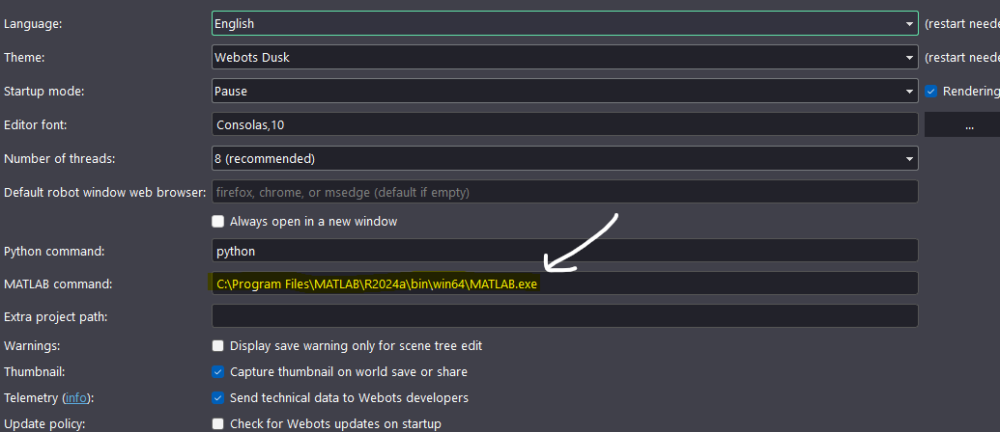

# Setup Guide

This guide provides step-by-step instructions to configure the Webots-Simulink Bridge on your system.

---

## 1. Install Webots

Download and install Webots from the official website:

1. Visit [https://cyberbotics.com/](https://cyberbotics.com/) and download Webots R2023a or later
2. Run the installer and follow the on-screen instructions
3. Verify the installation by launching Webots and opening a sample world

### Platform-Specific Installation

=== "Windows"
    ```
    1. Download the .exe installer
    2. Run the installer as Administrator
    3. Default path: C:\Program Files\Webots
    ```

=== "Linux (Ubuntu)"
    ```bash
    sudo apt update
    sudo apt install webots
    ```

=== "macOS"
    ```
    1. Download the .dmg file
    2. Drag Webots to Applications folder
    3. Allow the app in Security & Privacy settings
    ```

---

## 2. Install MATLAB and Simulink

1. Download MATLAB from [MathWorks](https://www.mathworks.com/)
2. During installation, select the following products:
   - MATLAB
   - Simulink
   - MATLAB Coder
   - Control System Toolbox (recommended)
3. Complete the installation and activate your license

### Verify Toolbox Installation

Run the following command in MATLAB to confirm installed toolboxes:

```matlab
ver
```

---

## 3. Configure MATLAB Path

Add the Webots MATLAB controller library to your MATLAB path:



### Manual Path Configuration

=== "Windows"
    ```matlab
    % Add Webots MATLAB library path
    addpath('C:\Program Files\Webots\lib\controller\matlab');
    savepath;
    ```

=== "Linux"
    ```matlab
    % Add Webots MATLAB library path
    addpath('/usr/local/webots/lib/controller/matlab');
    savepath;
    ```

=== "macOS"
    ```matlab
    % Add Webots MATLAB library path
    addpath('/Applications/Webots.app/Contents/lib/controller/matlab');
    savepath;
    ```

### Verify Path Configuration

```matlab
% Check if Webots functions are accessible
which wb_robot_init
```

If the path is correct, MATLAB displays the full path to the function file.

---

## 4. Configure Environment Variables

Set the `WEBOTS_HOME` environment variable to point to your Webots installation:

=== "Windows"
    ```
    1. Open System Properties → Environment Variables
    2. Add new System variable:
       - Name: WEBOTS_HOME
       - Value: C:\Program Files\Webots
    3. Restart MATLAB
    ```

=== "Linux"
    ```bash
    # Add to ~/.bashrc
    export WEBOTS_HOME=/usr/local/webots
    export LD_LIBRARY_PATH=$WEBOTS_HOME/lib/controller:$LD_LIBRARY_PATH

    # Apply changes
    source ~/.bashrc
    ```

=== "macOS"
    ```bash
    # Add to ~/.zshrc or ~/.bash_profile
    export WEBOTS_HOME=/Applications/Webots.app/Contents
    export DYLD_LIBRARY_PATH=$WEBOTS_HOME/lib/controller:$DYLD_LIBRARY_PATH

    # Apply changes
    source ~/.zshrc
    ```

---

## 5. Configure C Compiler

MATLAB requires a C compiler for MEX file generation. Configure the compiler:

```matlab
% Check available compilers
mex -setup

% Select C compiler
mex -setup C
```

### Install MinGW-w64 (Windows)

If no compiler is found on Windows:

1. Open MATLAB
2. Go to **Home → Add-Ons → Get Add-Ons**
3. Search for "MinGW-w64"
4. Install "MATLAB Support for MinGW-w64 C/C++ Compiler"
5. Restart MATLAB

---

## 6. Clone the Project Repository

Clone the Webots-Simulink Bridge repository:

```bash
git clone https://github.com/harunkurtdev/webots-simulink.git
cd webots-simulink
```

Add the project to MATLAB path:

```matlab
% Add project folders to path
addpath(genpath('path/to/webots-simulink'));
savepath;
```

---

## 7. Verify Installation

Run the following commands to verify your setup:

```matlab
% Check MATLAB version
version

% Check Simulink
ver Simulink

% Check if Webots library is accessible
exist('wb_robot_init', 'file')

% Check compiler
mex -setup
```

Expected output:
- MATLAB version should be R2020b or later
- Simulink should be installed
- `wb_robot_init` should return 2 (function exists)
- A C compiler should be configured

---

## Troubleshooting

| Issue | Solution |
|-------|----------|
| `wb_robot_init` not found | Verify Webots path is added correctly |
| Compiler not found | Install MinGW-w64 via MATLAB Add-Ons |
| Library load error | Check `WEBOTS_HOME` environment variable |
| Permission denied (Linux) | Run `sudo ldconfig` after setting library path |

---

## Next Steps

After completing the setup, proceed to the [Connecting Guide](../usage/connecting.md) to learn how to establish communication between Webots and Simulink.
