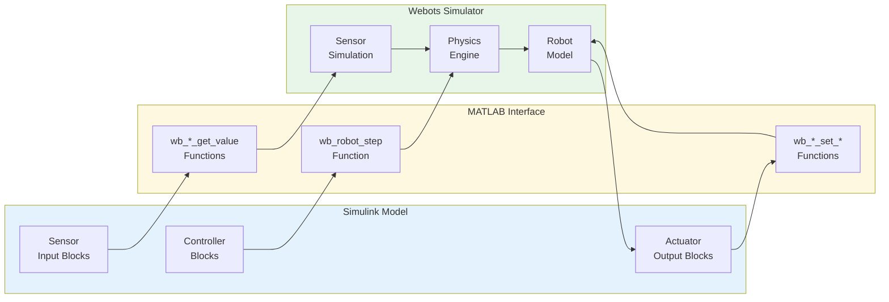
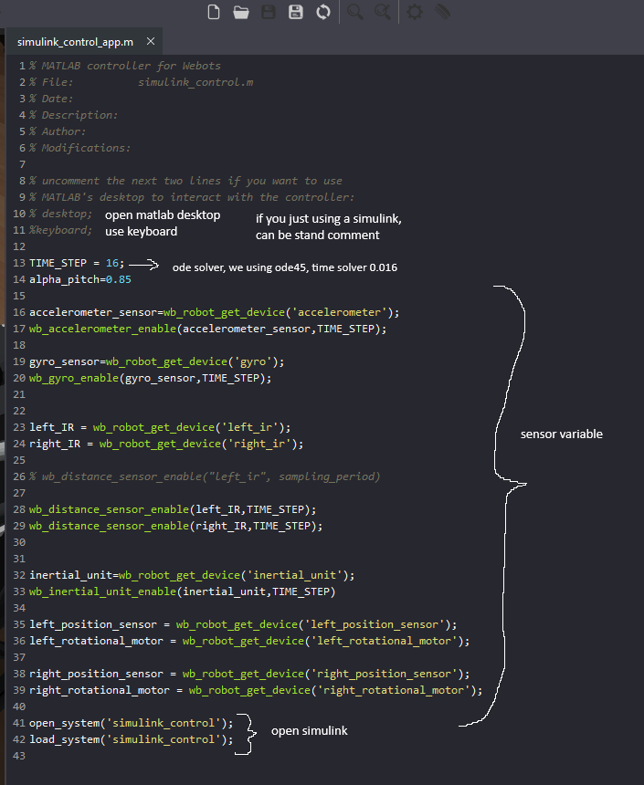
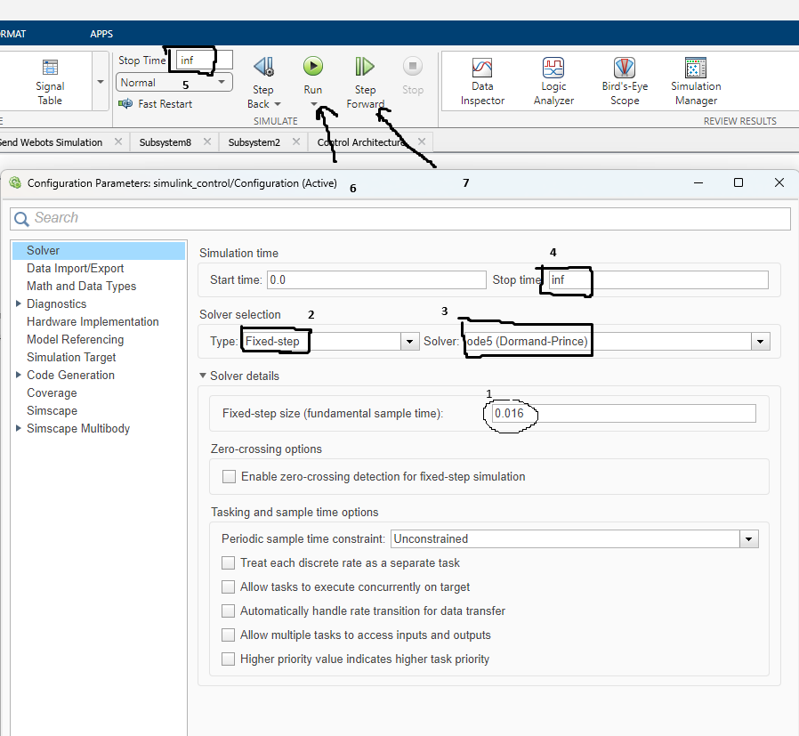
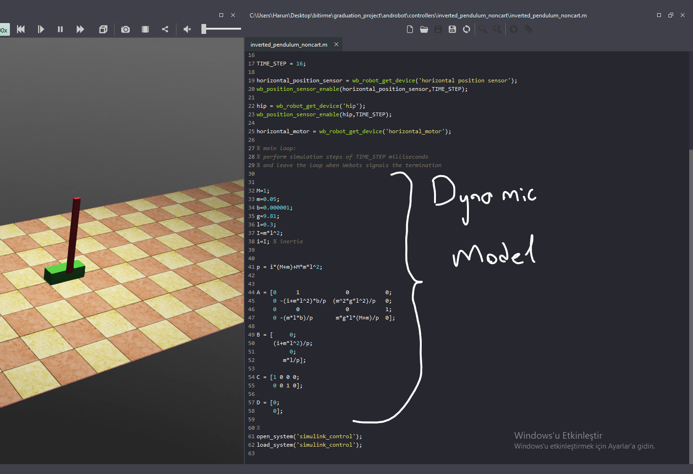
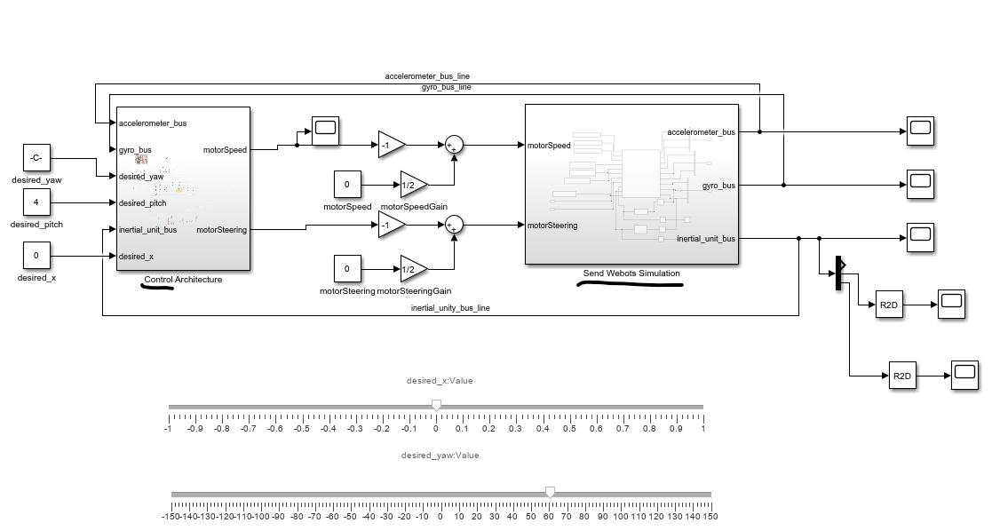
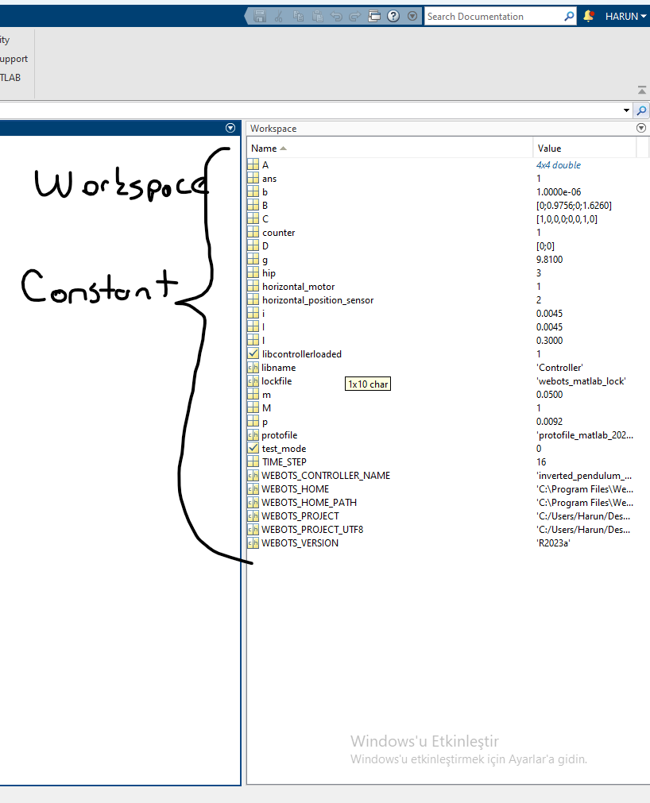

# Connecting Webots and Simulink

This guide explains how to establish communication between Webots and Simulink using the bridge interface.

---

## Communication Architecture

The Webots-Simulink Bridge uses a synchronous communication model where:

1. **Webots** acts as the physics simulation engine, handling robot dynamics and sensor simulation
2. **Simulink** acts as the controller, processing sensor data and generating actuator commands
3. **MATLAB functions** serve as the interface layer, calling Webots API functions


```mermaid
flowchart LR
    subgraph Simulink["Simulink Model"]
        CTRL[Controller<br/>Blocks]
        SENSOR[Sensor<br/>Input Blocks]
        ACTUATOR[Actuator<br/>Output Blocks]
    end

    subgraph MATLAB["MATLAB Interface"]
        WB_GET[wb_*_get_value<br/>Functions]
        WB_SET[wb_*_set_*<br/>Functions]
        WB_STEP[wb_robot_step<br/>Function]
    end

    subgraph Webots["Webots Simulator"]
        ROBOT[Robot<br/>Model]
        PHYSICS[Physics<br/>Engine]
        SENSORS[Sensor<br/>Simulation]
    end

    SENSOR --> WB_GET
    WB_GET --> SENSORS
    SENSORS --> PHYSICS
    PHYSICS --> ROBOT
    ROBOT --> ACTUATOR
    ACTUATOR --> WB_SET
    WB_SET --> ROBOT
    CTRL --> WB_STEP
    WB_STEP --> PHYSICS

    style Simulink fill:#e3f2fd
    style MATLAB fill:#fff8e1
    style Webots fill:#e8f5e9
```

---

## Step 1: Configure Webots World

Open your Webots world file (`.wbt`) and set MATLAB as the external controller:

1. Select the robot in the scene tree
2. Set the `controller` field to `<extern>`
3. Save the world file

```
Robot {
  controller "<extern>"
  ...
}
```

---

## Step 2: Initialize Sensor Variables

Define sensor device variables in your MATLAB controller script:



```matlab
% Initialize Webots robot
TIME_STEP = 16;  % Simulation time step in milliseconds

% Get device handles
gps = wb_robot_get_device('gps');
imu = wb_robot_get_device('inertial unit');
gyro = wb_robot_get_device('gyro');
accelerometer = wb_robot_get_device('accelerometer');

% Enable sensors with specified sampling period
wb_gps_enable(gps, TIME_STEP);
wb_inertial_unit_enable(imu, TIME_STEP);
wb_gyro_enable(gyro, TIME_STEP);
wb_accelerometer_enable(accelerometer, TIME_STEP);
```

---

## Step 3: Configure Simulink Model

Set the Simulink solver parameters to match Webots timing:



### Solver Configuration

| Parameter | Value | Description |
|-----------|-------|-------------|
| **Solver Type** | Fixed-step | Required for synchronous execution |
| **Solver** | ode4 (Runge-Kutta) | Fourth-order integration method |
| **Fixed Step Size** | 0.016 | Matches Webots TIME_STEP (16 ms) |
| **Stop Time** | inf | Continuous simulation |

```matlab
% Configure Simulink model programmatically
set_param('model_name', 'Solver', 'ode4');
set_param('model_name', 'FixedStep', '0.016');
set_param('model_name', 'StopTime', 'inf');
```

---

## Step 4: Create Simulink Blocks

Build your control system using Simulink blocks:



### Sensor Input Block

Create a MATLAB Function block to read sensor values:

```matlab
function [position, orientation, angular_velocity] = read_sensors()
    % Read GPS position
    position = wb_gps_get_values(gps);

    % Read IMU orientation (roll, pitch, yaw)
    orientation = wb_inertial_unit_get_roll_pitch_yaw(imu);

    % Read gyroscope angular velocity
    angular_velocity = wb_gyro_get_values(gyro);
end
```

### Actuator Output Block

Create a MATLAB Function block to send motor commands:

```matlab
function send_motor_commands(motor_velocities)
    % Set motor velocities
    wb_motor_set_velocity(motor1, motor_velocities(1));
    wb_motor_set_velocity(motor2, motor_velocities(2));
    wb_motor_set_velocity(motor3, motor_velocities(3));
    wb_motor_set_velocity(motor4, motor_velocities(4));
end
```

---

## Step 5: Synchronize Simulation Steps

The `wb_robot_step` function synchronizes Webots and Simulink:

```matlab
function step_simulation()
    % Advance simulation by one time step
    if wb_robot_step(TIME_STEP) == -1
        % Simulation ended
        return;
    end
end
```

This function must be called once per Simulink time step to:

1. Send actuator commands to Webots
2. Advance the physics simulation
3. Update sensor readings

---

## Step 6: Connect to Robot



Load and initialize the Simulink model:

```matlab
% Load Simulink model
model_name = 'robot_controller';
load_system(model_name);

% Open model for visualization
open_system(model_name);

% Initialize robot connection
wb_robot_init();

% Start simulation
set_param(model_name, 'SimulationCommand', 'start');
```

---

## Workspace Variables



Monitor variables in the MATLAB workspace during simulation:

| Variable | Type | Description |
|----------|------|-------------|
| `TIME_STEP` | Integer | Simulation step in milliseconds |
| `gps` | Device Handle | GPS sensor reference |
| `imu` | Device Handle | Inertial measurement unit reference |
| `motor1..4` | Device Handle | Motor actuator references |
| `position` | [3x1] Double | Current robot position (x, y, z) |
| `orientation` | [3x1] Double | Current orientation (roll, pitch, yaw) |

---

## Data Flow Summary

| Direction | Data Type | Example Variables |
|-----------|-----------|-------------------|
| Webots → Simulink | Sensor readings | Position, velocity, orientation, distances |
| Simulink → Webots | Actuator commands | Motor velocities, torques, positions |
| Bidirectional | Timing synchronization | `wb_robot_step()` return value |

---

## Next Steps

- [Running Simulations](running.md): Learn how to start, stop, and control simulations
- [Customization](customization.md): Modify the bridge for custom robots
