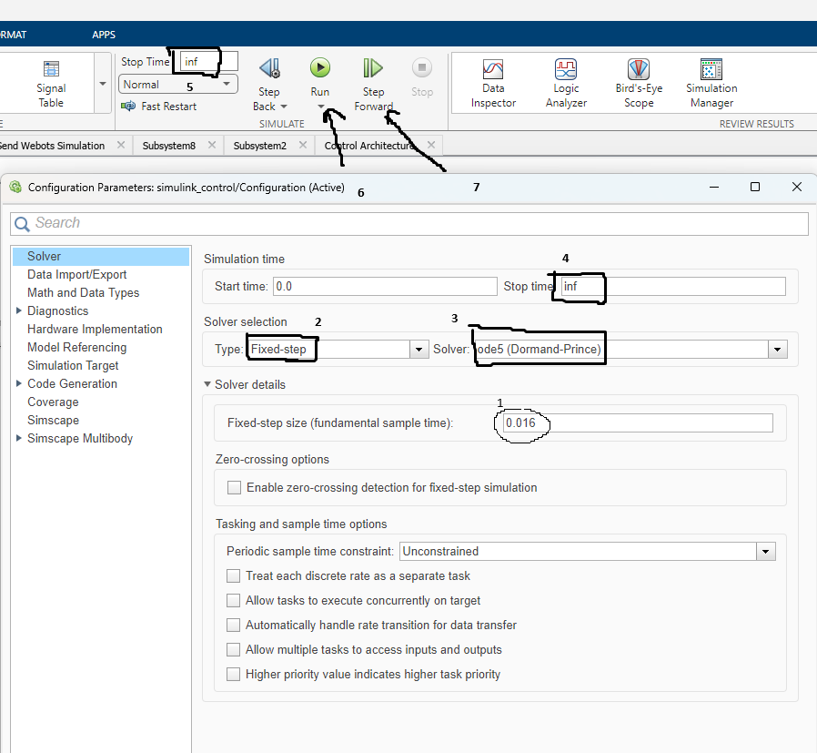

## Sensor Variables

To establish a connection between the sensor and actuator variables with the robot, we need to define them first. We'll set the time step for the ODE4 method to 0.016 seconds as required. After defining these variables, we can use `open_system` and `open_load` functions to connect them properly. Specifically, the open_system function is used to establish communication between the robot and its sensor variable, whereas the actuator variable should be connected through the open_load function for seamless data transfer.

## Dynamic Model

To connect the dynamic model with the robot, we need to define a new system that combines both. We can create a new subsystem in Simulink by using the "Subsystem" block and adding the dynamic model as a child of this new subsystem. Then, we use the `open_system` function to connect the sensor variable to the input port of the new subsystem, and the actuator variable to the output port of the new subsystem.

## Configuration

1. Fixed Step size: 0.016 seconds
2. Solver Selection: Fixed step solver
3. ODE method: ODE5
4. Stop time: Infinite (using `Inf` instead of string)
5. Simulation Start and Stop: Using `start` and `stop` functions
6. Step Forward, Step by Step simulation: Using `step` function with incremental input

## Workspace

Matlab Desktop Show a workspace with the robot, sensor variable, and actuator variable. You are able to see the variables in the workspace by clicking on them and use prompt commands.

## Connect Robot

The robot is connected to automaticly by using open_system function.
Simulink Blocks showing a Control Block, and Send Webots Simulation Blocks. The control block is used to send the robot's position and velocity to the webots simulation. The send webots simulation blocks are used to receive the robot's position and velocity from the webots simulation.

