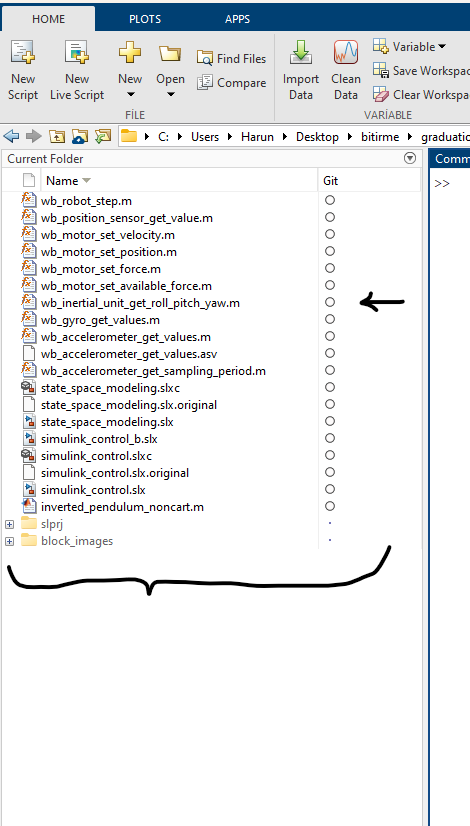
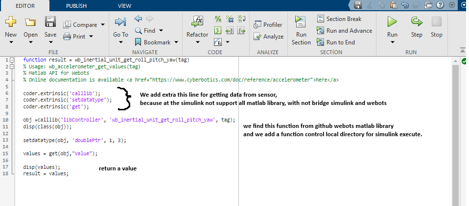
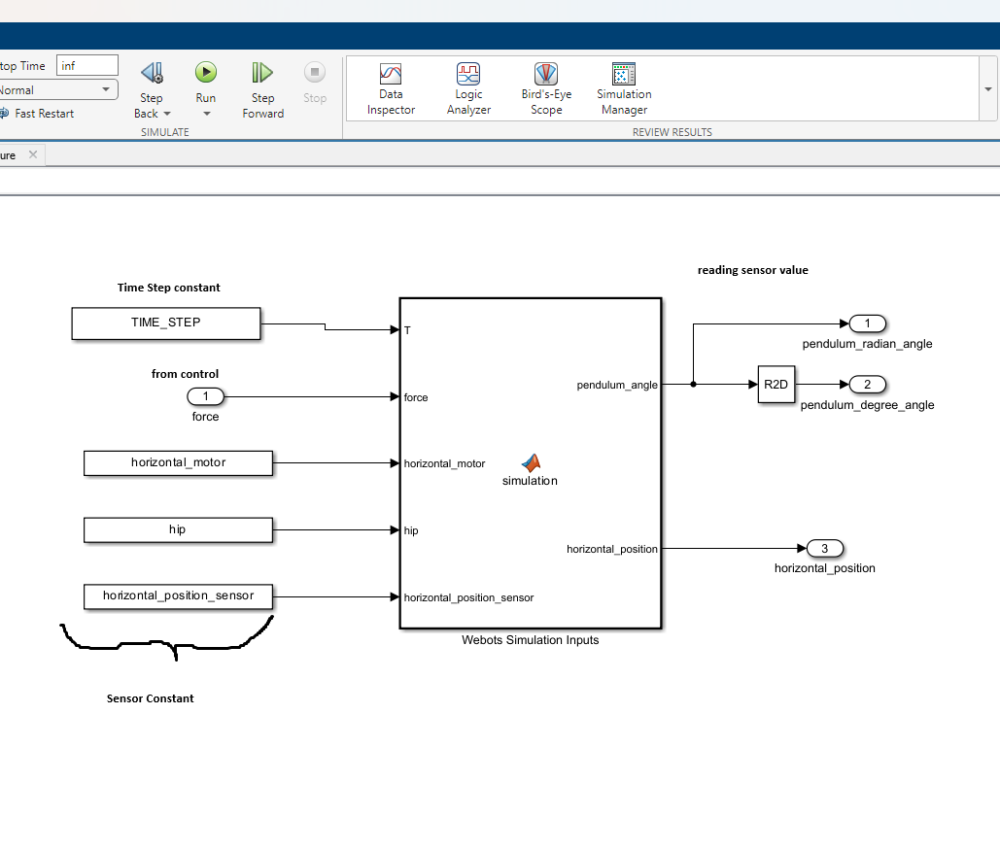
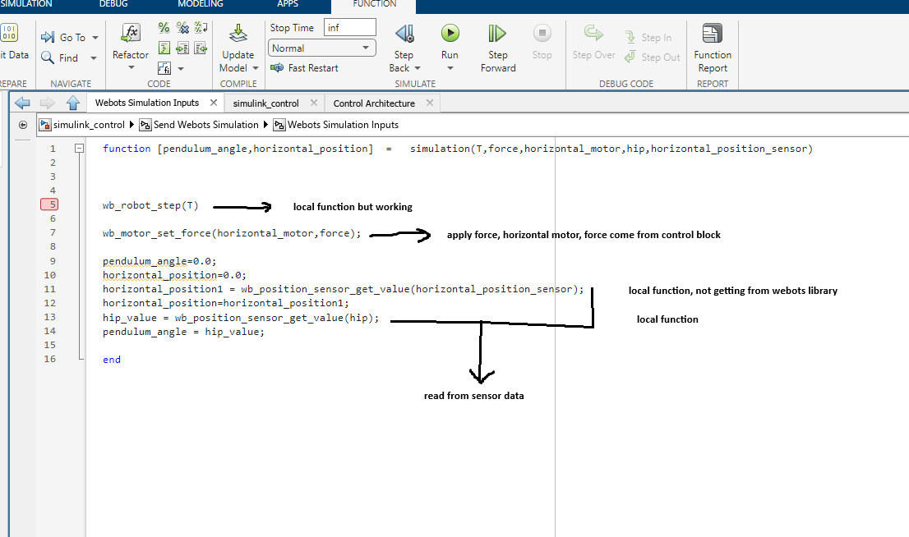

The bridge is a crucial component of Webots, responsible for connecting the simulation environment with your custom code. It allows you to interact with the simulation world and retrieve data from it. The bridge provides an interface between the simulation environment and your custom code.

### This will be Changed

## Introduction
In Webots, the bridge plays a vital role in enabling communication between the simulation environment and your custom code. It acts as a conduit for data exchange, allowing you to interact with the simulation world and retrieve information from it. The bridge provides an interface between the simulation environment and your custom code.

First, we create and define our required variables in Matlab desktop. Then, we add our files to these variables for further usage. These files are taken from Webots GitHub repository and modified to be compatible with Simulink.

The required variables include the robot model, simulation environment settings, and other necessary parameters. After defining these variables, we can use them to interact with the simulation world and retrieve data from it.

We now proceed to translate the functionality of our custom code into a series of function calls that will bridge the gap between our Matlab desktop environment and the Webots simulation engine.

Resim 3 de ise, webots TextEditor'ün de tanımladığımız sensör değişkenlerini ve sabit değişkenlerini, Constant olarak Simulink Tarafından çağırmaktayız.

Resim4 içinde, sabit değişkenlerin değerleri webots üzerinden çekilecek ve bu değerlerin atanması sağlanmaktadır.

Resim 2 de tanımlanan fonksiyonların Simulink tarafından çağrılması sağlanmaktadır. Böylece, wb_robot_step fonksiyonu her çağrıldığında Webots her bir adım işlenmesi sağlanmaktadır. Simulink ile ortak şekilde çalışması sağlanıyor.

