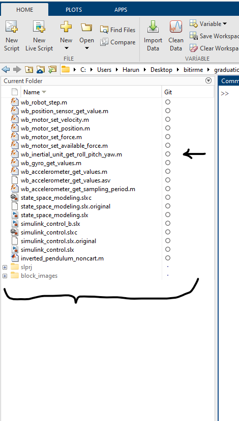
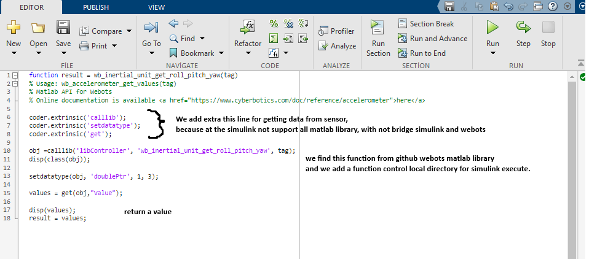
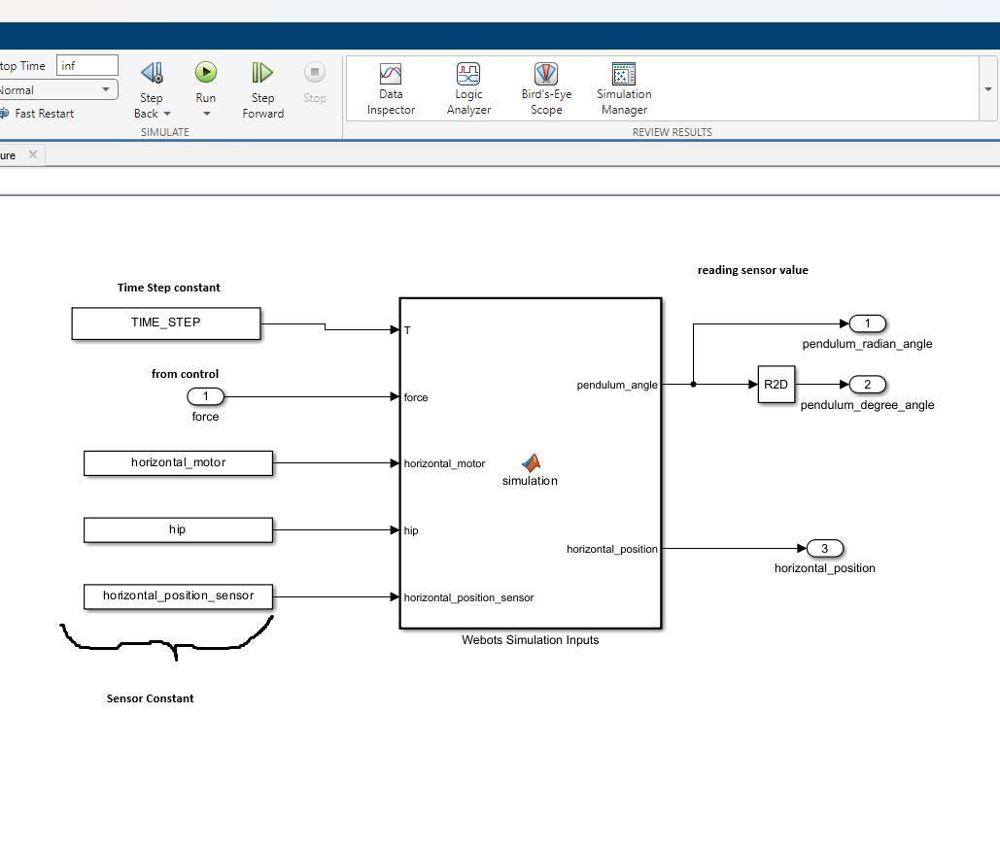
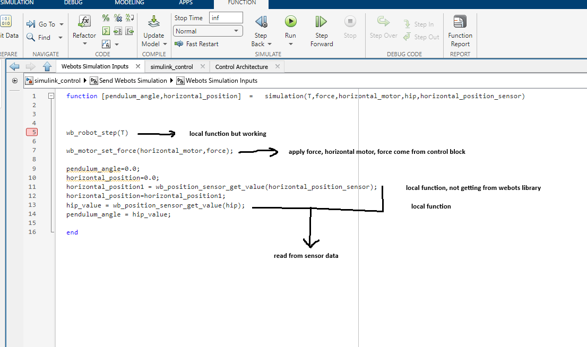

# Customizing the Bridge

This guide explains how to adapt the Webots-Simulink Bridge for custom robot models and sensors.

---

## Overview

The bridge connects Webots and Simulink through MATLAB functions that wrap the Webots API. To use a custom robot, you need to:

1. Define device variables for sensors and actuators
2. Create MATLAB wrapper functions
3. Build Simulink blocks that use these functions



---

## Adding Custom Sensors

### Step 1: Define Sensor Variables

Create variables in MATLAB to store device handles:

```matlab
% Get device handles from Webots
lidar = wb_robot_get_device('lidar');
camera = wb_robot_get_device('camera');
distance_sensor = wb_robot_get_device('distance_sensor');
touch_sensor = wb_robot_get_device('touch_sensor');

% Enable sensors with sampling period
TIME_STEP = 16;
wb_lidar_enable(lidar, TIME_STEP);
wb_camera_enable(camera, TIME_STEP);
wb_distance_sensor_enable(distance_sensor, TIME_STEP);
wb_touch_sensor_enable(touch_sensor, TIME_STEP);
```

### Step 2: Create Wrapper Functions



Create MATLAB functions to read sensor values:

```matlab
function range_data = read_lidar(lidar)
    % Read LiDAR range data
    range_data = wb_lidar_get_range_image(lidar);
end

function image = read_camera(camera)
    % Read camera image
    image = wb_camera_get_image(camera);
end

function distance = read_distance_sensor(sensor)
    % Read distance sensor value
    distance = wb_distance_sensor_get_value(sensor);
end
```

### Step 3: Create Simulink Blocks

Add MATLAB Function blocks in Simulink to call your wrapper functions:

```matlab
function y = fcn(sensor_handle)
    y = read_distance_sensor(sensor_handle);
end
```

---

## Adding Custom Actuators

### Motor Configuration



Configure motors for different control modes:

```matlab
% Get motor handles
motor1 = wb_robot_get_device('motor1');
motor2 = wb_robot_get_device('motor2');

% Velocity control mode
wb_motor_set_position(motor1, inf);  % Disable position control
wb_motor_set_velocity(motor1, 0);     % Initial velocity

% Position control mode
wb_motor_set_velocity(motor2, inf);  % Disable velocity limit
wb_motor_set_position(motor2, 0);    % Initial position

% Torque control mode
wb_motor_set_torque(motor1, 0);      % Direct torque control
```

### Actuator Wrapper Functions

```matlab
function set_motor_velocity(motor, velocity)
    % Set motor velocity (rad/s)
    wb_motor_set_velocity(motor, velocity);
end

function set_motor_position(motor, position)
    % Set motor position (rad)
    wb_motor_set_position(motor, position);
end

function set_motor_torque(motor, torque)
    % Set motor torque (N·m)
    wb_motor_set_torque(motor, torque);
end
```

---

## Sensor Reference Table

| Sensor Type | Enable Function | Get Value Function |
|-------------|-----------------|-------------------|
| GPS | `wb_gps_enable(gps, ts)` | `wb_gps_get_values(gps)` |
| IMU | `wb_inertial_unit_enable(imu, ts)` | `wb_inertial_unit_get_roll_pitch_yaw(imu)` |
| Gyroscope | `wb_gyro_enable(gyro, ts)` | `wb_gyro_get_values(gyro)` |
| Accelerometer | `wb_accelerometer_enable(acc, ts)` | `wb_accelerometer_get_values(acc)` |
| LiDAR | `wb_lidar_enable(lidar, ts)` | `wb_lidar_get_range_image(lidar)` |
| Camera | `wb_camera_enable(cam, ts)` | `wb_camera_get_image(cam)` |
| Distance Sensor | `wb_distance_sensor_enable(ds, ts)` | `wb_distance_sensor_get_value(ds)` |
| Touch Sensor | `wb_touch_sensor_enable(ts, ts)` | `wb_touch_sensor_get_value(ts)` |
| Position Sensor | `wb_position_sensor_enable(ps, ts)` | `wb_position_sensor_get_value(ps)` |
| Compass | `wb_compass_enable(comp, ts)` | `wb_compass_get_values(comp)` |

---

## Actuator Reference Table

| Actuator Type | Set Function | Description |
|---------------|--------------|-------------|
| Motor (Velocity) | `wb_motor_set_velocity(motor, vel)` | Set angular velocity (rad/s) |
| Motor (Position) | `wb_motor_set_position(motor, pos)` | Set target position (rad) |
| Motor (Torque) | `wb_motor_set_torque(motor, tau)` | Set torque (N·m) |
| LED | `wb_led_set(led, value)` | Turn LED on/off |
| Display | `wb_display_draw_pixel(display, x, y)` | Draw on display |
| Speaker | `wb_speaker_play_sound(speaker, ...)` | Play audio |

---

## Simulink Integration

### Constant Blocks for Parameters



Use Constant blocks to pass device handles and parameters:

```matlab
% In MATLAB workspace before simulation
TIME_STEP = 16;
gps_handle = wb_robot_get_device('gps');
motor_handle = wb_robot_get_device('motor');
```

### MATLAB Function Block Template

```matlab
function [position, velocity] = sensor_block(gps, imu, TIME_STEP)
    % Persistent variable for previous position
    persistent prev_position;
    if isempty(prev_position)
        prev_position = [0; 0; 0];
    end

    % Read current position
    position = wb_gps_get_values(gps);

    % Calculate velocity
    velocity = (position - prev_position) / (TIME_STEP / 1000);

    % Update previous position
    prev_position = position;
end
```

---

## Custom Robot Template

Complete template for adding a new robot:

```matlab
%% Robot Initialization
function init_robot()
    % Time step
    TIME_STEP = 16;

    % Initialize Webots
    wb_robot_init();

    %% Sensors
    % GPS
    gps = wb_robot_get_device('gps');
    wb_gps_enable(gps, TIME_STEP);

    % IMU
    imu = wb_robot_get_device('inertial unit');
    wb_inertial_unit_enable(imu, TIME_STEP);

    % Gyroscope
    gyro = wb_robot_get_device('gyro');
    wb_gyro_enable(gyro, TIME_STEP);

    %% Actuators
    % Motors
    motor_left = wb_robot_get_device('left_motor');
    motor_right = wb_robot_get_device('right_motor');

    % Configure for velocity control
    wb_motor_set_position(motor_left, inf);
    wb_motor_set_position(motor_right, inf);
    wb_motor_set_velocity(motor_left, 0);
    wb_motor_set_velocity(motor_right, 0);

    %% Load Simulink Model
    model_name = 'custom_controller';
    load_system(model_name);
    open_system(model_name);

    %% Main Loop
    while wb_robot_step(TIME_STEP) ~= -1
        % Simulation step handled by Simulink
    end

    %% Cleanup
    wb_robot_cleanup();
end
```

---

## Best Practices

| Practice | Description |
|----------|-------------|
| **Use consistent TIME_STEP** | Ensure Webots and Simulink use the same time step |
| **Initialize sensors early** | Enable all sensors before the main loop |
| **Handle device errors** | Check if `wb_robot_get_device()` returns valid handles |
| **Use persistent variables** | Store state between function calls in Simulink |
| **Modularize code** | Create separate functions for each sensor/actuator |

---

## Next Steps

- [Debugging](../advanced/debugging.md): Troubleshoot issues with custom configurations
- [ROS 2 Export](../advanced/export-ros2.md): Export your customized controller as a ROS 2 package
