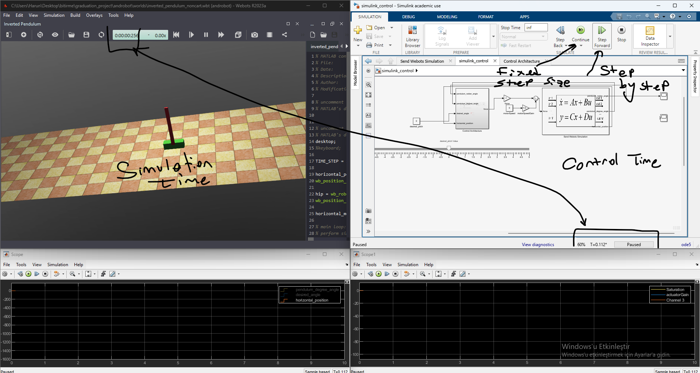

## Running Simulink Apps in Webots

Running the simulink apps is very simple. Just click on the "Run" button and you are done!

if you want to stop the simulation, just click on the "Stop" button.

and also you can see the output of your simulink app in the console.

if you want to step forward the simulink apps, just click on the "Step" button.

## Running Video

