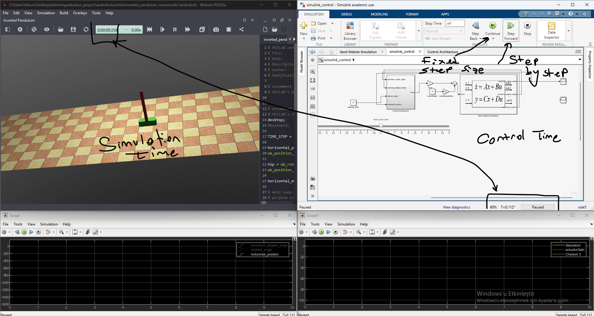

# Running Simulations

This guide explains how to start, control, and monitor Webots-Simulink simulations.

---

## Simulation Control Interface



The simulation is controlled through both Webots and Simulink interfaces. Webots handles physics simulation while Simulink manages the control algorithms.

---

## Starting a Simulation

### Step 1: Launch Webots

1. Open your Webots world file (`.wbt`)
2. Verify the robot controller is set to `<extern>`
3. Keep Webots in pause mode initially

### Step 2: Run MATLAB Controller

Execute the main controller script in MATLAB:

```matlab
% Initialize the robot
wb_robot_init();

% Load Simulink model
model_name = 'controller_model';
load_system(model_name);
open_system(model_name);

% Start simulation
set_param(model_name, 'SimulationCommand', 'start');
```

### Step 3: Start Webots Simulation

Press the **Play** button in Webots or use the keyboard shortcut.

---

## Simulation Controls

| Action | Webots Interface | MATLAB Command |
|--------|------------------|----------------|
| **Start** | Click Play button | `set_param(model, 'SimulationCommand', 'start')` |
| **Pause** | Click Pause button | `set_param(model, 'SimulationCommand', 'pause')` |
| **Stop** | Click Stop button | `set_param(model, 'SimulationCommand', 'stop')` |
| **Step** | Click Step button | `set_param(model, 'SimulationCommand', 'step')` |
| **Reset** | Click Reset button | `wb_supervisor_simulation_reset()` |

---

## Step-by-Step Simulation

For debugging purposes, you can advance the simulation one step at a time:

```matlab
% Single step execution
while wb_robot_step(TIME_STEP) ~= -1
    % Read sensors
    position = wb_gps_get_values(gps);
    orientation = wb_inertial_unit_get_roll_pitch_yaw(imu);

    % Process control algorithm
    control_output = controller(position, orientation);

    % Send commands
    wb_motor_set_velocity(motor, control_output);

    % Optional: pause for visualization
    pause(0.01);
end
```

---

## Real-Time Monitoring

### Using Simulink Scopes

Add Scope blocks to visualize signals in real-time:

1. Drag a **Scope** block from the Simulink library
2. Connect it to the signal you want to monitor
3. Double-click to open the scope window during simulation

### Using MATLAB Command Window

Print values to the command window:

```matlab
% Inside simulation loop
fprintf('Position: [%.3f, %.3f, %.3f]\n', position(1), position(2), position(3));
fprintf('Orientation: [%.3f, %.3f, %.3f]\n', orientation(1), orientation(2), orientation(3));
```

### Data Logging

Log simulation data to workspace variables:

```matlab
% Pre-allocate arrays
max_steps = 10000;
position_log = zeros(max_steps, 3);
time_log = zeros(max_steps, 1);

step = 1;
while wb_robot_step(TIME_STEP) ~= -1 && step <= max_steps
    position_log(step, :) = wb_gps_get_values(gps);
    time_log(step) = step * TIME_STEP / 1000;
    step = step + 1;
end

% Plot results
figure;
plot(time_log(1:step-1), position_log(1:step-1, :));
xlabel('Time (s)');
ylabel('Position (m)');
legend('X', 'Y', 'Z');
```

---

## Simulation Video


---

## Simulation Parameters

### Time Step Configuration

| Parameter | Typical Value | Description |
|-----------|---------------|-------------|
| `TIME_STEP` | 16 ms | Webots simulation step |
| `FixedStep` | 0.016 s | Simulink solver step |
| `StopTime` | inf | Continuous operation |

Ensure these values match between Webots and Simulink for proper synchronization.

### Performance Settings

```matlab
% Simulink model configuration
set_param(model_name, 'Solver', 'ode4');
set_param(model_name, 'FixedStep', '0.016');
set_param(model_name, 'SimulationMode', 'normal');

% For faster-than-realtime simulation
set_param(model_name, 'SimulationMode', 'accelerator');
```

---

## Stopping a Simulation

### Graceful Shutdown

```matlab
% Stop Simulink
set_param(model_name, 'SimulationCommand', 'stop');

% Cleanup Webots connection
wb_robot_cleanup();

% Close model (optional)
close_system(model_name, 0);
```

### Emergency Stop

If the simulation becomes unresponsive:

1. Press **Ctrl+C** in MATLAB command window
2. Click **Stop** in Webots
3. If necessary, close Webots from Task Manager

---

## Common Issues

| Issue | Cause | Solution |
|-------|-------|----------|
| Simulation doesn't start | Controller not set to `<extern>` | Check Webots robot settings |
| Simulation runs slowly | Time step mismatch | Verify TIME_STEP values match |
| Data not updating | Missing `wb_robot_step()` call | Ensure step function is called each iteration |
| Motors not moving | Actuators not enabled | Call `wb_motor_set_position()` with `INFINITY` for velocity control |

---

## Next Steps

- [Customization](customization.md): Learn how to modify the bridge for different robots
- [Debugging](../advanced/debugging.md): Troubleshoot simulation issues
