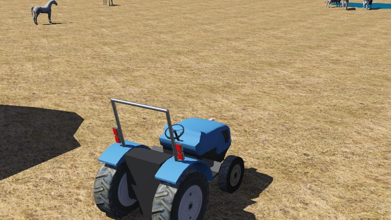

# Tractor (Boomer) Agricultural Vehicle



The Boomer Tractor is an agricultural vehicle simulation demonstrating steering control and drive systems for precision agriculture applications.

## Features

- Four-wheel drive with different front/rear wheel sizes
- Ackermann steering geometry
- Multiple sensors: LiDAR, GPS, IMU, compass
- Lighting system: work lights, road lights, flashers
- Position feedback for steering control

## Specifications

| Parameter | Value |
|-----------|-------|
| Front Wheel Radius | 0.38m |
| Rear Wheel Radius | 0.6m |
| Steering Type | Ackermann |
| LiDAR | Sick LMS 291 |

## Controllers

### boomer
C-based manual controller for keyboard operation.

### simulink_control_app
Simulink integration for advanced control algorithms.

## Quick Start

1. Open `worlds/boomer.wbt` in Webots
2. Set controller to `simulink_control_app`
3. Open `simulink_control.slx` in MATLAB
4. Run simulation

## File Structure

```
tractor/
├── controllers/
│   ├── boomer/                  # Manual control (C)
│   └── simulink_control_app/    # Simulink integration
└── worlds/
    └── boomer.wbt              # Webots world file
```

See [full documentation](../../docs/examples/tractor.md) for detailed information.
